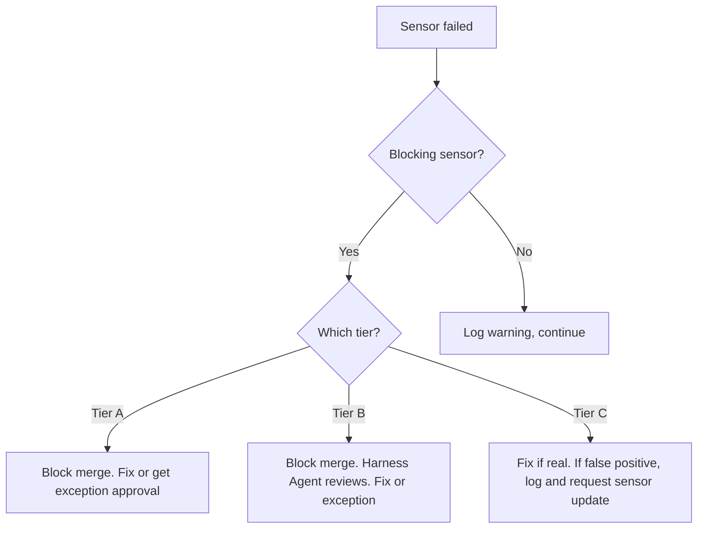
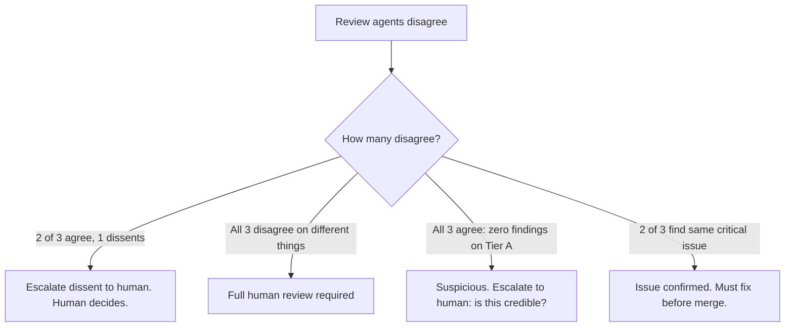
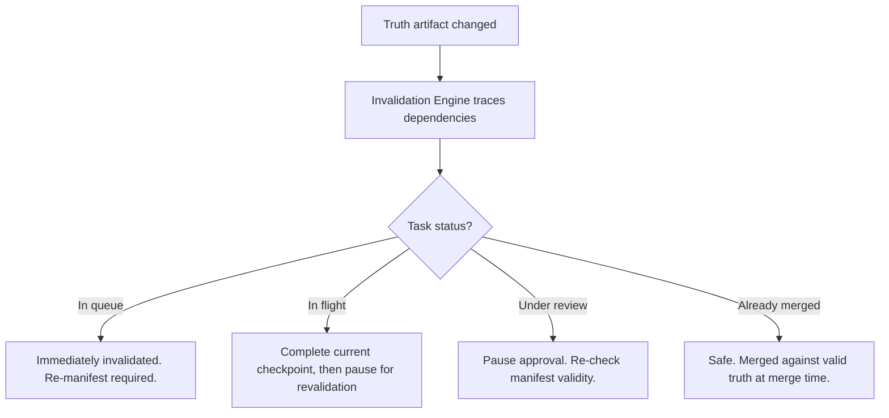
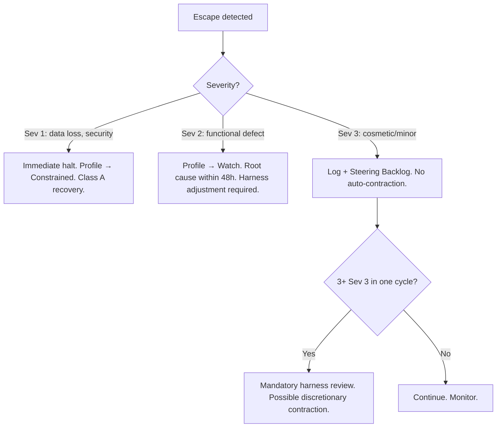
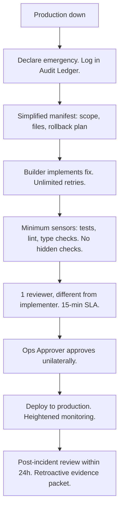

# Agent-Native Software Delivery — Quick Reference Card

> Companion to the Agent-Native Software Delivery Operating Model v4.
> Open this when you need an answer in 30 seconds.
>
> **Live operational docs**: see [`Quickstart.md`](Quickstart.md) for the
> shipped builder-first flow and [`Operator_Playbook.md`](Operator_Playbook.md)
> for day-to-day expert commands. The "Operating Model / Control Specifications
> / Implementation Guide" references in the cross-reference table below point
> at [`historical/PRD.md`](historical/PRD.md) and
> [`historical/Implementation_Guide.md`](historical/Implementation_Guide.md) —
> retained as design archives, not as a contract for the local-first product.

---

## 1. Classification Quick Lookup

### Decision table

| What I'm changing | Risk tier | BC | Change class |
|---|---|---|---|
| New API endpoint (internal) | B | BC1 | Class 1 |
| New API endpoint (external / public) | A | BC1 | Class 1 |
| New UI component (non-critical) | C | BC1 | Class 1 |
| New critical user flow (checkout, signup) | A | BC2 | Class 1 |
| Bug fix in non-critical path | C | BC1 | Class 2 |
| Bug fix in payment / auth / data path | A | BC1 | Class 2 |
| Modify existing business logic | B | BC2 | Class 2 |
| Change an interface contract | B | BC1 | Class 3 |
| Change an external API contract | A | BC1 | Class 3 |
| Database schema change (additive) | B | BC1 | Class 2 |
| Database schema change (destructive) | A | BC2 | Class 4 |
| Add/update dependency (minor version) | C | BC1 | Class 2 |
| Add/update dependency (major version) | B | BC1 | Class 2 |
| Security-sensitive change (auth, crypto, permissions) | A | BC2 | Class 2 |
| Feature flag toggle | C | BC1 | Class 2 |
| Infrastructure / config change | B | BC1 | Class 2 |
| Migration: extract service from monolith | A | BC2 | Class 4 |
| Remove deprecated feature | B | BC1 | Class 5 |
| UX/copy change (non-critical) | C | BC3 | Class 2 |
| UX flow redesign (critical path) | A | BC3 | Class 2 |

### When in doubt
- If it touches money, auth, or user data: **Tier A**
- If behavior is ambiguous or experiential: **BC3**
- If you're replacing something: **Class 4**
- Classification Oracle disagrees? Human decides. Oracle never downgrades without human confirmation.

---

## 2. Merge Checklists

### Tier C / BC1 — Autonomous path (Trusted profile, 3+ people)

- [ ] Manifest exists and is not expired (TTL: 2 weeks)
- [ ] All computational sensors pass (tests, lint, type checks)
- [ ] Applicable sensor packs pass (security if external-facing, etc.)
- [ ] Evidence packet synthesized with decision view
- [ ] Adversarial Challenger produced counter-brief
- [ ] Approval Triage Agent triaged as **green** (different model from builder)
- [ ] Agent chain of custody recorded in evidence packet
- [ ] Auto-merge → auto-deploy → canary observation (1 hour default)
- [ ] Meta-review: 10% sampling (100% for first 50 under new profile)

### Tier B — Governed path

Everything in Tier C, plus:

- [ ] At least 1 independent Reviewer Agent (different model from builder)
- [ ] Cross-model review if `reviewer_diversity_required: true`
- [ ] Human approval required (Tier B / BC2+) or elevated sensors (Tier B / BC1 Trusted)
- [ ] Rollback plan documented
- [ ] Meta-review: 50% sampling
- [ ] Auto-deploy to staging only. Human gate for production.

### Tier A — Full governance path

Everything in Tier B, plus:

- [ ] Adversarial Review Triad dispatched (3 agents, 3 different models)
- [ ] Triad quorum evaluated (unanimous zero-findings = suspicious)
- [ ] Human gate required for merge
- [ ] Human gate required for staging AND production deploy
- [ ] Security sensor pack mandatory
- [ ] Meta-review: 100%
- [ ] Rollback plan verified and tested
- [ ] If BC3: framing-independent challenge review included

---

## 3. "Something Went Wrong" Decision Trees

### Sensor failure



### Review disagreement



### Truth artifact changed



### Escape detected



### Production down



---

## 4. Approval SLAs and Autonomy

| | Tier A | Tier B | Tier C |
|---|---|---|---|
| **Approval SLA** | 4 business hours | 8 business hours | 24 business hours |
| **Meta-review rate** | 100% | 50% | 10% |
| **Auto-merge** (Trusted) | No | BC1 only (min credible) | Yes |
| **Auto-deploy staging** | No (human gate) | Yes | Yes |
| **Auto-deploy production** | No (human gate) | No (human gate) | Yes (with canary) |
| **Canary observation** | N/A (manual deploy) | N/A (manual prod) | Default 1 hour |
| **Rollback** | Human-authorized | Auto on canary + human for full | Auto on canary degradation |

---

## 5. Trust Status Quick Reference

| Control | Candidate | Trusted | Watch | Constrained |
|---|---|---|---|---|
| Phase gate type | HUMAN (all gates) | Per §16.7.2: AGENT/HYBRID for low-risk; HUMAN for Tier A/BC3 | HUMAN (all gates) | HUMAN (all gates) + elevated review |
| Auto-merge | No | Tier C/BC1 | No | No |
| Concurrency | 1-2 tasks | Normal | 50% of normal | 1 task |
| Self-correction | 1 retry | Per profile | 1 retry | None (fail to human) |
| Hidden checks | Every task | Sampling | Every task | Every task + extra |
| Review intensity | Full | Per classification | Full | Full + framing-independent |
| Delegation | None | Per manifest | None | None |

### Promotion: Candidate → Trusted
- 10+ tasks, 0 escapes
- Calibration probes pass
- Sensor false-positive rate <10%
- No review disagreements in last 5 tasks
- Explicit decision by Classification Authority

### Demotion triggers
- 1 Sev 2 escape → Watch
- 1 Sev 1 escape → Constrained
- 2+ Sev 2 escapes in a cycle → Constrained
- Calibration drift >25% → Watch
- Review catch rate <40% → Watch

---

## 5A. Phase Gate Type Quick Lookup

| Phase | Tier C/BC1 Trusted | Tier B/BC1 Trusted | Tier A / BC2+ / BC3 | Candidate/Watch/Constrained |
|---|---|---|---|---|
| 1. Opportunity framing | HYBRID | HUMAN | HUMAN | HUMAN |
| 2. Discovery | AGENT | HYBRID | HUMAN | HUMAN |
| 3. Product truth | HYBRID | HUMAN | HUMAN | HUMAN |
| 4. Architecture & harness | HYBRID | HUMAN | HUMAN | HUMAN |
| 5. Planning & decomposition | AGENT | AGENT | HUMAN | HUMAN |
| 6. Calibration | AGENT | HYBRID | HUMAN | HUMAN |
| 7. Execution (per-task) | AGENT (§16.5) | AGENT (§16.5) | HUMAN | HUMAN |
| 8. Integration & hardening | HYBRID | HUMAN | HUMAN | HUMAN |
| 9. Release & cutover | HYBRID | HUMAN | HUMAN | HUMAN |
| 10. Post-launch | AGENT | HYBRID | HUMAN | HUMAN |

**Classification Oracle override:** MEDIUM confidence (70-90%) → elevate one level. LOW (<70%) → all HUMAN.

**Key:** AGENT = agent decides (meta-reviewed). HYBRID = agent evaluates, human decides. HUMAN = human decides.

---

## 5B. Intake Interview Quick Reference

| Phase | Mandatory question categories | Responsible agent |
|---|---|---|
| 1. Opportunity framing | Problem, users, constraints, kill criteria, mode | Bootstrap Agent |
| 2. Discovery | Codebase access, pain points, stakeholder map | Discovery Agent |
| 3. Product truth | Priority, acceptance criteria, BC-sensitive areas | PRL Co-Author |
| 4. Architecture & harness | Tech stack, team expertise, NFR priorities | Architecture Oracle |
| 5. Planning | Capacity, timeline, concurrency, dependencies | Planning Agent |
| 6. Calibration | Risk appetite, probe preferences, model prefs | Self-Calibrating Harness |
| 8. Integration | Release scope, journey coverage expectations | Reassembly Authority |
| 9. Release | Deployment constraints, rollback appetite, monitoring | Deploy Controller |

**Unanswered question handling:** BLOCK (cannot proceed), FLAG (proceed with logged assumption + invalidation trigger), PROCEED (informational, logged).

**Brownfield additions:** Source-of-record clarity, legacy behavior intent, migration scope, discovery confidence.

---

## 5C. CES CLI Workflow Routing

| If you need to... | Stay builder-first or switch? | Supported CES surface | Why |
|---|---|---|---|
| Start or resume one delivery request | `builder-first` | `ces build`, `ces continue`, `ces explain`, `ces status` | CES keeps the active request and recovery path together |
| Check brownfield context for the active request | `builder-first` | `ces explain --view brownfield` | Use the current builder summary before deciding whether you need an explicit legacy-behavior review |
| Export a reviewer or audit handoff from the latest builder chain | `expert workflow` | `ces report builder` | Use a portable report when another operator needs the current builder story without opening CES internals |
| Take direct control of manifest, review, triage, or approval artifacts | `expert workflow` | `ces manifest`, `ces classify`, `ces review`, `ces triage`, `ces approve` | Use the lower-level governance surfaces directly when you need explicit operator control |
| Make explicit brownfield legacy decisions | `expert workflow` | `ces brownfield register`, `ces brownfield review OLB-<entry-id> --disposition preserve`, `ces brownfield promote` | Day-to-day brownfield delivery stays builder-first with `ces build` and `ces continue`; use these commands only for named legacy-behavior decisions, then refer to the [Brownfield Guide](Brownfield_Guide.md) for the full handoff |
| Monitor CES broadly or respond to incidents | `expert workflow` | `ces status --expert`, `ces status --expert --watch`, `ces audit --limit 20`, `ces emergency declare "Security incident detected"` | System-wide monitoring and emergency handling sit outside the single-request builder loop; use the [Operations Runbook](Operations_Runbook.md) for drills and recovery follow-up |

Use the [Operator Playbook](Operator_Playbook.md) when you need the fuller builder-first versus expert workflow boundary for a single request.

---

## 6. Key Section References

| I need to understand... | Section | Document |
|---|---|---|
| Why this model exists | Part I §1-2 | Executive Doctrine |
| When to use / not use this model | Part I §5-6 | Executive Doctrine |
| Human roles and authority | Part II §2.1 | Operating Model |
| Agent roles | Part II §3 | Operating Model |
| Truth artifacts and hierarchy | Part II §4-5 | Operating Model |
| Lifecycle phases (1-10) | Part II §7 | Operating Model |
| Classification system | Part II §8 | Operating Model |
| Decomposition and reassembly | Part II §9 | Operating Model |
| Review model | Part II §10 | Operating Model |
| Engineering practice sensor packs | Part II §10.1.1 | Operating Model |
| Agent independence rules | Part II §10.9 | Operating Model |
| Progressive autonomy model | Part II §16 | Operating Model |
| Autonomous execution path (Tier C) | Part II §16.5 | Operating Model |
| Tier A execution path | Part II §16.6 | Operating Model |
| Agent-delegated phase gates | Part II §16.7 | Operating Model |
| Intake Interview Protocol | Part II §7.0 | Operating Model |
| Project Knowledge Vault | Part II §15A | Operating Model |
| Control enforcement classes | Part II §2.4 | Operating Model |
| Draft namespace and promotion | Part II §9.6.1 | Operating Model |
| Release-slice aggregate classification | Part III §8.5 | Control Specifications |
| Observed Legacy Behavior Register | Part II §7.0.9A | Operating Model |
| Agent command execution security | Part II §15.7 | Operating Model |
| Polyrepo limitations and extensions | Part II §15B | Operating Model |
| Harness profile contract | Part III §3 | Control Specifications |
| Manifest contract | Part III §6 | Control Specifications |
| Manifest expiry and staleness | Part III §6.3 | Control Specifications |
| Evidence packet contract | Part III §7 | Control Specifications |
| Approval rules | Part III §8 | Control Specifications |
| Invalidation rules | Part III §9 | Control Specifications |
| Token budget and economics | Part III §10 | Control Specifications |
| Control-plane failure classes | Part III §11 | Control Specifications |
| Emergency hotfix path | Part III §12.5 | Control Specifications |
| Anti-patterns | Part III §13 | Control Specifications |
| Canonical rule set | Part III §14 | Control Specifications |
| What to build as software | Part IV §1 | Implementation Guide |
| Artifact schemas (YAML, incl. Gate Evidence Packet) | Part IV §2 | Implementation Guide |
| Quick-start path (12 steps) | Part IV §4 | Implementation Guide |
| 13 sub-agents | Part IV §5.1-5.13 | Implementation Guide |
| Skill architecture | Part IV §5.15-5.22 | Implementation Guide |
| Worked example (payment retry) | Part IV §6 | Implementation Guide |

---

## 7. Canonical Rules (memorize these)

1. No meaningful work without manifests
2. No meaningful work without harness profiles
3. No approval without adversarially candid evidence
4. No upstream truth change without downstream invalidation
5. No autonomy expansion without measured control quality
6. No repeated failure without harness change
7. No trust in a degraded control plane
8. No agent may review, triage, or approve its own output
9. No same-model review when diversity is required
10. No evidence packet without agent chain of custody
11. No Tier A merge without cross-agent review (2+ agents, different models)
12. No production deployment without canary monitoring (auto-deployed changes)
13. No security-sensitive change without security sensor pack
14. No agent may proceed with work depending on info it does not have without asking, flagging, or blocking
15. No agent gate without gate evidence packet, model diversity, and audit trail
16. No agent gate on work where classification confidence is below 70%
17. No vault write without chain of custody in the Audit Ledger
18. No vault knowledge may override or contradict a truth artifact
19. No autonomy expansion based solely on detective or advisory controls
20. No agent-generated artifact may govern execution without human promotion from draft to approved
21. No release slice without aggregate classification (max-risk of constituent tasks)
22. No observed legacy behavior promoted to PRL without explicit human disposition
23. No emergency fix exceeding 500 lines without explicit Ops Approver justification
24. No Tier A merge without the Adversarial Review Triad (3 agents, 3 different models)

---

## 8. Authoring a spec -- `ces spec`

Turn a PRD into governed manifest drafts for the `ces build` pipeline.

```bash
ces spec author                                       # Interactive authoring
ces spec author --polish                              # Same, with LLM polish on long-form fields
ces spec import path/to/prd.md                        # Import existing PRD (LLM-assisted)
ces spec import path/to/prd.md --no-llm               # Deterministic header match only
ces spec validate docs/specs/my.md                    # Structural checks (required sections, DAG)
ces spec decompose docs/specs/my.md                   # Create one manifest per story
ces spec reconcile docs/specs/my.md                   # Diff spec vs. existing manifests
ces spec tree docs/specs/my.md                        # Show spec + manifest workflow status
ces build --from-spec docs/specs/my.md --story ST-01  # Preview build order
```

See `docs/designs/2026-04-21-ces-spec-authoring.md` for full design.
