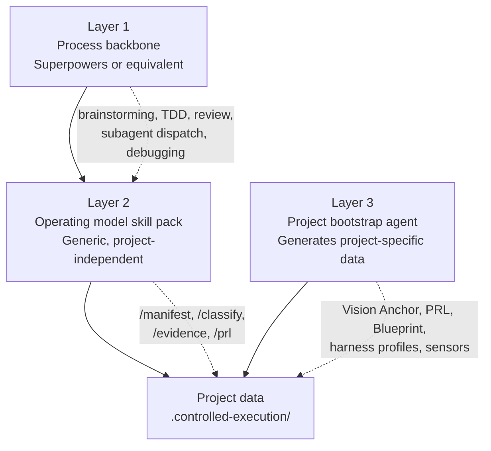

# Part IV — Implementation Guide

> Historical implementation guide. CES is currently shipped as a local builder-first CLI. Server, dashboard, and multi-repo/control-plane material below is retained for design context only and is not the supported product surface.

This part bridges the operating model to the system that enforces it.
Parts I–III define what the model requires.
Part IV defines what must be built, what remains organizational process, how the system integrates with existing tools, what every artifact looks like as structured data, and how to get started.

---

## 1. Implementation boundary

Not everything in this model is software.
Some controls are organizational processes, some are software, and some are hybrids that require both.
A builder must know which is which before writing a line of code.

### 1.1 Software components

These must be built as deterministic software.
If they are not automated, they do not exist.

| Component | What it does | Bootstrap with |
|---|---|---|
| **Manifest Service** | Creates, signs, validates, expires, and invalidates task manifests | YAML files in repo + CI validation script |
| **Policy Engine** | Enforces role permissions, file boundaries, tool boundaries, environment restrictions | GitHub/GitLab branch protection + CODEOWNERS |
| **Scheduler** | Determines what runs next based on readiness, budgets, concurrency caps, dependency state | Manual queue or project board (GitHub Projects, Linear) |
| **Invalidation Engine** | Traces dependencies and invalidates downstream work when upstream artifacts change | Git hooks + dependency graph script |
| **Merge Controller** | Gates all merges to governed branches | Branch protection rules + required CI checks |
| **Deploy Controller** | Gates all promotions across environments | CI/CD pipeline gates (GitHub Actions, GitLab CI) |
| **Approval Engine** | Checks evidence completeness and records approval decisions | PR review requirements + checklist template |
| **Audit Ledger** | Append-only record of all work, approvals, invalidations, exceptions, merges, releases, rollbacks, and harness changes | Append-only file in repo or shared database |
| **Kill Switch** | Halts defined activity classes under pre-defined conditions | CI pipeline abort + branch lock script |
| **Control Verification Service** | Periodic checks of manifest lineage, invalidation traces, audit completeness, merge provenance, approval freshness | Scheduled CI job (weekly cron) |
| **Guide Pack Builder** | Assembles the task-specific feedforward package from approved upstream assets | Template files + assembly script |
| **Sensor Orchestrator** | Runs required sensor stacks and governs self-correction loops | CI pipeline with ordered stages |
| **Harness Metrics Service** | Tracks guide effectiveness, sensor yield, review quality, false positives, escapes, recurring failures | Observability platform dashboards (Grafana, Datadog) |
| **Harness Registry** | Stores versioned harness profiles, guide packs, sensor packs, templates, hidden challenge suites | Directory of versioned YAML files in repo |
| **Telemetry Pipeline** | Collects and aggregates all telemetry streams defined in § 14 of the Operating Model | Existing observability platform ingestion |

At minimum deployable, most of these components can be bootstrapped with existing tools and manual processes. The goal is to enforce the controls, not to have perfect automation. A YAML manifest validated by a CI script is a real manifest. A branch protection rule is a real merge gate. Automate incrementally as you move toward minimum credible and minimum scalable.

### 1.2 Organizational processes

These require human judgment and cannot be fully automated.
Software can support them with tooling, but the decision remains human.

| Process | What it involves | Tooling support |
|---|---|---|
| **Vision Anchor authoring** | Defining target users, problem, value, non-goals, kill criteria | Template + validation (structure check, not content check) |
| **PRL authoring** | Writing product requirements with acceptance criteria | Schema validation, coverage checks, contradiction detection |
| **Stakeholder alignment** | Resolving disagreements about intent, priority, or legacy disposition | Structured disagreement capture, time-box tracking, decision recording |
| **Architecture approval** | Accepting or rejecting load-bearing design decisions | Decision recording, impact tracing |
| **Classification authority** | Validating risk tier, BC class, and change class for work | Classification rubric tooling, override logging |
| **Meta-review** | Sampling approvals to check whether evidence was actually read | Sampling automation, but judgment is human |
| **Political override governance** | Logging and reviewing exceptions to normal control paths | Exception recording, retrospective scheduling |
| **Steering loop decisions** | Deciding which harness improvements to prioritize | Harness effectiveness reports feed human decision |

### 1.3 Hybrid components

These combine software automation with human judgment at specific decision points.

| Component | Automated part | Human decision point |
|---|---|---|
| **Review routing** | Routing to computational vs. inferential review based on harness profile | Escalation decisions when reviews disagree or sensors fail |
| **Calibration** | Running probe tasks and collecting metrics | Evaluating results against proceed/redesign thresholds |
| **Reassembly verification** | Structural coverage checks, contract compatibility checks | Strategic coherence judgment for Tier A and BC3 slices |
| **Evidence packet generation** | Assembling test results, sensor outputs, review findings | Decision view authoring (adversarial honesty is a judgment call) |
| **Escape analysis** | Tracing escapes back through review layers | Determining root cause category (sensor gap, guide gap, harnessability limit) |
| **Harnessability assessment** | Automated analysis of typing strength, module boundaries, test coverage | Human judgment on where templates are safe vs. dangerous |

---

## 2. Artifact schemas

Parts I–III define artifact field lists.
This section provides machine-readable schemas suitable for validation.

### 2.1 Vision Anchor schema

```yaml
schema: vision_anchor
version: 1

required_fields:
  anchor_id: string          # unique identifier
  version: integer           # incremented on every change
  target_users:              # who this is for
    - segment: string
      description: string
  problem_statement: string  # the problem to solve
  intended_value: string     # why solving it matters
  non_goals:                 # what is explicitly out of scope
    - string
  experience_expectations:   # what the product should feel like
    - string
  hard_constraints:          # immovable boundaries
    - constraint: string
      source: string         # why this constraint exists
  kill_criteria:             # conditions under which the project should stop
    - criterion: string
      measurement: string    # how to detect this condition
  owner: string              # Product Owner
  created_at: timestamp
  last_confirmed: timestamp
  status: draft | approved | superseded
  signature: signed_token
```

### 2.2 PRL item schema

```yaml
schema: prl_item
version: 1

required_fields:
  prl_id: string             # unique identifier (e.g., PRL-0042)
  type: feature | constraint | quality | integration | migration | operational
  statement: string          # what must be true
  acceptance_criteria:       # how to verify it
    - criterion: string
      verification_method: deterministic | inferential | manual
  negative_examples:         # what this does NOT mean
    - string
  owner: string              # who owns this requirement
  priority: critical | high | medium | low
  release_slice: string      # which release this belongs to
  dependencies:
    - prl_id: string
  last_confirmed: timestamp
  status: draft | approved | deferred | retired

optional_fields:
  legacy_disposition: preserve | change | retire | under_investigation | new
  legacy_source_system: string
  legacy_golden_master_ref: string
  technical_debt_refs:       # links to Technical Debt Register entries
    - debt_id: string
```

### 2.3 Architecture Blueprint schema

```yaml
schema: architecture_blueprint
version: 1

required_fields:
  blueprint_id: string
  version: integer
  components:
    - component_id: string
      name: string
      responsibility: string
      boundaries:
        allowed_dependencies:
          - component_id: string
        prohibited_dependencies:
          - component_id: string
      data_flows:
        - from: string
          to: string
          data_type: string
          sensitivity: public | internal | sensitive | regulated
      state_ownership:
        - state_name: string
          owner: component_id
  trust_boundaries:
    - boundary_id: string
      inside: [component_id]
      outside: [component_id]
      crossing_rules: string
  non_functional_requirements:
    - nfr_id: string
      category: performance | availability | security | scalability | observability
      requirement: string
      measurement: string
  prohibited_patterns:
    - pattern: string
      reason: string
  owner: string              # Architecture Approver
  status: draft | approved | superseded
  last_confirmed: timestamp
  signature: signed_token
```

### 2.4 Interface Contract schema

```yaml
schema: interface_contract
version: 1

required_fields:
  contract_id: string
  version: integer
  producer: component_id
  consumers:
    - component_id: string
  interface_type: api | event | shared_state | file | message_queue
  schema_ref: string         # pointer to the schema definition
  versioning_rule: semver | dated | hash
  compatibility_rule: backwards_compatible | breaking_allowed_with_migration
  impact_scope: internal | cross_team | external
  owner: string
  status: draft | approved | deprecated | retired
  last_confirmed: timestamp
  signature: signed_token
```

### 2.5 Migration Control Pack schema

```yaml
schema: migration_control_pack
version: 1

required_fields:
  pack_id: string
  version: integer
  domain: string
  current_state_inventory:
    - system: string
      role: string
      data_stores: [string]
      interfaces: [contract_id]
      behavioral_notes: string
  disposition_decisions:
    - item: string
      disposition: preserve | change | retire | under_investigation
      rationale: string
      deciding_authority: string
      decided_at: timestamp
  source_of_record:
    - data_domain: string
      current_source: string
      target_source: string
      transition_phase: string
  golden_master_traces:
    - trace_id: string
      behavior: string
      expected_output_ref: string
  reconciliation_rules:
    - rule_id: string
      description: string
      frequency: continuous | daily | per_release
      tolerance: string
  coexistence_plan:
    duration: string
    boundary: string
    routing_rules: string
    data_sync_mechanism: string
  cutover_plan:
    prerequisites: [string]
    sequence: [string]
    rollback_trigger: string
    point_of_no_return: string
  rollback_matrix:
    - scenario: string
      rollback_action: string
      data_recovery: string
      max_rollback_window: string
  exit_criteria:
    - criterion: string
      measurement: string
  owner: string              # Migration Approver
  status: draft | approved | active | completed
  last_confirmed: timestamp
  signature: signed_token
```

### 2.6 Evidence Packet schema

```yaml
schema: evidence_packet
version: 1

required_fields:
  packet_id: string
  task_id: string            # the manifest this evidences
  manifest_hash: string

  agent_chain_of_custody:    # required — records which agent/model performed each pipeline step
    - step: implementation | review_structural | review_semantic | review_red_team | evidence_synthesis | adversarial_challenge | approval_triage | verification
      agent_model: string    # specific model version (e.g., claude-opus-4-20250514, gpt-4.1-2025-04-14)
      agent_role: builder | reviewer | synthesizer | challenger | triage | verifier
      timestamp: ISO-8601

  decision_view:             # the human-readable summary
    change_summary: string
    scope: string
    affected_artifacts: [string]
    risk_tier: TierA | TierB | TierC
    behavior_confidence_class: BC1 | BC2 | BC3
    change_class: Class1 | Class2 | Class3 | Class4 | Class5
    prl_impact: string
    architecture_impact: string
    contract_impact: string
    migration_impact: string
    harness_impact: string
    assumptions: [string]
    unknowns: [string]
    test_outcomes:
      passed: integer
      failed: integer
      skipped: integer
    hidden_test_outcomes:     # null if hidden checks not required
      passed: integer
      failed: integer
    review_summary: string
    unresolved_risks: [string]
    rollback_readiness: ready | conditional | not_ready
    economic_impact:
      tokens_consumed: integer
      invocations: integer
      wall_clock_minutes: number
    recommended_decision: approve | reject | escalate
    vault_references: [string]  # KV-IDs of vault notes that materially informed this work (§ 15A.6)

  adversarial_honesty:       # mandatory disclosures
    retries_used: integer
    skipped_checks: [string]
    flaky_checks: [string]
    context_summarized: boolean
    context_summarization_details: string  # null if not summarized
    exception_paths_used: [string]
    review_disagreements: [string]
    stale_approval_risk: boolean
    stale_check_risk: boolean
    omitted_evidence_categories: [string]

  raw_evidence_links:
    test_logs: [url]
    review_outputs: [url]
    replay_diffs: [url]
    reconciliation_outputs: [url]
    deployment_checks: [url]
    observability_dashboards: [url]

  created_at: timestamp
  signature: signed_token
```

### 2.7 Gate Evidence Packet schema

```yaml
schema: gate_evidence_packet
version: 1

required_fields:
  gate_id: string              # unique identifier (e.g., GATE-P5-2026-04-05-001)
  phase: integer               # 1-10
  gate_type: agent | hybrid | human
  gate_agent_model: string     # model used for gate evaluation
  work_agent_models: [string]  # models that produced the work being gated
  classification:
    risk_tier: TierA | TierB | TierC
    behavior_confidence_class: BC1 | BC2 | BC3
    classification_confidence: float  # from Classification Oracle (0.0–1.0)
  trust_status: candidate | trusted | watch | constrained
  gate_criteria:
    - criterion: string        # from the phase gate definition
      evidence: string         # how the criterion was evaluated
      met: true | false | escalated
  decision: pass | fail | escalate
  escalation_reason: string | null  # required if decision is escalate
  concerns: [string]           # non-blocking concerns noted by the gate agent
  assumptions_from_intake:     # cross-references to intake assumptions this gate depends on
    - assumption_id: string
      assumed_value: string
      status: active | confirmed | invalidated
  intake_complete: boolean     # true if all mandatory intake questions for this phase were answered
  open_blocking_questions: [string]  # any unanswered BLOCK questions (must be empty for pass)
  timestamp: ISO-8601
  audit_ledger_ref: string
```

### 2.8 Technical Debt Register entry schema

```yaml
schema: debt_entry
version: 1

required_fields:
  debt_id: string
  origin_type: inherited | introduced | discovered
  description: string
  affected_artifacts: [string]
  affected_task_classes: [string]
  severity: blocks_future_work | degrades_future_work | cosmetic
  owner: string
  resolution_plan_ref: string  # null only for inherited debt under investigation
  resolution_deadline: date    # null only for inherited debt under investigation
  accepting_approver: string
  created_at: timestamp
  status: open | in_progress | resolved | accepted_permanent

optional_fields:
  legacy_source_system: string
  related_prl_items: [prl_id]
  related_migration_pack: pack_id
```

### 2.9 Audit Ledger entry schema

```yaml
schema: audit_entry
version: 1

required_fields:
  entry_id: string             # unique, sequential
  timestamp: timestamp
  event_type: approval | merge | invalidation | exception | override | deployment |
              rollback | harness_change | truth_change | classification | escalation |
              kill_switch | recovery | delegation | calibration
  actor: string                # human name, agent ID, or system component
  actor_type: human | agent | control_plane
  scope:
    affected_artifacts: [string]
    affected_tasks: [task_id]
    affected_manifests: [manifest_id]
  action_summary: string       # what happened, in one sentence
  decision: string             # the decision made, if applicable
  rationale: string            # why, especially for exceptions and overrides
  evidence_refs: [url]         # links to supporting evidence

optional_fields:
  exception_type: planned | emergency | structural
  exception_expiry: timestamp
  override_owner: string
  override_scope: string
  retrospective_review_date: date
  previous_state: string       # what changed from
  new_state: string            # what changed to
  invalidation_severity: high | medium | low
  invalidation_downstream_count: integer
  model_version: string        # AI model version involved, if applicable
  cost_impact:
    tokens_consumed: integer
    tasks_invalidated: integer
    rework_estimated_hours: number
```

### Rule
The Audit Ledger must be append-only. Entries may not be modified or deleted. If an entry is later found to be incorrect, a correction entry must be appended that references the original.

---

## 3. Integration model

This model is platform-agnostic by design.
But any real implementation must connect to the tools teams already use.
This section defines the integration points and the contract each integration must satisfy.

### 3.1 Version control integration (Git)

The Merge Controller is the critical integration point.

**Required capabilities:**

- branch protection rules that enforce: no direct pushes to governed branches, all merges through the Merge Controller
- manifest validation as a pre-merge check (verify manifest is valid, not expired, not invalidated)
- evidence packet completeness as a pre-merge check
- automated stale-check detection (re-run blocking checks if the branch has drifted)
- merge provenance logging to the Audit Ledger (who approved, what evidence, which manifest)

**Implementation pattern:**
Git hooks or CI pipeline steps that call the Manifest Service and Approval Engine before allowing merge.
The Merge Controller must be the sole merge authority; "admin merge" bypass must be logged as a political override.

### 3.2 CI/CD pipeline integration

The control system wraps the existing CI/CD pipeline, not replaces it.

**Required integration points:**

| Pipeline stage | Control system hook | What it does |
|---|---|---|
| Pre-build | Manifest validation | Verify the task manifest is valid and current |
| Build | Sensor Orchestrator trigger | Run computational sensors (tests, lint, type checks, contract validation) |
| Post-build | Evidence collection | Collect sensor outputs into the evidence packet |
| Pre-merge | Approval Engine check | Verify evidence packet is complete and approval is recorded |
| Pre-deploy | Deploy Controller gate | Verify deployment packet and release readiness |
| Post-deploy | Monitoring Agent trigger | Begin post-release observation window |

**Implementation pattern:**
CI/CD pipeline steps that call control system APIs at each stage.
The pipeline does not make governance decisions; it calls the control system and acts on the response.

### 3.3 Agent platform integration

The model is designed to work with any agent platform (Claude Code, Codex, Cursor, Windsurf, Cline, Aider, custom agents, etc.).

**Required integration contract:**

Each agent platform integration must support:

- **Manifest injection:** The agent receives its task manifest as part of its context. The manifest defines scope, boundaries, and constraints. The agent platform must support injecting this structured context.
- **File boundary enforcement:** The agent platform must respect `allowed_files` and `forbidden_files` from the manifest. Ideally enforced at the platform level; at minimum, violations are detected by sensors post-execution.
- **Tool boundary enforcement:** The agent platform must respect `allowed_tools` and `forbidden_tools` from the manifest.
- **Token budget tracking:** The agent platform must report token consumption back to the Scheduler.
- **Output capture:** Agent output (code, tests, docs, review findings) must be capturable for evidence packet assembly.
- **Delegation tracking:** If the agent spawns sub-agents, the platform must report delegation depth and sub-agent token consumption.

**Adaptation guidance by platform type:**

| Platform type | Manifest injection | Boundary enforcement | Token tracking |
|---|---|---|---|
| CLI agents (Claude Code, Codex, Aider) | CLAUDE.md / system prompt + task file | File system permissions or post-execution diff validation | API usage logging |
| IDE agents (Cursor, Windsurf, Cline) | Workspace rules + task file | IDE workspace scoping or post-execution diff validation | Extension-level tracking |
| Custom agents (API-based) | Direct context injection | API-level enforcement | Direct API metering |
| Orchestration platforms (LangGraph, CrewAI) | Agent configuration + tool binding | Tool permission layer | Built-in token tracking |

### 3.4 Issue tracker integration

The control system maps to issue trackers but does not replace them.

**Mapping:**

| Control system concept | Issue tracker equivalent |
|---|---|
| PRL item | Epic or user story |
| Release slice | Milestone or sprint |
| Task manifest | Issue or ticket (with structured metadata) |
| Evidence packet | Issue attachment or linked artifact |
| Invalidation | Issue state change (reopened, blocked) |

**Required capabilities:**

- Bi-directional sync between manifests and issues (manifest creation generates an issue; issue state changes update manifest state)
- Invalidation propagation (upstream truth change marks dependent issues as blocked)
- Evidence packet linking (approval decisions linked to the issue for audit trail)

### 3.5 Observability platform integration

The telemetry pipeline (§ 14 of the Operating Model) must feed an observability platform.

**Required capabilities:**

- Time-series storage for all telemetry streams
- Dashboard rendering for the health dashboard
- Alerting for proactive alert conditions
- Querying for meta-review and escape analysis

**Implementation pattern:**
Standard observability tooling (Grafana, Datadog, or equivalent) with custom dashboards.
The model does not prescribe a specific platform.

---

## 4. Quick-start adoption path

This section provides the step-by-step sequence for reaching each adoption level.
It is designed for a team that has read the Executive Doctrine and wants to start.

### 4.1 Prerequisites

Before starting:

- [ ] At least one person has read Parts I–III completely
- [ ] Leadership has explicitly accepted the commitments in § 7 of the Executive Doctrine ("What leadership is actually signing up for")
- [ ] The team has identified a real project to apply the model to (not a toy project)
- [ ] The team has identified which operating mode applies (greenfield, brownfield, or hybrid)

### 4.2 Path to minimum deployable

**Goal:** The smallest version that is real enough to begin using.
**Timeline guidance:** 1–2 weeks for a small team with an existing project.

**Step 1: Author the Vision Anchor.**
One person (the Product Owner) writes the Vision Anchor using the schema in § 2.1.
This should take hours, not days. If it takes days, the problem is not well enough understood to proceed.

**Step 2: Author the initial PRL.**
The Product Owner writes PRL items for the first release slice using the schema in § 2.2.
Focus on acceptance criteria that are specific enough to verify. Defer items that are ambiguous to "under investigation" status.

**Step 3: Describe architecture boundaries.**
The Architecture Approver writes a minimal Architecture Blueprint. For a first pass, this can be a component list with allowed dependencies and prohibited patterns. It does not need to be exhaustive.

**Step 4: Set up the Manifest Service (minimal version).**
At minimum: a structured YAML file per task that includes scope, allowed files, PRL slice reference, risk tier, and BC class. This can start as a manual process (human writes the manifest) before being automated.

**Step 5: Set up the Merge Controller (minimal version).**
At minimum: branch protection rules that require manifest reference and evidence before merge. This can be a GitHub/GitLab branch protection rule plus a CI check.

**Step 6: Set up at least one Guide Pack per task class.**
For each type of work the team does (e.g., "API endpoint implementation", "UI component", "migration task"), assemble a guide pack: the relevant PRL slice, architecture constraints, examples, and negative examples.

**Step 7: Set up deterministic sensors for meaningful task classes.**
At minimum: tests, lint, type checks, and contract validation running in CI. These are likely already in place. The new requirement is that their results feed into evidence packets.

**Step 8: Set up evidence packets for Tier A work.**
For high-risk work: assemble a decision view (using the schema in § 2.6) before merge. This can start as a manually authored markdown file before being automated.

**Step 9: Set up basic invalidation.**
At minimum: when the PRL, architecture, or contracts change, manually review and invalidate affected in-progress work. This can be automated later.

**Step 10: Name human approver roles.**
Assign Product Owner, Architecture Approver, and at least one other approver role. Record in a team-visible location.

**Step 11: Set up the Audit Ledger (minimal version).**
At minimum: a shared log (can be a file in the repo, a shared doc, or a database) that records approvals, merges, invalidations, and exceptions. It must be append-only.

**Step 12: Run calibration.**
Execute 3 probe tasks under the new controls. Evaluate against the criteria in § 7.6 of the Operating Model. Fix harness issues before proceeding to full execution.

**You now have minimum deployable.**

### 4.3 Path to minimum credible

**Goal:** The smallest version strong enough to trust beyond narrow cases.
**Timeline guidance:** 2–4 weeks after minimum deployable is operational.

Build on minimum deployable by adding:

- [ ] Harnessability Assessment for the codebase
- [ ] Harness Profiles (formal, versioned, per task class)
- [ ] Readable decision views (not raw evidence dumps) for all evidence packets
- [ ] Approval SLAs with escalation paths
- [ ] Classification control: risk tier + BC class validated by someone other than the implementer
- [ ] Hidden checks for Tier A work
- [ ] Routing rules for sensor failure, review disagreement, and summarized context
- [ ] Meta-review: sample 10% of Tier B and 25% of Tier A approvals
- [ ] Policy for political overrides and urgent approvals

### 4.4 Path to minimum scalable

**Goal:** The smallest version that supports throughput growth without collapsing.
**Timeline guidance:** Ongoing after minimum credible is stable.

Build on minimum credible by adding:

- [ ] Profile sprawl controls (caps, retirement rules, owner attestation)
- [ ] Template retirement rules
- [ ] Invalidation burden governance (track volume, frequency, downstream loss)
- [ ] Behavior confidence classes fully wired into routing and review
- [ ] Control-plane verification (periodic self-checks)
- [ ] Cross-metric anti-gaming review
- [ ] Targeted meta-review sampling
- [ ] Reassembly Authority for release slices
- [ ] Automated Manifest Service
- [ ] Automated Invalidation Engine
- [ ] Automated evidence packet assembly
- [ ] Health dashboard and proactive alerts
- [ ] Harness learning cycle (end-of-cycle effectiveness reports)
- [ ] Escape analysis process

### 4.5 Common adoption mistakes

- Starting with the Control Specifications (Part III) instead of the Executive Doctrine (Part I). Leadership buy-in comes first.
- Automating everything before understanding what the controls actually do. Manual controls that are enforced beat automated controls that are misconfigured.
- Treating minimum deployable as the final state. It is the starting point, not the destination.
- Adding all controls at once. Each adoption level must be stable before adding the next.
- Skipping calibration. Calibration is the only point where you test whether your harness actually works. Skipping it means discovering harness failures during production execution.
- Applying the heaviest controls uniformly. Tier C work with BC1 classification does not need adversarial review and hidden checks. Over-governing low-risk work stalls the system (Anti-pattern 1).

---

## 5. Autonomy maximization: specialized sub-agents and skills

The operating model places humans at every chokepoint by design. But many of those chokepoints can be compressed with specialized sub-agents and skills without removing humans from the loop.

The principle: **turn human creation into human review, and turn human review into human approval of pre-digested, pre-challenged evidence.**

Every proposition below preserves the model's integrity. Humans remain the governing authority. What changes is that they govern pre-processed, pre-challenged output rather than doing the structural work themselves.

---

### 5.1 PRL Co-Author Agent

**Bottleneck addressed:** PRL authoring is the single biggest human cost in the model.

**What it does:**
A specialized agent that drafts PRL items from minimal input. Given a one-paragraph feature description, it:

- generates structured PRL items with acceptance criteria, negative examples, and dependencies
- cross-references existing PRL for contradictions and coverage gaps
- suggests legacy dispositions by analyzing the codebase (brownfield awareness)
- suggests BC classification based on the decision table (§ 8.4)
- flags items it is uncertain about as "under investigation" automatically

**Human role shift:** Writing PRL items (hours) becomes reviewing and approving drafted items (minutes per item).

**Estimated input reduction:** PRL authoring drops from ~80% human to ~20% human. The human still owns content but the agent does the structural heavy lifting.

**Implementation notes:**
The agent must receive the Vision Anchor, existing PRL, Architecture Blueprint, and relevant codebase context as input. Its output must conform to the PRL item schema (§ 2.2). The agent must not silently resolve ambiguity; items where the agent is uncertain must be flagged, not guessed at.

---

### 5.2 Evidence Synthesizer and Adversarial Challenger (dual-agent skill)

**Bottleneck addressed:** Reviewing evidence packets is the dominant per-task human cost.

**What it does:**
Two agents in sequence:

- **Agent A (Synthesizer):** Reads all raw evidence (test logs, sensor outputs, review findings) and produces the adversarial decision view. Forced to disclose retries, flaky checks, gaps, and summarized context.
- **Agent B (Challenger, different model):** Reads the same raw evidence independently and writes a counter-brief: "Here is what the Synthesizer might be downplaying." Forced to find at least one concern or explicitly state why there are none.

The human receives a 10-line decision view plus a 3-line challenge brief. That is a 2-minute read instead of a 30-minute evidence dive.

**Human role shift:** Investigating evidence becomes approving or rejecting a pre-digested, pre-challenged summary.

**Estimated input reduction:** Per-task review time drops by 60–80%. Tier C/BC1 with Trusted profiles and auto-approve (§ 16.5): near-zero human review time (automated triage + sampling-based meta-review). Tier A/BC3: still meaningful but 3x faster.

**Implementation notes:**
Agent B must use a different model from Agent A to avoid shared blind spots. If Agent B finds zero concerns on Tier A work, that itself should be flagged as suspicious and routed to human review.

**Vault integration:** The Synthesizer writes recurring finding patterns to the vault under `patterns/`. The Challenger references vault escape analyses when constructing counter-briefs. Both include `vault_references` in the evidence packet decision view.

---

### 5.3 Classification Oracle

**Bottleneck addressed:** Independent classification requires a human who is not the implementer.

**What it does:**
A specialized agent that auto-classifies every task using:

- the classification decision table (§ 8.4) as its primary reference
- codebase analysis: which files are touched, which interfaces are affected, which state machines are involved
- historical classification decisions as calibration data

**Behavior:**
Classifies with a confidence score.

- high confidence (>90%): classification is accepted; human is notified but does not need to act
- medium confidence (70–90%): classification is recommended; human reviews only if they disagree
- low confidence (<70%) or classification that materially reduces review requirements: escalated to human

The Oracle's confidence score also feeds phase gate type selection (Part II § 16.7.6): HIGH confidence preserves the gate assignment per the § 16.7.2 table, MEDIUM confidence elevates by one level (AGENT → HYBRID, HYBRID → HUMAN), and LOW confidence forces all gates to HUMAN regardless of tier or trust status.

**Human role shift:** Classifying every task becomes reviewing the ~15–20% of tasks where classification is ambiguous or consequential.

**Estimated input reduction:** Classification effort drops by ~80% for projects with a stable risk profile.

**Implementation notes:**
The oracle must never downgrade a classification without human confirmation. Upgrades (classifying higher than the table suggests) are safe to auto-accept. The oracle's accuracy must be tracked per task class through the Harness Metrics Service.

---

### 5.4 Approval Triage Agent

**Bottleneck addressed:** Human approvers must review evidence packets for every gated task.

**What it does:**
Pre-screens every evidence packet and produces a triage brief:

- **Green:** All signals nominal, evidence is complete, no adversarial concerns from the Challenger (§ 5.2). Human can fast-approve.
- **Yellow:** One concern worth 30 seconds of attention. The brief points the human to the exact issue.
- **Red:** Material concern requiring substantive review. Full human engagement needed.

Combined with the progressive autonomy model (§ 16 of the Operating Model): for normal teams (3+ people) with Trusted profiles on Tier C/BC1 work, green-triaged packets can auto-approve with sampling-based meta-review, following the full autonomous execution path defined in § 16.5. For 2-person teams, green triage still requires second-person approval within 24 hours.

**Human role shift:** Reading every evidence packet becomes reviewing a triage signal and engaging only when the signal is yellow or red.

**Estimated input reduction:** Typical distribution is 60% green, 30% yellow, 10% red. Average approval time across all tiers drops from ~15 minutes to ~2 minutes. For Tier C/BC1 with Trusted profiles and green triage, approval is automatic (see § 16.5).

**Implementation notes:**
The triage agent must err on the side of yellow/red. A triage agent that produces >80% green signals while escapes rise is itself exhibiting Anti-pattern 12 (plausible but empty review). Meta-review must sample green-triaged approvals to verify triage quality.

---

### 5.5 Adversarial Review Triad

**Bottleneck addressed:** Single-agent review, even with model diversity, can share blind spots.

**What it does:**
A mandatory three-agent review structure for Tier A work:

- **Agent 1 (Structural Reviewer):** Checks boundaries, contracts, types, manifest compliance. Runs on a fast model.
- **Agent 2 (Semantic Reviewer):** Checks PRL alignment, intent fidelity, conceptual drift. Runs on a reasoning model.
- **Agent 3 (Red Team Reviewer):** Explicitly tries to break the implementation. Given the task: "Find a way this could be wrong while looking correct." Runs on a different model from Agents 1 and 2.

The three outputs are merged into a single review packet. Points where all three agents agree represent high confidence. Points where they disagree are automatically escalated to the human with the specific disagreement framed.

**Human role shift:** Investigating code changes becomes judging inter-agent disagreements. The human acts as a judge, not an investigator.

**Estimated input reduction:** Replaces most human review effort for Tier A work. Human review time drops by ~50% on Tier A tasks.

**Implementation notes:**
Agent 3 must be incentivized to find issues. If the Red Team Reviewer consistently finds zero issues, its effectiveness should be questioned. The three agents must receive truth artifact slices independently, not through each other's framing.

---

### 5.6 Continuous PRL Drift Monitor

**Bottleneck addressed:** PRL maintenance is periodic and manual.

**What it does:**
A background agent that continuously:

- watches code changes post-merge
- compares implemented behavior to PRL acceptance criteria
- detects when code does things the PRL does not describe (feature drift)
- detects when the PRL describes things the code does not do (coverage gap)
- auto-generates PRL update suggestions as structured diffs

**Behavior:**
Runs as a Monitoring Agent extension. Produces a weekly PRL health report that the Product Owner reviews. Instead of maintaining the PRL from scratch, the human reviews and accepts or rejects suggested changes.

**Human role shift:** Authoring PRL updates becomes reviewing suggested updates.

**Estimated input reduction:** PRL maintenance drops from 2–4 hours per cycle to 30–60 minutes of review.

**Implementation notes:**
The agent must not silently update the PRL. All suggestions are proposals that require human acceptance. The agent should distinguish between drift that is likely intentional (implemented feature slightly exceeds PRL scope) and drift that is likely unintentional (code contradicts PRL acceptance criteria).

---

### 5.7 Stakeholder Perspective Simulator

**Bottleneck addressed:** Stakeholder alignment can block work for up to 5 business days.

**What it does:**
Before surfacing disagreements to humans, an agent:

- analyzes the PRL items, architecture decisions, and legacy dispositions
- simulates the likely concerns of each stakeholder role (Product Owner, Architecture Approver, Ops Approver, etc.)
- pre-drafts the structured disagreement artifacts with positions, rationales, and evidence
- proposes a resolution with rationale
- flags only the genuinely unresolvable conflicts for human attention

**Human role shift:** Discovering disagreements in meetings becomes reviewing pre-surfaced, pre-framed disagreements and choosing between pre-analyzed options.

**Estimated input reduction:** Most "disagreements" are unexplored implications. The simulator surfaces them before humans meet, turning a multi-day alignment window into a 1-hour review of pre-framed options.

**Implementation notes:**
The simulator must not suppress disagreements. It surfaces more, not fewer. Its value is in structuring and framing them, not in resolving them silently. The Product Owner retains final authority on product-intent decisions.

---

### 5.8 Self-Calibrating Harness

**Bottleneck addressed:** Calibration is a semi-manual phase that takes half a day.

**What it does:**
A skill that automates most of calibration:

- **Probe selection:** Analyzes the plan and auto-selects probe tasks matching the criteria in § 7.6 (highest risk tier, highest BC, most complex dependency chain, legacy-touching).
- **Execution:** Runs probes automatically under real constraints.
- **Evaluation:** Scores each probe against the 6 evaluation criteria. Uses a separate reasoning model to judge hallucination absence and context fidelity.
- **Decision support:** Presents results as proceed / adjust and re-probe / redesign, with the specific evidence supporting the recommendation.

**Human role shift:** Running and evaluating probes becomes reviewing a calibration evaluation summary and approving or overriding the recommendation.

**Estimated input reduction:** Calibration drops from ~4 hours to ~15 minutes of review.

**Implementation notes:**
The evaluation agent must use a different model from the builder agents that executed the probes. Self-evaluation by the same model that produced the output is not credible evaluation. Calibration evidence must still be stored as permanent artifacts.

---

### 5.9 Manifest Generator Skill

**Bottleneck addressed:** At minimum deployable, manifests are hand-written YAML.

**What it does:**
Generates complete task manifests from natural-language task descriptions. Given "Add a retry mechanism for failed payments with exponential backoff," the skill:

- reads the PRL, Architecture Blueprint, Interface Contract Registry, and existing code
- determines: affected files, relevant PRL slice, risk tier, BC class, change class, appropriate harness profile, token budget estimate, dependencies
- outputs a complete manifest YAML conforming to the manifest contract (Part III § 6)

**Human role shift:** Writing manifests (15–30 minutes) becomes reviewing pre-filled manifests (~2 minutes).

**Estimated input reduction:** Manifest creation drops from ~20 minutes per task to ~2 minutes of review.

**Implementation notes:**
The skill must not underestimate risk classification. If in doubt, classify higher. The generated manifest must reference specific PRL item IDs, architecture slice hashes, and harness profile IDs, not generic placeholders. The human signs the manifest after review, which is the authorization act.

---

### 5.10 Semantic Invalidation Analyzer

**Bottleneck addressed:** Mechanical invalidation creates churn by invalidating tasks that are structurally dependent but semantically unaffected.

**What it does:**
When an upstream truth change occurs, the agent goes beyond structural dependency tracing:

- analyzes whether the change actually affects each dependent task semantically, not just structurally
- "PRL-042 wording changed but the acceptance criteria did not change" → downstream tasks are flagged but not auto-invalidated
- "Architecture boundary moved" → agent identifies exactly which tasks are affected and which are not
- produces a triage: "These 3 tasks must be invalidated. These 7 are structurally dependent but semantically unaffected."

**Human role shift:** Dealing with blanket invalidation becomes reviewing a semantic invalidation triage.

**Estimated input reduction:** Invalidation churn drops by 50–70%. The remaining invalidations are the ones that genuinely matter.

**Implementation notes:**
The analyzer must err on the side of invalidating. False negatives (failing to invalidate a task that should be invalidated) are more dangerous than false positives (invalidating a task unnecessarily). The analyzer's accuracy must be tracked: if post-merge defects correlate with tasks the analyzer marked as "semantically unaffected," the analyzer's thresholds must be tightened.

---

### 5.11 Vision Anchor Bootstrapper

**Bottleneck addressed:** Phase 1 (Opportunity framing) is 100% human.

**What it does:**
Takes minimal input (a paragraph, a Slack conversation, a meeting transcript, or even a rough sketch) and:

- drafts a complete Vision Anchor: target users, problem statement, intended value, non-goals, experience expectations, hard constraints, kill criteria
- suggests preliminary risk classification based on domain analysis
- produces an agent suitability map by analyzing the codebase for harnessability signals
- identifies likely operating mode (greenfield, brownfield, hybrid) from codebase analysis

**Human role shift:** Authoring from a blank page becomes editing and refining a comprehensive draft.

**Estimated input reduction:** Vision Anchor creation drops from 1–3 hours to ~30 minutes of editing.

**Implementation notes:**
The agent must not invent constraints that were not in the input. Non-goals and kill criteria are especially dangerous to hallucinate. The agent should surface uncertainty: "I did not find information about hard constraints; please add any regulatory, legal, or organizational constraints."

The 5–10 questions previously described here are now formalized as the Phase 1 mandatory question set under the Intake Interview Protocol (Part II § 7.0). Questions are asked one at a time, sequentially, with conditional follow-ups triggered by previous answers.

---

### 5.12 Self-Healing Control Plane

**Bottleneck addressed:** Control-plane failures require human diagnosis and manual recovery (§ 11.4 of Part III).

**What it does:**
When the Control Verification Service detects degradation:

- **Diagnostic agent:** Identifies root cause (which component failed, what is the blast radius, which tasks were in flight).
- **Repair agent:** Proposes a fix based on the degradation class and root cause.
- **Verification agent:** Validates the proposed fix in a sandboxed environment.
- The human receives a recovery brief: "Class B degradation detected. Root cause: stale cache in Invalidation Engine. Blast radius: 3 manifests. Proposed fix: cache flush plus revalidation of affected manifests. Fix verified in sandbox. Approve recovery?"

**Human role shift:** Diagnosing and fixing control-plane failures becomes approving a pre-diagnosed, pre-tested recovery.

**Estimated input reduction:** Recovery time drops from hours of investigation to ~5 minutes of review and approval.

**Implementation notes:**
The repair agent must not execute fixes without human approval. A control-plane fix that introduces a new control-plane defect is worse than the original failure. Class A integrity events must always require human authorization regardless of diagnostic confidence.

---

### 5.13 Architecture Oracle

**Bottleneck addressed:** Phase 4 (Architecture and Harness Design) is the only lifecycle phase without dedicated agent support. Architecture decisions remain a serial human bottleneck where the Architecture Approver must design from a blank page.

**What it does:**
A specialized agent that generates architectural options from project inputs:

- reads the PRL, existing Architecture Blueprint (if brownfield/hybrid), Discovery packet, codebase analysis results, and technology constraints
- generates 2–3 architectural options, each with explicit tradeoff analysis covering: complexity, scalability, cost, team expertise match, and operational burden
- maps each option to a harnessability assessment: which option enables the strongest harness (better typing, clearer boundaries, more testable interfaces, higher sensor coverage potential)
- suggests harness profile templates per option, including which engineering practice sensor packs (§ 10.1.1) apply
- identifies cross-cutting concerns per option: security boundaries, data flow, trust boundaries, and state ownership
- flags options that would create low-harnessability domains requiring compensating controls
- for each option, includes a "what could go wrong" section that honestly assesses failure scenarios

**Human role shift:** Designing architecture from scratch becomes selecting, combining, and refining from pre-evaluated options. The Architecture Approver acts as a judge of proposed designs, not the sole author.

**Estimated input reduction:** Phase 4 drops from ~40% human to ~15% human (selection + refinement + approval).

**Implementation notes:**
The oracle must present tradeoffs honestly, not advocate for a single option. Each option must conform to the Architecture Blueprint schema (Part IV § 2.3). The Architecture Approver may combine elements from multiple options. For brownfield/hybrid work, the oracle must flag where the existing codebase constrains design choices and where migration cost differs significantly between options. The oracle's proposals must pass through the standard Architecture Agent review path (the oracle proposes, the Architecture Approver approves).

---

### 5.14 Impact summary

If all 13 sub-agents and skills are implemented, the human role transforms from performing structural work to governing pre-processed, pre-challenged output.

| Lifecycle phase | Human input without sub-agents | Human input with sub-agents | Human input with sub-agents + agent gates (Tier C/BC1 Trusted) | What humans still do |
|---|---|---|---|---|
| 1. Opportunity framing | ~100% | ~30% | ~15% (HYBRID) | Quick review of drafted Vision Anchor |
| 2. Discovery | ~20% | ~10% | ~2% (AGENT gate) | Notified; intervene only on escalation |
| 3. PRL authoring | ~80% | ~20% | ~10% (HYBRID) | Quick review of agent-drafted PRL items |
| 4. Architecture and harness | ~40% | ~15% | ~10% (HYBRID) | Quick review of pre-evaluated options |
| 5. Planning | ~20% | ~10% | ~2% (AGENT gate) | Notified; intervene only on escalation |
| 6. Calibration | ~30% | ~10% | ~2% (AGENT gate) | Notified; intervene only on escalation |
| 7. Execution | ~5–15% | ~2–5% | ~1% (per § 16.5) | Meta-review sampling only |
| 8. Integration | ~30% | ~15% | ~5% (HYBRID) | Quick coherence check on small slice |
| 9. Release | ~40% | ~20% | ~5% (HYBRID) | Quick review of deployment packet |
| 10. Post-launch | ~10% | ~5% | ~1% (AGENT gate) | Notified; intervene only on escalation |

**Overall human effort reduction:** Approximately 55–65% with sub-agents alone. With sub-agents plus agent-delegated phase gates for Tier C/BC1 Trusted work: approximately 80–90%. Total human involvement for a full Tier C feature lifecycle: approximately 30–45 minutes of fast Hybrid reviews, down from 3–4 hours. The remaining human input is concentrated on genuine judgment calls: ambiguity resolution, strategic coherence, risk acceptance, and approval of pre-processed decisions.

### Design principle

Every sub-agent in this section follows a single pattern:

> Agent does the work. A second agent challenges the work. The human governs the result.

This is the model's core thesis applied to the model's own overhead. The same controls that prevent governance theater in execution (adversarial challenge, model diversity, mandatory disclosure, escalation on disagreement) are applied to the governance process itself.

### Implementation priority

For teams building the system described by this document, the recommended implementation order by impact is:

1. **Manifest Generator** (§ 5.9) — highest leverage, lowest complexity; unlocks faster execution immediately
2. **Evidence Synthesizer and Challenger** (§ 5.2) — reduces the dominant per-task human cost
3. **Classification Oracle** (§ 5.3) — removes a common bottleneck from every task
4. **PRL Co-Author** (§ 5.1) — reduces the biggest upfront cost
5. **Approval Triage** (§ 5.4) — compresses approval time across the board
6. **Self-Calibrating Harness** (§ 5.8) — automates a periodic but important phase
7. **Semantic Invalidation Analyzer** (§ 5.10) — reduces churn, which is the primary source of frustration
8. **Continuous PRL Drift Monitor** (§ 5.6) — reduces ongoing maintenance cost
9. **Vision Anchor Bootstrapper** (§ 5.11) — one-time cost reduction, lower priority
10. **Adversarial Review Triad** (§ 5.5) — high value for Tier A, but complex to implement
11. **Stakeholder Perspective Simulator** (§ 5.7) — valuable for large teams, less critical for small teams
12. **Self-Healing Control Plane** (§ 5.12) — important at scale, but requires a mature control plane first

---

### 5.15 Skill-based implementation architecture

The 13 sub-agents above are conceptual designs. This section defines how to implement them as concrete, invocable skills using existing agent frameworks, and how the system bootstraps itself when a user starts a new project.

The architecture has three layers. Each layer serves a different purpose, and all three are required for the full system to function.



### 5.16 Layer 1: Process backbone

An existing agent workflow framework provides the foundational process discipline. The framework must support:

- brainstorming before implementation
- structured planning with decomposition
- subagent-driven execution with isolated contexts
- multi-stage review (spec compliance, then quality)
- test-driven development
- systematic debugging with root-cause tracing
- parallel agent dispatch with coordination

Frameworks like Superpowers, or equivalent skill-based systems for Claude Code, Codex, Cursor, or other agent platforms, satisfy this layer.

**How the process backbone maps to the operating model:**

| Process skill | Operating model phase |
|---|---|
| Brainstorming | Phase 1: Opportunity framing |
| Writing plans | Phase 5: Planning and decomposition |
| Executing plans | Phase 7: Execution |
| Subagent-driven development | Multi-agent coordination (§ 9.6) |
| Dispatching parallel agents | Scheduler + concurrency governance |
| Test-driven development | Computational sensors |
| Systematic debugging | Escape analysis (§ 7.10) |
| Verification before completion | Evidence packets + review gates |
| Code review (requesting + receiving) | Review layers (§ 10) |
| Finishing a development branch | Phase 9: Release |

**Key compatibility:** Two-stage review (spec compliance then code quality) maps directly to the model's computational + inferential review layers. Subagent-driven development with isolated contexts and precisely scoped information is almost exactly what the manifest system describes.

Layer 1 is installed once and works on any project. It provides process discipline. It does not provide operating-model-specific governance.

### 5.17 Layer 2: Operating model skill pack

The 13 sub-agents from § 5.1–5.13, implemented as concrete, invocable skills. These are generic: they work on any project by reading from a standardized data location.

**Skill catalog:**

| Skill | Command | Sub-agent | What it does |
|---|---|---|---|
| `vision-anchor-bootstrap` | `/vision` | § 5.11 | Drafts a Vision Anchor from minimal input |
| `prl-coauthor` | `/prl` | § 5.1 | Drafts PRL items from feature descriptions |
| `classify` | `/classify` | § 5.3 | Auto-classifies risk tier, BC, change class |
| `manifest-gen` | `/manifest` | § 5.9 | Generates a task manifest from natural language |
| `evidence-synth` | `/evidence` | § 5.2 | Synthesizes + adversarially challenges evidence packets |
| `approval-triage` | `/triage` | § 5.4 | Pre-screens evidence as green / yellow / red |
| `review-triad` | `/review-triad` | § 5.5 | Dispatches 3-agent adversarial review |
| `calibrate` | `/calibrate` | § 5.8 | Runs and evaluates calibration probes |
| `prl-drift` | `/prl-drift` | § 5.6 | Monitors code vs. PRL for drift |
| `invalidation-analyze` | `/invalidation` | § 5.10 | Semantic invalidation triage |
| `stakeholder-sim` | `/stakeholder` | § 5.7 | Simulates stakeholder perspectives |
| `architecture-oracle` | `/architecture` | § 5.13 | Generates architectural options with tradeoff analysis |
| `control-heal` | `/heal` | § 5.12 | Diagnoses and proposes control-plane recovery |
| `intake-interview` | `/intake` | § 7.0 | Runs phase-appropriate intake questions; logs answers and assumptions |
| `gate-evaluate` | `/gate` | § 16.7 | Evaluates phase gate criteria and produces gate evidence packet |
| `vault-maintain` | `/vault` | § 15A | Writes, queries, and maintains the Project Knowledge Vault |

**How skills read project data:**

All Layer 2 skills read from a standard directory in the project root:

```
.controlled-execution/
├── vision-anchor.yaml
├── prl/
│   ├── prl-items.yaml
│   └── prl-status.yaml
├── architecture/
│   ├── blueprint.yaml
│   └── interface-contracts/
├── harness/
│   ├── profiles/
│   ├── guide-packs/
│   ├── sensor-packs/
│   └── templates/
├── manifests/
│   ├── active/
│   └── completed/
├── evidence/
│   ├── pending/
│   └── approved/
├── classification/
│   └── rubric.yaml
├── debt/
│   └── register.yaml
├── calibration/
│   └── baselines/
├── intake/
│   ├── phase-1-answers.yaml
│   ├── phase-3-answers.yaml
│   ├── phase-4-answers.yaml
│   ├── assumptions.yaml       # flagged assumptions with invalidation triggers
│   └── open-questions.yaml    # unanswered blocking questions
├── gates/
│   ├── pending/
│   └── approved/
├── audit/
│   └── ledger.yaml
├── config.yaml          # project mode, team roles, adoption level
└── knowledge-vault/     # Project Knowledge Vault (§ 15A)
    ├── _index.md        # auto-maintained master index
    ├── _recent.md       # last 50 entries
    ├── decisions/
    ├── patterns/
    ├── escapes/
    ├── discovery/
    ├── calibration/
    ├── harness/
    ├── domain/
    ├── stakeholders/
    ├── sessions/
    └── _archive/
```

When a user invokes `/manifest "Add retry logic for payment failures"`, the skill reads `prl/prl-items.yaml`, `architecture/blueprint.yaml`, `harness/profiles/`, the relevant `knowledge-vault/` entries, and the current codebase to generate a complete, project-aware manifest.

**Skill format:**

Each skill is a SKILL.md file following the standard skill format:

```yaml
---
name: manifest-gen
description: Use when the user needs to create a task manifest for a piece of work.
  Reads project truth artifacts from .controlled-execution/ and generates a complete
  manifest conforming to the operating model's manifest contract.
---
```

The skill body contains instructions that reference the operating model's rules (manifest contract from Part III § 6, classification decision table from § 8.4, context budget rules from § 9.7) and the project data files.

**Important distinction:**

Skills are instructions to agents. They are not deterministic software. The 15 software components from § 1.1 (Manifest Service, Invalidation Engine, Merge Controller, Kill Switch, etc.) still need to be built as actual software. Skills can invoke those services, but they cannot replace them.

A `/manifest` skill that generates a manifest YAML is useful. But the Manifest Service that validates, signs, and enforces that manifest must be deterministic software. If someone installs the skills and thinks they have the full system, they have governance theater.

### 5.18 Layer 3: Project bootstrap agent

The bootstrap agent runs when a user starts a new project. Its job is to generate the project-specific data that Layer 2 skills consume. It does not generate skills. It generates the data files that make generic skills project-aware.

**Invocation:**

```
/bootstrap
```

**For greenfield projects:**

1. **Gather input via the Intake Interview Protocol (Part II § 7.0).** Run the Phase 1–3 intake: questions are asked one at a time, each building on previous answers. Mandatory questions cover what the user is building, who it is for, what the hard constraints are, what the tech stack is, and what the kill criteria are. Conditional questions branch based on answers (e.g., brownfield → legacy scope questions, regulated → compliance questions). The intake concludes with a completeness check. Accept a brief description, a Slack conversation, a meeting transcript, or a rough sketch as initial input.

2. **Generate truth artifact drafts:**
   - Vision Anchor draft (`.controlled-execution/vision-anchor.yaml`)
   - Initial PRL draft with 10–20 items for the first release slice
   - Architecture Blueprint skeleton from tech stack analysis (components, boundaries, prohibited patterns)
   - Interface Contract stubs for detected boundaries

3. **Generate control configuration:**
   - Classification rubric calibrated to the tech stack (e.g., if the project uses a state machine library, state-machine changes default to Tier A)
   - Harness profile templates for the detected service classes (e.g., `HP-api-tier-b-v1`, `HP-ui-tier-c-v1`)
   - Guide pack templates with negative examples drawn from the tech stack's known anti-patterns
   - Config file specifying project mode (greenfield), team roles, and adoption level (minimum deployable)

4. **Generate project-specific sensors** (see § 5.19).

5. **Present output for review.** The bootstrap agent must not silently create truth artifacts. All generated files are drafts. The human reviews, edits, and approves before they become governing artifacts.

**Bootstrap file ownership and lifecycle:**

| File | Generated by | Reviewed by | Signed by | Status after bootstrap |
|---|---|---|---|---|
| `vision-anchor.yaml` | Bootstrap | Product Owner | Product Owner | Draft → Active after approval |
| `prl/prl-items.yaml` | Bootstrap | Product Owner | Product Owner | Draft → Active after approval |
| `architecture/blueprint.yaml` | Bootstrap | Architecture Approver | Architecture Approver | Draft → Active after approval |
| `architecture/contracts/*.yaml` | Bootstrap | Architecture Approver | Architecture Approver | Draft → Active after approval |
| `harness/profiles/*.yaml` | Bootstrap | Architecture Approver | Architecture Approver | Candidate trust status |
| `classification/rubric.yaml` | Bootstrap | Classification Authority | Classification Authority | Draft → Active after approval |
| `config.yaml` | Bootstrap | Any team member | Team lead | Active immediately |
| `calibration/` | Empty | — | — | Populated during Phase 6 |
| `audit/ledger.yaml` | Bootstrap (initialized) | — | System | Active immediately |

**Trust status rules for bootstrapped profiles:**

- All bootstrapped harness profiles begin with `trust_status: candidate`. No exceptions.
- Candidate profiles must pass calibration (Phase 6) before any work governed by them can proceed beyond Phase 7.
- Calibration (Phase 6) is mandatory before executing under bootstrapped profiles. Skipping calibration on bootstrapped profiles means the harness has never been tested and trust is unfounded.
- After calibration, profiles may be promoted to Trusted per the expansion triggers in § 16.2.
- Bootstrap does not determine the final profile count. If bootstrap generates more profiles than the sprawl control allows (Part III § 4: target 1-3 per service class), the Architecture Approver must consolidate during review.

**For brownfield projects:**

The bootstrap follows a different sequence because the project already has code, behavior, and implicit requirements.

1. **Run discovery.** Dispatch discovery agents to:
   - inventory the codebase (components, dependencies, file structure)
   - extract existing test coverage
   - identify stateful paths and state machines
   - infer interface contracts from existing APIs
   - assess harnessability (typing strength, module boundaries, test maturity)
   - compare documentation to code reality

2. **Generate truth artifact drafts from discovery:**
   - Architecture Blueprint derived from actual code structure, not aspirational design
   - PRL items inferred from existing tests (each passing test implies a requirement)
   - PRL items inferred from existing API documentation
   - Legacy disposition suggestions (preserve / change / retire) for each discovered component
   - Migration Control Pack skeleton if the project involves replacement or transition
   - Technical Debt Register draft with inherited debt identified during discovery

3. **Generate harnessability-aware control configuration:**
   - Harness profiles with lower trust status (candidate) by default for legacy-touching work
   - Higher reliance on inferential review for low-harnessability domains
   - More conservative concurrency ceilings
   - Discovery budget allocation (10–15% of cycle capacity reserved for mid-cycle discovery)

4. **Present output for review.** Brownfield drafts require more human scrutiny than greenfield drafts because the discovery agents may have misinterpreted legacy behavior. The bootstrap must flag areas of low confidence explicitly.

**For hybrid projects:**

Run the greenfield bootstrap for new domains and the brownfield bootstrap for existing domains. Generate a cross-domain interface contract set and flag all boundaries between new and legacy domains as Tier A by default.

### 5.19 Project-specific sensor generation

This is the one case where the bootstrap should generate actual skills rather than data files.

Sensors are inherently project-specific. A GraphQL project needs schema validation sensors. A project using a specific state machine library needs state-transition validation. A project with a particular ORM needs migration safety checks.

The bootstrap agent should:

1. **Analyze the tech stack** from the codebase and configuration files.

2. **Generate computational sensor skills** for the detected frameworks:

   | Detected technology | Generated sensor |
   |---|---|
   | GraphQL | Schema validation, query complexity check, breaking-change detection |
   | REST API (OpenAPI) | Contract conformance, backwards-compatibility check |
   | State machine library | Transition coverage, unreachable-state detection, coexistence validation |
   | ORM / migration tool | Migration reversibility check, data-loss risk detection |
   | Message queue | Schema evolution check, dead-letter handling verification |
   | Infrastructure-as-code | Drift detection, security group audit |

3. **Generate inferential review prompts** calibrated to the project's domain:
   - "This project handles payments. Review for: idempotency, partial failure handling, reconciliation gaps, and audit trail completeness."
   - "This project has a multi-tenant architecture. Review for: tenant isolation, cross-tenant data leaks, and tenant-specific configuration drift."

4. **Write generated sensors as SKILL.md files** in `.controlled-execution/harness/sensor-packs/`. These are invoked by the Sensor Orchestrator during execution.

5. **Track generated sensors in the Harness Registry.** Each generated sensor must have an owner, a version, and a retirement plan. Generated sensors that produce persistent false positives must be tuned or retired.

### 5.20 Skill maintenance and invalidation

Skills that encode project state can become stale. This is the invalidation problem applied to the tooling itself.

**Data files vs. skills:**

Layer 2 skills read from data files in `.controlled-execution/`. When truth artifacts change, the data files are updated. The skills automatically consume the updated data next time they run. No skill regeneration is needed for truth changes.

This is the primary reason Layer 2 skills should be generic and read from data files rather than encoding project state directly.

**Sensor skills:**

Generated sensor skills (§ 5.19) do encode project-specific logic. They must be regenerated when:

- the tech stack changes (new framework, new library, major version upgrade)
- the architecture changes in a way that creates new boundaries or removes old ones
- sensor effectiveness declines (false-positive rate rises, catch rate drops)

The Harness Metrics Service should track sensor skill effectiveness. Sensor skills that underperform should be flagged for regeneration or retirement.

**Bootstrap re-run:**

The `/bootstrap` command should be safe to re-run at any time. On subsequent runs, it should:

- detect what already exists in `.controlled-execution/`
- compare current codebase state to the existing truth artifacts
- suggest updates rather than overwriting
- flag areas where the existing artifacts have drifted from reality

This makes the bootstrap a continuous alignment tool, not just a one-time setup.

### 5.21 What the bootstrap does NOT replace

The bootstrap generates drafts, data files, and sensor skills. It does not replace:

- **Human judgment on truth artifacts.** The Vision Anchor, PRL, and Architecture Blueprint must be reviewed and approved by humans before they govern work. Generated drafts are starting points, not decisions.

- **Deterministic software components.** The Manifest Service, Invalidation Engine, Merge Controller, Kill Switch, and other software components from § 1.1 must be built as actual software. Skills can invoke these services but cannot substitute for them.

- **Organizational processes.** Stakeholder alignment, meta-review, political override governance, and steering loop decisions remain human processes. Skills can support them with tooling (pre-drafted artifacts, structured templates, triage automation) but cannot automate the judgment.

- **Calibration.** The `/calibrate` skill automates much of the calibration process, but the proceed / redesign decision remains human. The bootstrap does not certify its own output.

### 5.22 Usage walkthrough

This walkthrough shows how the three layers work together from day one of a new project.

```
Day 1: Bootstrap

  User: /bootstrap
  Agent: "What are you building?"
  User: "A SaaS billing system. Stripe integration, usage-based pricing,
         multi-tenant. We have an existing Rails monolith we're breaking apart."
  Agent: Runs discovery on the Rails codebase. Generates:
         - Vision Anchor draft
         - 18 PRL items (12 from existing tests, 6 from API docs)
         - Architecture Blueprint (8 components extracted from code)
         - Legacy disposition: payment module = preserve, billing calc = change,
           reporting = retire
         - Classification rubric (payments = Tier A, reporting = Tier B)
         - 3 harness profiles (HP-payments-tier-a, HP-billing-tier-b, HP-api-tier-b)
         - 4 sensor skills (Stripe webhook validation, pricing model consistency,
           tenant isolation check, migration reversibility)
         - Config: hybrid mode, minimum deployable
  Agent: "Review the drafts in .controlled-execution/. I flagged 3 PRL items as
          'under investigation' because the existing tests are ambiguous."

Day 1: Refine

  User: /prl
  Agent: "Based on your Vision Anchor, I'd add 4 more PRL items for the billing
          calculation rewrite. Here they are with acceptance criteria and negative
          examples. BC2 for the pricing edge cases."
  User: Reviews, edits 2 items, approves.

Day 2: Plan and classify

  User: /manifest "Extract billing calculation from monolith into new service"
  Agent: Reads PRL, architecture, harness profiles. Generates manifest:
         Tier A / BC2 / Class 4 (migration). Harness: HP-billing-tier-b.
         Allowed files: billing/, pricing/. Token budget: 60000.
         Dependencies: T-001 (Stripe contract extraction).
  User: Reviews, signs.

  User: /classify
  Agent: "T-003 (update reporting queries): Tier B / BC1 / Class 2 (confidence: 91%).
          Matches 'Refactor internal module boundaries' in the decision table.
          Note: reporting module is marked for retirement — consider Class 5 instead
          if this is the first step toward removal."

Day 3: Execute and review

  [Subagent-driven development dispatches builder agents per manifest]
  [Computational sensors run: type checks, Stripe webhook validator, tenant isolation]
  [Builder completes. Evidence assembled.]

  User: /evidence
  Agent A: "Task T-002 complete. 4 tests pass, 0 hidden-check failures.
            Self-correction used once (import path fix). No context summarization.
            Tenant isolation sensor: pass. Pricing model consistency: pass."
  Agent B: "The synthesizer didn't mention that the billing calculation uses
            floating-point arithmetic for currency. The PRL doesn't specify
            decimal precision. This is a BC2 gap worth flagging."
  User: Reads 15 lines. Adds PRL item for decimal precision. Approves T-002.

  User: /triage
  Agent: "3 evidence packets pending.
          T-003: GREEN — all signals nominal, Tier B, low risk.
          T-004: YELLOW — review found 1 concern about error handling in Stripe retry.
          T-005: GREEN — standard migration step, all sensors pass."
  User: Fast-approves T-003 and T-005. Reads T-004 concern. Requests fix.

Weekly: Drift check

  User: /prl-drift
  Agent: "2 items drifting:
          PRL-009 says 'usage data updated hourly' but the cron job runs daily.
          PRL-014 describes webhook retry logic that no code implements yet.
          1 new implicit requirement detected: the reporting module has a
          hard-coded 90-day data retention that isn't in the PRL."
  User: Updates PRL-009, marks PRL-014 for next sprint, adds PRL-022 for retention.
```

---

## 6. Worked example: shipping a payment retry feature

This walkthrough shows a 6-person team using the model at minimum credible maturity to ship a single feature. It compresses weeks of work into a narrative that shows how the parts connect. Names are fictional.

### Context

The team builds an e-commerce checkout service. They have 3 human roles (Priya is Product Owner, Marc is Architecture Approver, Lena is Ops Approver) and use Claude Code and Codex as Builder Agents. They are at minimum credible adoption. The existing system is hybrid: the checkout flow is new (greenfield), the payment gateway integration is legacy (brownfield).

### Phase 1: Opportunity framing

Priya identifies a problem: when a payment fails due to a transient gateway error, the customer sees a hard failure and must restart checkout. She writes a one-paragraph problem statement, sets the kill criterion ("abandon if the gateway does not support idempotent retries"), and classifies the project mode as hybrid.

Marc flags: the retry logic touches the payment state machine (a shared boundary) and the gateway contract (an external interface). He sets the preliminary risk classification: Tier A for the state-machine changes, Tier B for the UI retry flow.

**Gate:** The team decides to proceed.

### Phase 2: Discovery

A Discovery Agent inventories the existing payment flow: maps the state machine (states: pending, authorized, captured, failed, refunded), identifies the gateway API contract, extracts test coverage (72% on the payment module, 0% on the failure paths), and produces a harnessability assessment.

**Harnessability finding:** The payment module has strong typing and clear boundaries (high harnessability), but the gateway integration has implicit error semantics documented only in a Confluence page (low harnessability for that domain).

Priya and Marc disagree about whether a failed-then-retried payment should show in the customer's order history. Priya says no (cleaner UX). Marc says yes (audit trail). The stakeholder alignment protocol kicks in:
1. Both positions recorded as structured artifacts.
2. Priya decides (product-intent authority): retried payments are hidden from customers but visible in the admin panel.
3. Decision recorded in the Audit Ledger. Affected PRL items updated.

**Gate:** Discovery packet and Harnessability Assessment approved.

### Phase 3: Product truth authoring

Priya writes 4 PRL items:

- **PRL-101:** When a payment fails with a retryable error code, the system retries up to 3 times with exponential backoff. Acceptance: retry count and timing are verifiable in logs. BC1.
- **PRL-102:** During retry, the customer sees a "processing" state, not a failure. Acceptance: UI shows spinner for up to 30 seconds. BC1.
- **PRL-103:** If all retries fail, the customer sees a clear error with the option to try again or use a different payment method. Acceptance: error message matches the approved copy. BC2 (the "clear error" phrasing involves UX judgment).
- **PRL-104:** Retried payments do not appear in the customer's order history. Successful retried payments appear normally. Acceptance: order history query excludes intermediate failed attempts. BC1. Legacy disposition: change (modifying existing order-history query).

The gateway's error code taxonomy is not fully documented. Priya marks "retryable error code definition" as "under investigation" — no tasks can be manifested against it until resolved.

**Gate:** PRL approved after validation agent confirms no contradictions.

### Phase 4: Architecture and harness design

An Architecture Agent proposes:
- New `RetryPolicy` component within the payment module.
- Modified state machine: new `retrying` state between `pending` and `failed`.
- No changes to the gateway contract (retry uses the same idempotent endpoint).
- Interface contract: the order-history service receives a new `exclude_intermediate_failures` flag.

Marc approves the architecture. He classifies the state-machine change as Tier A / Class 2 (modification of existing behavior) and the order-history contract change as Tier B / Class 3 (interface change).

**Harness profile assignments:**
- State-machine work: `HP-payment-core-tier-a-v1` (adversarial review, hidden checks, human gate).
- UI retry flow: `HP-checkout-ui-tier-b-v1` (independent review, standard verification).
- Order-history query: `HP-api-tier-b-v2` (independent review, contract validation).

**Gate:** Human approval of architecture and harness choices.

### Phase 5: Planning and decomposition

A Planning Agent proposes 5 tasks. Because the state-machine change is Tier A, two independent planning runs are compared.

| Task | Scope | Tier | BC | Class | Agent |
|---|---|---|---|---|---|
| T-001 | Implement `RetryPolicy` component | A | BC1 | Class 1 | Claude Code |
| T-002 | Modify payment state machine (add `retrying` state) | A | BC1 | Class 2 | Codex |
| T-003 | Implement UI retry flow (spinner, error, fallback) | B | BC2 | Class 1 | Claude Code |
| T-004 | Modify order-history query (exclude intermediate failures) | B | BC1 | Class 3 | Claude Code |
| T-005 | Integration test: full retry flow end-to-end | A | BC1 | Class 2 | Codex |

**Semantic decomposition checks pass:** T-001 and T-002 have a dependency (T-001 defines the policy, T-002 uses it), so they are sequenced. T-003 and T-004 are independent but both depend on T-002 completing. The plan explicitly notes: "reassembly risk is highest at the junction of T-002 and T-003, where the UI must correctly interpret the new `retrying` state."

**Concurrency control:** T-001 and T-002 have non-overlapping `allowed_files`. T-003 and T-004 have non-overlapping `allowed_files`. No serialization conflicts.

**Gate:** Plan passes evidence review and classification review.

### Phase 6: Calibration

The team runs T-004 (order-history query modification) as a probe task — it is Tier B and touches the legacy query (brownfield).

**Results:**
- Functional correctness: pass. The query correctly excludes intermediate failures.
- Boundary compliance: pass. Agent stayed within `allowed_files`.
- Hallucination absence: **flag.** The agent added a `retry_count` field to the API response that was not in the PRL or the interface contract. This is a hallucinated feature.
- Cost: 18,000 tokens consumed (within the 30,000 budget).

**Decision:** 1 probe task with 1 significant issue. The team adjusts the guide pack: adds a negative example ("do not add fields to API responses that are not in the Interface Contract Registry") and re-probes. Second run: clean.

**Gate:** Calibration approved.

### Phase 7: Execution

Tasks execute through manifests. The Scheduler issues T-001 first.

**T-001 (RetryPolicy):** Claude Code implements the component. Computational sensors pass (types, lint, unit tests). Independent inferential review catches one issue: the retry delay calculation uses milliseconds but the PRL acceptance criterion specifies seconds. Builder Agent self-corrects (within the 2-retry budget). Evidence packet assembled. Decision view notes: 1 self-correction used. Merged through Merge Controller.

**T-002 (state machine):** Codex modifies the payment state machine. This is Tier A, so it receives:
- Adversarial review (a Reviewer Agent receives the PRL slice and architecture blueprint independently, challenges the implementation from the problem side: "what happens if the gateway returns a non-retryable error while in the `retrying` state?")
- Hidden check: a hidden test injects a `retrying -> refunded` transition that should be impossible. The implementation correctly rejects it.
- Human gate: Marc reviews the evidence packet. Decision view is 12 lines. Adversarial honesty markers show: 0 retries, 0 skipped checks, no context summarization. Marc approves.

**T-003 (UI):** During execution, the "retryable error code definition" PRL item resolves (Priya confirms the gateway's documentation). The Invalidation Engine checks: T-003's manifest referenced the PRL slice before this resolution. The invalidation is low-severity (the resolution added information, didn't contradict). T-003 proceeds with an updated guide pack.

**T-004 (order-history query):** Executes cleanly with the calibration-adjusted guide pack. No hallucinated fields this time.

**T-005 (integration test):** Runs end-to-end. Replay test compares the full retry flow against the golden-master for the non-retry path. Differential test confirms the order-history query correctly hides intermediate failures.

### Phase 8: Integration and hardening

The Reassembly Authority (Marc) reviews the assembled release slice.

**Reassembly proof includes:**
- Structural coverage: all 4 PRL items have at least one task addressing them.
- End-to-end journey: customer triggers payment -> gateway returns transient error -> system retries -> customer sees spinner -> payment succeeds -> order history shows one successful payment.
- Contract compatibility: order-history API's new `exclude_intermediate_failures` flag is backwards-compatible (defaults to `false`).
- State continuity: the `retrying` state correctly transitions to `authorized` (on success) or `failed` (after exhausting retries).

**One issue found:** T-003's error message copy does not exactly match PRL-103's "approved copy" requirement — because no approved copy was ever provided. This is a PRL gap, not an implementation error. Priya writes the copy. T-003 receives a targeted re-execution for the copy change only (scoped manifest, not a full re-run).

**Gate:** Reassembly approved after copy fix.

### Phase 9: Release and cutover

Deployment packet assembled. Lena reviews: rollback plan is "revert the state-machine migration and feature-flag the retry logic off." She approves.

Staged rollout: 5% of traffic for 24 hours, then 25%, then 100%.

### Phase 10: Post-launch stewardship

Monitoring Agent observes for 72 hours:
- No retry-related errors in production logs.
- Payment success rate increased by 2.3% (retries recovering transient failures).
- No unexpected state transitions.
- Order-history query latency unchanged.

**Harness learning cycle output:**
- The calibration-stage hallucination (adding unrequested API fields) was caught by the probe. The negative example added to the guide pack should be promoted to the standard guide pack for all API-touching tasks in this service class.
- The PRL gap (missing approved copy) was caught during reassembly. The harness effectiveness report recommends: add a "copy completeness" check to the PRL validation sensor for UI-facing PRL items.

Both recommendations enter the Steering Backlog.

### What this example shows

| Model concept | Where it appeared |
|---|---|
| Vision Anchor | Phase 1: problem statement and kill criterion |
| PRL with legacy disposition | Phase 3: PRL-104 marked as "change" |
| "Under investigation" blocking manifests | Phase 3: retryable error codes deferred |
| Stakeholder alignment protocol | Phase 2: Priya and Marc disagree on order history |
| Harnessability assessment | Phase 2: high for payment module, low for gateway |
| Three classification dimensions | Phase 4-5: Tier A/BC1/Class 2 for state machine |
| Calibration with probe tasks | Phase 6: hallucination caught and guide pack adjusted |
| Multi-agent coordination | Phase 5: non-overlapping `allowed_files`, sequenced dependencies |
| Adversarial review | Phase 7: T-002 reviewed from the problem side |
| Hidden checks | Phase 7: impossible state transition injected |
| Adversarial honesty markers | Phase 7: T-001 evidence discloses 1 self-correction |
| Self-correction within budget | Phase 7: T-001 milliseconds/seconds fix |
| Invalidation (low-severity) | Phase 7: PRL resolution triggers guide pack update |
| Reassembly authority | Phase 8: Marc reviews assembled slice |
| PRL gap detection | Phase 8: missing copy caught during reassembly |
| Harness learning cycle | Phase 10: hallucination pattern promoted to standard guide |
| Steering backlog | Phase 10: two harness improvements queued |

---

# References and intellectual lineage

This model did not emerge from nothing. It builds on prior work that deserves explicit credit.

## Harness engineering

The concepts of feedforward guides, feedback sensors, the steering loop, computational vs. inferential controls, regulation categories (maintainability, architecture fitness, behavior), harnessability, and harness templates are drawn from:

- **Birgitta Böckeler**, "Harness engineering for coding agent users," published on martinfowler.com (2025).
  https://martinfowler.com/articles/harness-engineering.html

This article shifted the conversation from "which model is smartest" to "what system of controls makes agent output trustworthy enough to use repeatedly." That framing is foundational to this operating model.

## Signal Fidelity System

The concepts of the Product Requirements Ledger (PRL), source-of-truth hierarchy, tiered specifications, reassembly governance, the coherence budget, gated lifecycle phases, the Lead Integrator role (redesigned here as the Orchestrator Agent pattern), and the core diagnosis that software delivery fails through signal decay at handoffs are drawn from the Signal Fidelity System, an independently developed operating model for high-performance human software delivery.

The Signal Fidelity System evolved through eleven versions before being adapted for agent-native delivery. Approximately 60% of its structural ideas transferred directly; 25% required fundamental redesign for agent execution; 15% required replacement with structural controls that do not depend on human social signaling, tacit knowledge, or accumulated context.

## What this model adds

Beyond the foundations above, this model contributes:

- the three-plane architecture (control plane, harness plane, execution plane) as distinct governance layers
- the treatment of invalidation as core infrastructure rather than administrative overhead
- behavior confidence classes (BC1–BC3) as a control dimension orthogonal to risk tier
- adversarial honesty markers as a structural requirement in evidence packets
- the explicit treatment of review theater and governance theater as primary risks
- multi-agent coordination governance (artifact concurrency, delegation limits, truth-write prohibition)
- context-window governance as an agent-specific control domain
- cost economics (token budgets, delegation cost models, circuit breakers) as part of the operating model
- the principle that autonomy is earned through measured harness effectiveness, not assumed
- the principle that humans are part of the failure model and must be governed too
- cross-metric anti-gaming rules that prevent single-metric manipulation
- control-plane self-verification (treating the governance system itself as fallible)
