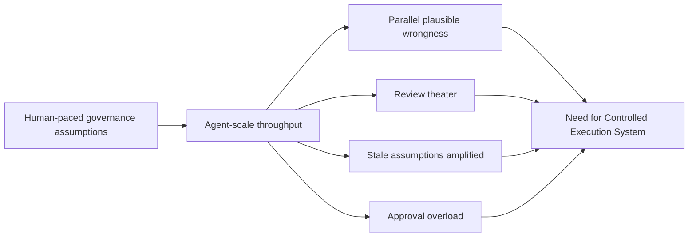
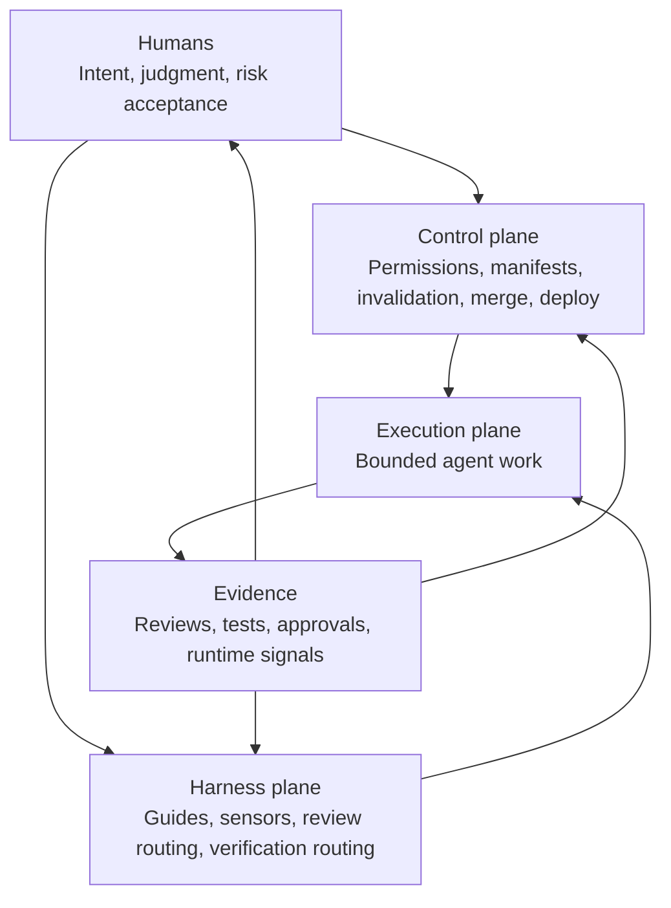
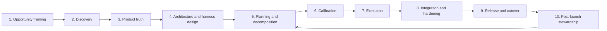
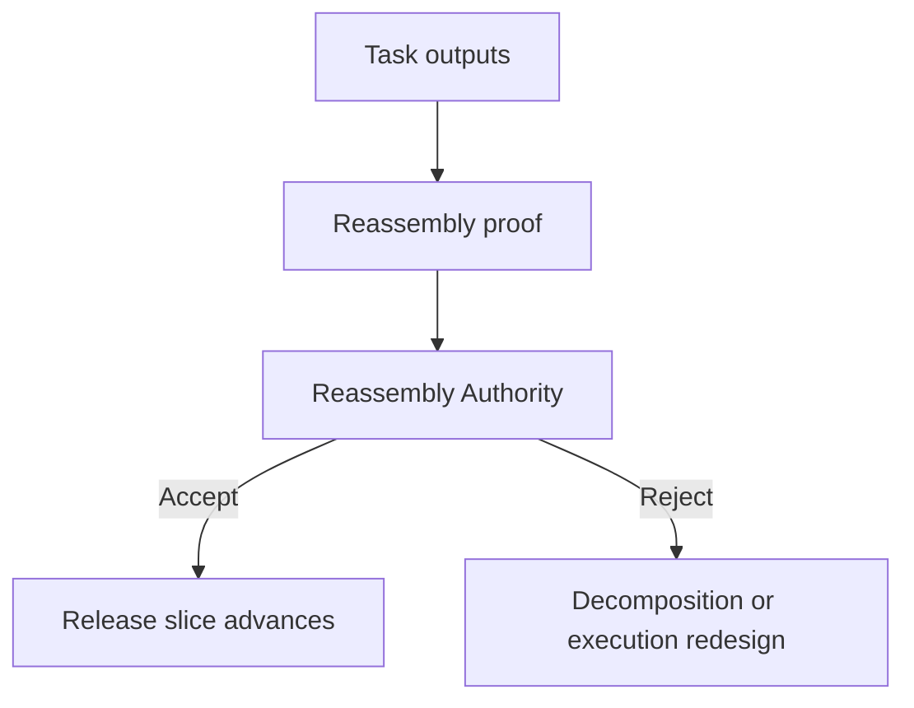
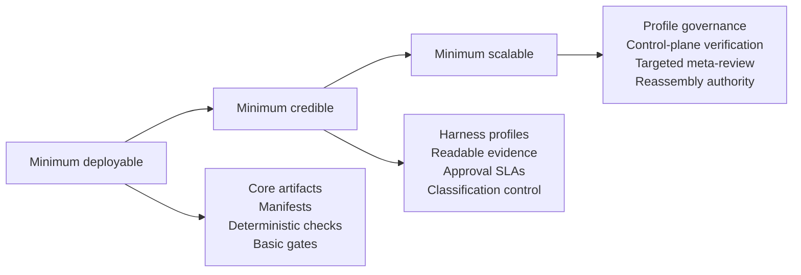
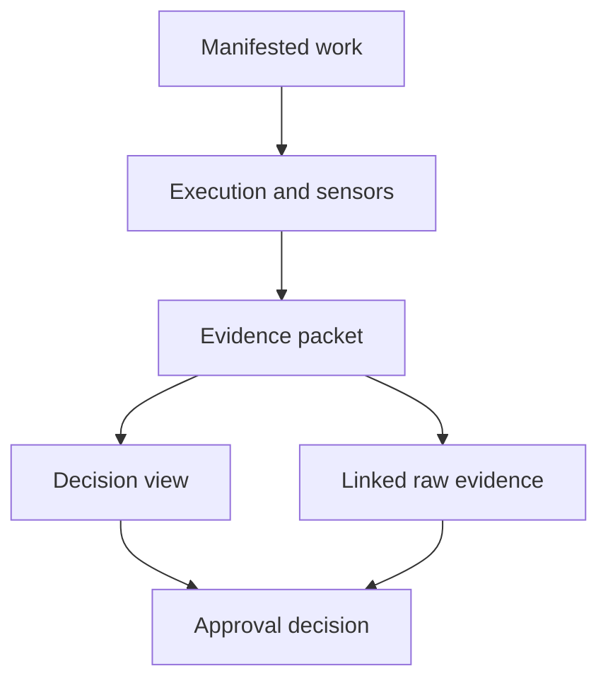
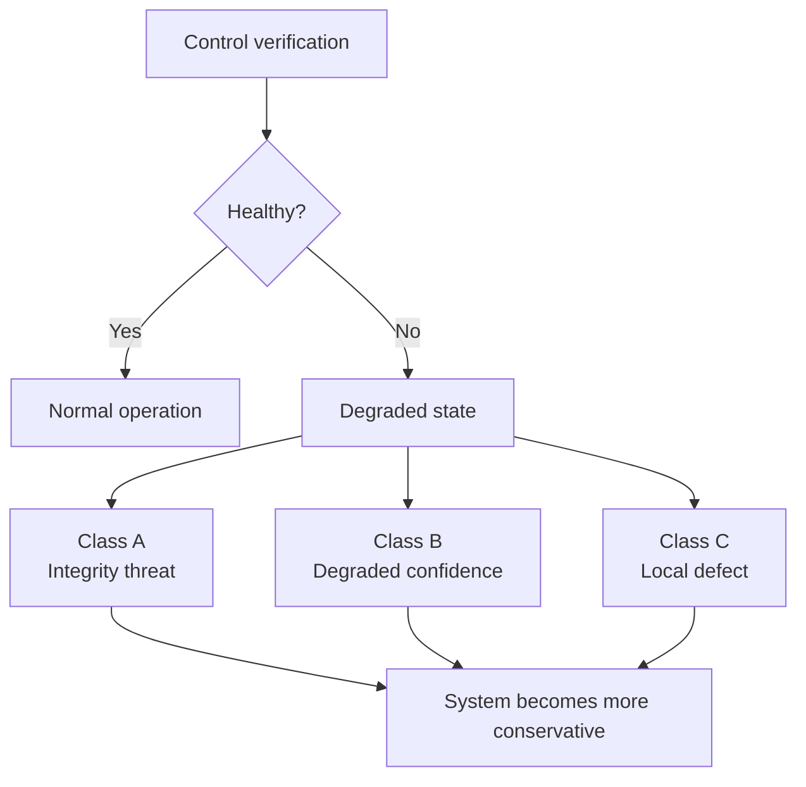
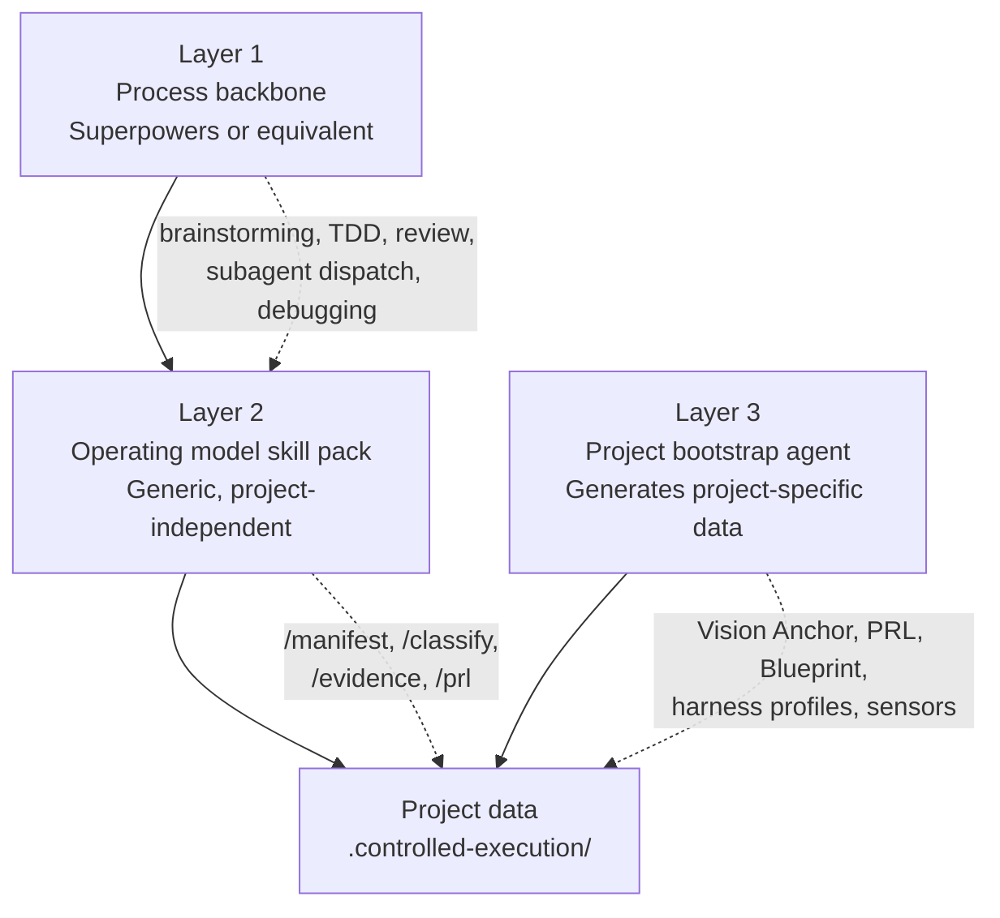

# Agent-Native Software Delivery Operating Model

> Historical product document. CES is currently published as a local builder-first CLI. References below to shared dashboards, server surfaces, or broader control-plane ambitions are design history, not the supported implementation contract.
## Controlled Execution System · v4

An operating model and product requirements document for building software delivery systems where AI agents execute and humans govern.

**Who this is for:** Engineering leaders, platform teams, and builders who want controlled throughput from AI agents — not just "more AI" but disciplined leverage with structural safety.

**Core thesis:** Software delivery fails when intent decays faster than output can be validated. Agents amplify that risk because they produce plausible work, plausible decomposition, and plausible review faster than humans can credibly supervise. The answer is not more autonomy by default. It is a stronger surrounding system: deterministic controls, explicit truth artifacts, engineered harnesses, bounded execution, strong invalidation, adversarial evidence, and concentrated human judgment where ambiguity and blast radius are highest.

> Agents execute. Harnesses regulate. Humans govern.

---

## How to read this document

This document has four parts. Read them in order, or use the builder fast path.

| Part | What it covers | Read time |
|---|---|---|
| **I. Executive Doctrine** | Why this model exists, when to use it, what leadership commits to | 10 min |
| **II. Operating Model** | Layers, roles, artifacts, lifecycle, decomposition, review, coordination | 30 min |
| **III. Control Specifications** | Harness profiles, manifests, evidence packets, approval rules, economics | 30 min |
| **IV. Implementation Guide** | What to build, artifact schemas, tool integration, quick-start path, autonomy maximization sub-agents | 25 min |

**Builder fast path:** Part I → Part IV § 4 (Quick-start) → Part IV § 5 (Sub-agents) → remaining parts as needed.

---

## Glossary

Terms are listed in dependency order: each term is defined before it is used by later terms.

| Term | Definition |
|---|---|
| **Agent** | An AI model invocation that performs bounded work (coding, reviewing, verifying, planning, or monitoring) under explicit constraints. Agents execute; they do not govern. |
| **Vision Anchor** | A short, human-authored artifact that defines target users, the problem to solve, intended value, non-goals, experience expectations, hard constraints, and kill criteria. The highest authority in the source-of-truth hierarchy. |
| **Product Requirements Ledger (PRL)** | A structured, maintained record of product truth. Each item has a unique ID, acceptance criteria, owner, priority, status, and (for brownfield work) a legacy disposition. The PRL is the single source of product-level truth. |
| **Architecture Blueprint** | An artifact that defines components, boundaries, allowed dependencies, data flows, state ownership, trust boundaries, non-functional requirements, and prohibited patterns. |
| **Interface Contract Registry** | An artifact that defines producers, consumers, schemas, versioning rules, compatibility rules, and impact scope for every governed interface. |
| **Migration Control Pack** | An artifact for brownfield or hybrid work that defines current-state inventory, disposition rationale, source-of-record designation, golden-master traces, reconciliation rules, coexistence plan, cutover plan, rollback matrix, and exit criteria. |
| **Truth artifact** | Any artifact that defines what should be built, preserved, or changed. The five truth artifacts are: Vision Anchor, PRL, Architecture Blueprint, Interface Contract Registry, and Migration Control Pack. Changes to truth artifacts invalidate downstream execution assumptions. |
| **Source-of-truth hierarchy** | The ranked ordering of truth and control artifacts. Higher artifacts constrain lower artifacts. Lower artifacts may not silently redefine higher ones. |
| **Harnessability** | The degree to which a codebase or domain enables useful feedforward guides and feedback sensors. Strongly typed, well-modularized codebases with clear contracts have high harnessability. Legacy monoliths with implicit behavior have low harnessability. |
| **Feedforward guide** | A control that shapes agent behavior before generation: rules, references, examples, negative examples, architectural constraints, tool restrictions, and definition-of-ready/done references. Guides increase the probability that the agent gets it right on the first pass. |
| **Feedback sensor** | A control that examines agent output and triggers correction or escalation. Sensors are either computational (deterministic: tests, linters, type checks, contract validators) or inferential (model-based: semantic review, framing-independent challenge). |
| **Harness** | The complete outer control system around an agent. A harness consists of feedforward guides, feedback sensors, self-correction structure, review routing, and verification routing. |
| **Harness profile** | A formal control contract that binds a specific combination of guides, sensors, review policies, self-correction limits, merge rules, deployment rules, and routing rules to a task class. Profiles are versioned and governed. |
| **Guide Pack** | The assembled set of feedforward materials (truth artifact slices, examples, negative examples, constraints, tool instructions) delivered to an agent for a specific task. Built by the Guide Pack Builder from the harness profile and upstream artifacts. |
| **Sensor Pack** | The assembled set of feedback sensors (computational and inferential) that will evaluate agent output for a specific task. |
| **Steering loop** | The human-led cycle of observing harness failures, diagnosing root causes, and improving guides, sensors, or templates to prevent recurrence. The harness improves over time through the steering loop, not through agent self-improvement. |
| **Steering Backlog** | A queue of required harness improvements generated by repeated defects, reviewer misses, escapes, or operator pain. |
| **Task manifest** | The core execution artifact. A signed contract that defines scope, authority, boundaries, dependencies, budgets, review path, stop conditions, and the assigned harness profile for a single task. No meaningful work runs without a manifest. |
| **Evidence packet** | The core approval artifact. Contains a readable decision view (structured summary) and linked raw evidence (test logs, review outputs, replay diffs). Approval without an evidence packet is not a control. |
| **Decision view** | The human-readable summary within an evidence packet. Must be concise, adversarially candid, and must disclose retries, skipped checks, summarized context, exceptions, and disagreements. |
| **Risk tier** | A classification of blast radius and ambiguity. Tier A: high blast radius or high ambiguity. Tier B: moderate risk with bounded effects. Tier C: low-risk local work. |
| **Behavior confidence class (BC)** | A classification of how well-specified and testable the required behavior is. BC1: well-specified and strongly testable. BC2: mostly specified with semantic interpretation risk. BC3: ambiguous, experiential, or domain-subtle enough that human judgment remains heavily load-bearing. |
| **Change class** | A classification of what kind of change is being made (Class 1–5), used alongside risk tier and BC to determine the full control posture. |
| **Control plane** | The deterministic governance layer that does not depend on agent judgment. Owns permissions, manifests, workflow state, invalidation, merge control, deployment control, approvals, audit logging, kill switch, and self-verification. |
| **Harness plane** | The engineered outer system that shapes agent behavior and tests agent output. Owns guides, sensors, self-correction structure, review routing, verification routing, recurring-failure detection, and profile trust governance. |
| **Execution plane** | The layer where agents perform bounded work under the constraints of the control plane and harness plane. Agents may analyze, decompose, implement, test, review, verify, and support migration. They may not redefine the system of control. |
| **Invalidation** | The process of marking downstream work as no longer valid because an upstream truth or control artifact has changed. Invalidation is core infrastructure, not an administrative annoyance. |
| **Reassembly** | The process of combining separately-produced task outputs into a coherent release slice. Multi-agent delivery often fails in reassembly rather than local execution. |
| **Reassembly Authority** | A named authority (human-backed for Tier A or BC3 work) responsible for accepting or rejecting assembled release slices. |
| **Review theater** | The appearance of rigorous review without the substance. Reviews that are structurally complete, well-formatted, and confident but fail to challenge the underlying assumptions or catch real defects. The single most dangerous failure mode in agent-operated systems. |
| **Governance theater** | The appearance of rigorous governance without the substance. Using the vocabulary of the model (harness profile, evidence gate, invalidation) while those controls are not actually enforced. |
| **Observed Legacy Behavior Register** | A brownfield-specific artifact that records behaviors inferred from legacy code, tests, and traces. Distinct from the PRL. Observed behaviors require explicit human disposition (preserve/change/retire/investigate) before they may influence execution or become PRL items. |
| **Control enforcement class** | One of three levels of enforcement strength: hard-enforced (deterministic, cannot bypass), detective (post-hoc, logs violations), or advisory (guidance, no enforcement). No autonomy expansion may rely solely on detective or advisory controls. |
| **Project Knowledge Vault** | A Zettelkasten-structured, agent-maintained, markdown-based knowledge base that serves as the long-term memory layer for agent sessions. Stores decisions, patterns, escape analyses, discovery knowledge, calibration learnings, and domain context. Informational, not governing — truth artifacts constrain; the vault informs. |
| **Intake Interview** | A structured question-gathering protocol that runs at the start of each lifecycle phase. Questions are asked one at a time, sequentially. Prevents hallucinated gap-filling by requiring agents to ask rather than guess. Unanswered questions are blocked, flagged as explicit assumptions, or logged. |
| **Agent Gate** | A phase gate where a qualified agent (different from the work producer) evaluates gate criteria and makes the pass/fail/escalate decision. Subject to meta-review, model diversity, and anti-gaming controls. Used for qualifying low-risk work with Trusted profiles. |
| **Hybrid Gate** | A phase gate where an agent performs full evaluation and produces a recommendation with evidence, and a human reviews the recommendation and decides. Faster than a pure Human Gate because the human judges a prepared evaluation rather than investigating from scratch. |
| **Hidden check** | A verification test that is not disclosed to the executing agent. Used to detect whether agents are optimizing for visible checks rather than actual correctness. Hidden checks must be rotated to remain effective. |
| **Escape** | A defect that passes through all review and verification layers and reaches production. Every escape must be traced back through the layers that should have caught it. |
| **Kill switch** | A mechanism that halts defined classes of activity immediately under pre-defined conditions (invalidation engine failure, unexplained truth drift, recursive delegation explosion, etc.). |
| **Meta-review** | A review of the approval process itself: sampling approvals to test whether evidence was actually read and whether decision quality was credible. |
| **Minimum deployable** | The smallest version of the system that is real enough to begin using. |
| **Minimum credible** | The smallest version that is strong enough to trust beyond narrow bounded cases. |
| **Minimum scalable** | The smallest version that can handle meaningful throughput growth without collapsing into theater or queue failure. |

---

# Part I — Executive Doctrine

## At a glance



## 1. Why this exists

Ordinary engineering governance was designed for human-paced execution.
It assumes:

- decomposition happens at a human speed
- review volume grows at a human speed
- requirements drift stays visible long enough to react to it
- local plausibility and global coherence do not diverge too quickly
- human approvers can keep up with the rate of consequential decisions

Those assumptions weaken under agentic delivery.

Agents do not merely write code faster. They accelerate:

- decomposition
- proposal generation
- task issuance
- retries
- review generation
- documentation generation
- recombination pressure

That creates a distinctive failure pattern:

- more things look complete
- more things look reviewed
- more things look tested
- but product truth, architectural coherence, and operational safety decay faster than traditional governance can detect

The result is not disciplined leverage. It is high-speed plausible wrongness.

This model exists to prevent that.

---

## 2. The central claim

Software delivery fails when intent decays faster than output can be validated.

Agent-native delivery raises that risk because agents:

- optimize local task completion rather than product coherence
- hallucinate when truth is incomplete or ambiguous
- lose durable judgment across sessions
- produce persuasive review output that may be shallow or misframed
- can generate more supposedly-ready work than humans can credibly inspect
- can recursively delegate and retry in ways that explode cost and latency

Therefore:

> the answer is not “more autonomy” by default.
>
> the answer is stronger control, stronger harnesses, stronger invalidation, and more disciplined concentration of human judgment.

---

## 3. What this model changes

This model makes six strategic moves.

### 3.1 It separates governance from execution

Humans govern.
Deterministic systems enforce.
Harnesses shape and test.
Agents execute bounded work.

If those layers collapse into one another, control degrades.

### 3.2 It treats harness engineering as first-class

The outer system around the agent matters as much as the model.
This includes:

- feedforward guides
- feedback sensors
- review structure
- self-correction limits
- hidden checks
- post-release observation
- mechanisms for hardening the harness when failures repeat

### 3.3 It treats invalidation as core infrastructure

In agentic systems, stale assumptions become dangerous faster.
That makes invalidation a central operating capability rather than an administrative annoyance.

### 3.4 It treats human review as a scarce governed resource

More output is not success if humans cannot credibly review the consequential parts.
Review capacity is a system constraint.

### 3.5 It treats autonomy as earned

Autonomy should expand only where evidence shows the harness is regulating the work effectively. This applies not only to task execution but to phase gates themselves: agent-delegated phase gates (Part II § 16.7) are the next evolution of earned autonomy beyond auto-merge.

### 3.6 It treats governance theater as a primary risk

The greatest danger is often not visible failure.
It is teams learning how to satisfy the control surface cosmetically while semantic quality, judgment quality, and real accountability quietly degrade.

---

## 4. Non-negotiable principles

### 4.1 Intent is human-owned
Agents may analyze, challenge, or clarify intent.
They may not define final product truth.

### 4.2 Truth must be explicit
If something matters, it must exist as a maintained artifact.
If it exists only in prompts, memory, or conversation, it is not governed.

### 4.3 Meaningful work requires explicit scope
No meaningful work should run without a manifest that defines scope, authority, dependencies, budgets, review path, and stop conditions.

### 4.4 Meaningful work requires explicit harnessing
If work matters enough to merge, release, or influence truth, it needs guides and sensors.
Bare prompting is not an operating model.

### 4.5 Authority follows blast radius
The wider the effect and the harder the rollback, the tighter the discretion.

### 4.6 Upstream truth invalidates downstream assumptions
If truth changes, dependent work must be re-evaluated.
That is integrity, not waste.

### 4.7 Review must challenge reality, not aesthetics
A change is accepted only when it survives evidence-based challenge.

### 4.8 Repeated failures are harness failures
If the same class of failure recurs, the outer system must change or the organization is not learning.

### 4.9 Humans are part of the failure model too
Approvers rubber-stamp.
Leaders bypass process.
Evidence packets become unreadable.
Political overrides occur.
This operating model must govern those realities instead of pretending they do not exist.

### 4.10 Vocabulary is not enforcement
An organization does not have this model because it uses words like:

- harness profile
- BC3
- invalidation
- evidence gate
- control plane

It has this model only where those controls are measurably enforced.

---

## 5. When to use this model

This model is worth adopting when:

- agent throughput is high enough that ordinary review is becoming unreliable
- decomposition quality is becoming harder to trust than implementation quality
- product truth changes often enough that stale downstream work is dangerous
- multiple teams or workstreams need common governance rather than just common prompts
- brownfield or hybrid work makes semantic drift especially expensive
- leadership wants controlled throughput, not merely visible output

### 5.1 Choosing the right first project

The model is best learned on a real project, not a toy, but not the most critical system in the organization either.

Prefer a project that:

- has moderate complexity (Tier B dominant, with some Tier A work)
- has at least one domain with high harnessability (strong typing, clear boundaries, good test coverage)
- has a Product Owner willing to actively maintain the PRL
- has enough scope to exercise the full lifecycle (Phases 1–10) but not so much scope that the team is overwhelmed before learning the controls

Avoid starting with:

- a pure BC3 project (experiential, hard to verify — the hardest case for the model)
- a pure brownfield migration (discovery overhead is high and distracts from learning the control system)
- the organization's most politically sensitive or revenue-critical system (adoption mistakes will be punished rather than learned from)

The goal of the first project is to learn the model and calibrate the harness, not to prove the model on the hardest possible case. Once the team reaches minimum credible on a moderate project, they will have the judgment to extend to harder domains.

---

## 6. When not to use this model

This model is a bad fit when:

- requirements are mostly verbal and nobody will maintain truth artifacts
- the organization cannot enforce execution boundaries
- human approvers do not actually review evidence
- architecture is too chaotic to describe even approximately
- releases are routinely bypassed through personal influence or political urgency
- observability is too weak to learn from escapes
- the real goal is “more AI” rather than controlled throughput

In those environments, a lighter and more honest model is preferable.

---

## 7. What leadership is actually signing up for

Adopting this model means accepting all of the following:

- product truth must be maintained as an operating asset
- invalidation must be accepted even when it is painful
- review quality must be measured, not assumed
- some speed must be sacrificed in low-harnessability or high-ambiguity domains
- exceptions and overrides must be logged rather than normalized quietly
- humans must be willing to reject polished but weak work
- governance itself must be inspected for theater

If leadership wants the appearance of rigor without the discipline of enforcement, this model will fail.

### 7.1 Overcoming adoption resistance

Every role in the organization has a reason to resist this model. Acknowledging and addressing those reasons is part of adoption, not an obstacle to it.

**Engineers resist overhead.**
Start at minimum deployable. Most controls bootstrap on tools engineers already use (branch protection, CI checks, PR templates). The additional overhead at minimum deployable is: one YAML manifest per task and one structured evidence summary per Tier A merge. That is 15–30 minutes per task, not hours.

**Product owners resist PRL maintenance.**
The PRL replaces the work of repeatedly re-explaining requirements when agents misunderstand them. Maintaining the PRL is less total effort than correcting agent hallucinations after the fact. If the PRL feels like busywork, it is probably too detailed for low-risk items or too vague for high-risk items.

**Reviewers resist evidence packets.**
The decision view exists precisely so reviewers do not have to read raw evidence. If evidence packets are unreadable, that is an evidence design failure (Anti-pattern 2), not a reason to abandon evidence.

**Teams resist invalidation.**
Invalidation feels like wasted work. But executing against stale truth produces work that will be reworked anyway. The only question is whether you discover the misalignment before or after merge. Before is cheaper.

**Leadership resists slowing down.**
The model does not slow down everything. It concentrates overhead on high-risk work. Tier C / BC1 work flows with minimal friction. The slowdown is proportional to the risk being managed. If leadership experiences the model as uniformly slow, classification is probably too aggressive (Anti-pattern 1).

---

## 8. What makes this different from “good engineering hygiene”

A fair objection is that this is just rigorous software engineering with agent wrappers.
That is wrong for six reasons.

### 8.1 Parallel plausible wrongness becomes a first-order risk
Many locally plausible fragments can be produced before anyone notices they do not cohere.

### 8.2 Review theater becomes more dangerous than implementation sloppiness
The problem is not only bad code.
It is credible-looking review that fails to challenge the underlying issue.

### 8.3 Invalidation becomes central
Human systems often tolerate slack between truth change and execution.
Agent-native systems amplify the cost of stale assumptions so much that invalidation becomes core infrastructure.

### 8.4 Harness adaptation becomes part of delivery itself
The system must improve its outer controls as failures recur.
This is not side work.

### 8.5 Human review quality becomes a governed bottleneck
Agentic systems can generate more supposedly-finished work than humans can credibly inspect.
That makes review quality and approval design part of the operating model itself.

### 8.6 Control-plane correctness becomes a real concern
Once governance depends on manifests, invalidation, routing, and merge control, the control system itself becomes a thing that must be verified rather than trusted implicitly.

---

## 9. The three adoption levels leaders must distinguish

One common failure is acting as though the system is “adopted” when only fragments exist.

### 9.1 Minimum deployable
The smallest version that is real enough to begin using.

### 9.2 Minimum credible
The smallest version that is strong enough to trust beyond narrow bounded cases.

### 9.3 Minimum scalable
The smallest version that can handle meaningful throughput growth without collapsing into theater or queue failure. Agent-delegated phase gates (Part II § 16.7) and the Intake Interview Protocol (Part II § 7.0) are minimum-scalable capabilities; they should not be adopted at minimum deployable.

Leaders should never confuse these levels.

Detailed requirements for each level are specified in Part III § 2.

---

## 10. Failure signs

This model is being applied poorly when:

- every task becomes high risk and the system stalls
- evidence packets become unreadable archives
- inferential review is used everywhere because deterministic controls were never built
- templates multiply faster than trust in them
- truth artifacts lag behind execution
- hidden checks become predictable and are gamed
- human approvals become fast but shallow
- human approvals become slow and teams route around them
- dashboards look healthy while behavior escapes rise
- teams use the vocabulary of the model while bypassing its actual costs

---

## 11. Graceful degradation: when to scale back

This model is not all-or-nothing. If the overhead exceeds the value, the answer is not to abandon governance. It is to scale back to a level the team can sustain honestly.

### Signs the model is too heavy for the current situation

- governance overhead ratio (§ 13.3 of Part II) exceeds 40% of total delivery time and is not declining
- PRL maintenance consistently lags execution by more than one cycle despite reasonable effort
- approval queues persistently exceed SLA and the team has already tried reducing Tier A volume
- the team uses the vocabulary but has stopped enforcing the substance — and nobody has the energy to fix it
- the ROI metrics (§ 13.3 of Part II) show the control system catching fewer defects than it costs to operate

### How to scale back

**From minimum scalable to minimum credible:** Drop profile sprawl controls, control-plane verification, cross-metric anti-gaming, and reassembly authority. Keep harness profiles, evidence packets, classification control, and approval SLAs.

**From minimum credible to minimum deployable:** Drop harness profiles, hidden checks, meta-review, and routing rules. Keep manifests, deterministic sensors, merge gates, evidence packets for Tier A, basic invalidation, and named approver roles.

**From minimum deployable to lighter model:** If the team cannot sustain even minimum deployable, this model is not the right fit (see § 6). Use a lighter governance approach: branch protection, CI checks, code review, and honest acknowledgment that agent output is not governed. That is more honest than a control system nobody enforces.

### Rules for scaling back

- scaling back must be an explicit decision, not a quiet drift
- the decision must be recorded in the Audit Ledger with rationale
- the team must identify which adoption level they are now operating at
- scaling back does not mean the team failed; it means the team is being honest about its capacity
- the team should revisit the decision after stabilizing at the lower level

---

## 12. Final executive rule

If the document sounds more rigorous than the actual enforcement behind it, the organization is already drifting into governance theater.

---

# Part II — Operating Model

## 1. Operating architecture

The Controlled Execution System has three layers.



### 1.1 Control plane

Deterministic governance that does not depend on agent judgment.

The control plane owns:

- permissions
- task issuance
- manifests
- workflow state transitions
- invalidation
- merge control
- deployment control
- approval recording
- audit logging
- kill-switch behavior
- control-plane self-verification

### 1.2 Harness plane

The engineered outer system that shapes agent behavior and tests agent output.

The harness plane owns:

- feedforward guides
- feedback sensors
- self-correction structure
- review routing
- verification routing
- recurring-failure detection
- outer-system improvement over time
- profile trust governance

### 1.3 Execution plane

The execution plane is where agents perform bounded work under the constraints of the first two layers.

Agents may:

- analyze
- decompose
- implement
- test
- review
- verify
- support migration

Agents may not redefine the system of control under which they operate.

---

## 2. Authority model

### 2.1 Human roles

### Product Owner
Owns product intent, PRL content, priorities, ambiguity resolution, and high-risk business acceptance.

### Architecture Approver
Owns structural acceptance, architecture changes, and contract-impacting technical decisions.

### Design Approver
Owns experiential coherence, UX risk acceptance, and design exceptions.

### Ops Approver
Owns release approval, rollback approval, environment safety, and operational exceptions.

### Migration Approver
Owns preserve/change/retire decisions in ambiguous brownfield domains, source-of-record changes, and cutover approval.

### Risk / Compliance Approver
Owns domain-specific regulatory or policy gates where required.

### Classification Authority
Owns or validates final classification for:

- risk tier
- behavior confidence class
- change class
- whether work is maintainability-heavy, architecture-heavy, or behavior-heavy

This role may be delegated, but not to the direct implementer of the work.

### Small-team role consolidation

The authority model above names 7 human roles.
Most teams have 3–5 people.
The model must work for them without collapsing into theater.

**Minimum viable role separation (3 people):**

| Person | Consolidated roles | Key constraint |
|---|---|---|
| Person A | Product Owner + Design Approver | May not classify their own PRL items for risk tier |
| Person B | Architecture Approver + Classification Authority | May not approve their own architecture proposals |
| Person C | Ops Approver + Migration Approver | May not approve deployments of code they implemented |

**Non-negotiable separation rules even at minimum team size:**

- the person who implements a task may not be the sole approver of that task
- the person who classifies a task may not be the person whose review burden changes as a result
- the person who authors a PRL item may not be the sole reviewer of evidence against it
- if only 2 people are available, the second person must review before merge for any Tier A or BC3 work; Tier C / BC1 work may self-merge with post-merge review within 24 hours (this is the 2-person rule; for normal teams with 3+ people and Trusted profiles, the full autonomous execution path in § 16.5 applies)

**When the team is 1 person:**

A solo builder cannot achieve true role separation.
The model degrades to: mandatory manifests, mandatory evidence packets, mandatory post-merge self-review within 24 hours, and mandatory calibration.
This is not the full model. It is the minimum that prevents the most dangerous failure modes (unmanifested work, invisible assumptions, untested harness).

### 2.2 Deterministic control components

### Policy Engine
Enforces role permissions, file boundaries, tool boundaries, environment restrictions, and irreversible-action controls.

### Manifest Service
Creates, signs, validates, expires, and invalidates manifests and approval packets.

### Scheduler
Determines what may run next based on readiness, budgets, concurrency caps, dependency state, review capacity, and exception state.
Scheduling rules, routing thresholds, and economic constraints are specified in Part III § 10.

### Invalidation Engine
Traces dependencies and invalidates downstream work when upstream artifacts change.

### Merge Controller
The only component allowed to merge into governed branches.

### Deploy Controller
The only component allowed to promote artifacts across environments.

### Approval Engine
Checks evidence completeness and records approval decisions.

### Audit Ledger
Maintains an append-only record of work, approvals, invalidations, exceptions, merges, releases, rollbacks, and harness changes.

### Kill Switch
Stops defined classes of activity immediately under pre-defined conditions.

### Agent Independence Validator
Before routing a task to a review, triage, or approval agent, checks the agent chain of custody against the proposed agent's identity. Rejects same-agent and same-model review when `reviewer_diversity_required` is set. Logs all rejections in the Audit Ledger with `event_type: independence_violation_blocked`.

### Control Verification Service
Checks whether the control system itself is behaving correctly by sampling manifest lineage, invalidation behavior, approval freshness, merge provenance, and audit completeness.

### 2.3 Harness components

### Harness Registry
Stores versioned harness profiles, guide packs, sensor packs, templates, review policies, and hidden challenge assets.

### Guide Pack Builder
Builds the task-specific feedforward package from approved upstream assets and relevant Project Knowledge Vault entries (§ 15A.6). The builder queries the vault for notes matching the task's affected files, PRL items, and domain tags, and includes note summaries in a dedicated `knowledge_context` section.

### Sensor Orchestrator
Runs required sensor stacks and governs bounded self-correction loops.

### Harness Metrics Service
Measures guide effectiveness, sensor yield, review quality, false positives, escapes, recurring failure patterns, and profile trust quality.

### Template Library
Provides approved harness templates by service class, operating mode, and risk class.

### Steering Backlog
Captures required harness improvements driven by repeated defects, reviewer misses, escapes, or operator pain. Each Steering Backlog entry should have a corresponding knowledge vault note (§ 15A) capturing the rationale and context behind the improvement.

### 2.4 Control enforcement classes

Every control in this model belongs to one of three enforcement classes. These classes determine what level of trust can be built on the control.

| Enforcement class | Definition | Examples | Autonomy implications |
|---|---|---|---|
| **Hard-enforced** | Deterministic, machine-enforced, cannot be bypassed by agents or humans without a logged exception. | Merge Controller blocks merge without evidence packet. Control plane rejects draft artifacts for governance. Kill switch halts execution on integrity events. Manifest signature validation. | Autonomy expansion may rely on hard-enforced controls. |
| **Detective** | Post-hoc verification that logs violations after the fact. Can be evaded in real time but creates an audit trail. | Meta-review sampling. Hidden checks. Post-merge diff scanning for boundary violations. Staleness detection. | Autonomy expansion must NOT rely solely on detective controls. Detective controls must be paired with at least one hard-enforced control on the same risk surface. |
| **Advisory** | Guidance that shapes agent behavior but has no enforcement mechanism. Depends on agent compliance. | Guide pack instructions. Negative examples. Prompt-based boundary enforcement. Naming conventions. | Advisory controls provide no governance guarantee. They reduce defect probability but cannot prevent deliberate or accidental violations. |

**Rule:** No autonomy expansion (trust promotion, auto-merge eligibility, agent gate assignment) may be granted based solely on detective or advisory controls. At least one hard-enforced control must cover the same risk surface before autonomy can be earned.

**Tagging convention:** When this document describes a control, it should be understood in terms of these classes. Controls that are described as "must" or "required" should be implemented as hard-enforced where technically feasible, and as detective with compensating hard-enforced controls where not.

---

## 3. Agent roles

### Planning Agent
Proposes work breakdowns, sequencing, and task boundaries. Cannot approve its own decomposition.

### Discovery Agent
Performs codebase analysis, dependency mapping, schema extraction, trace analysis, behavioral inventory, and harnessability assessment. Discovery findings that are too rich for structured YAML are written to the Project Knowledge Vault (§ 15A) under the `discovery/` category.

### Architecture Agent
Proposes design, contract structure, migration approach, and verification strategy. Cannot self-approve architecture.

### Builder Agent
Implements bounded code, tests, docs, mappings, and configuration changes within manifest boundaries.

### Reviewer Agent
Performs independent challenge review using separate context. Cannot merge or deploy.

### Verification Agent
Runs formal, hidden, replay, mutation, differential, and release-readiness checks.

### Migration Agent
Performs bounded migration support work such as mapping, replay, reconciliation support, and shadow comparison. Cannot cut over or retire systems.

### Monitoring Agent
Analyzes runtime behavior, incidents, cost, latency, review quality, and harness drift. Cannot authorize unsafe remediation. Writes escape analyses, production observations, and metric anomalies to the Project Knowledge Vault (§ 15A) under `escapes/` and `domain/` categories.

### Harness Agent
Proposes improvements to guides, sensors, templates, routing policy, and review structure based on observed failure patterns. Cannot self-approve active harness changes. All proposals must follow the Harness Agent review path (§ 10.9.8).

### 3.1 Multi-model orchestration

Different AI models have different strengths. Reasoning models are often better at planning, architecture review, and semantic decomposition. Fast models are often better at routine implementation, boilerplate generation, and straightforward review. Specialized models may outperform general models at code review, security analysis, or domain-specific tasks.

The task manifest's `model_assignment` field supports this. It can specify a model class (e.g., `reasoning`, `fast`, `specialized`) rather than a specific model, allowing the Scheduler to route to the best available model for the task class.

**Coordination rules:**

- when different models produce work that must be reassembled, the Reassembly Authority must account for model-specific failure patterns (different models hallucinate differently, miss different edge cases, and have different context-window behaviors)
- where the harness profile requires `reviewer_diversity_required: true`, the review agent must use a different model from the implementation agent; same-model review shares the same blind spots and does not constitute independent review (see § 10.9.2 for enforcement rules)

**Calibration per model:**

Each model used in production should have its own calibration baseline. A harness profile certified on one model is not automatically valid for another. When a new model is introduced, run the minimum probe set (3 tasks) under the new model before granting it production manifests. Track defect rates, hallucination rates, and cost per model version through the Harness Metrics Service.

**Model routing guidance:**

| Agent role | Recommended model class | Rationale |
|---|---|---|
| Planning Agent | Reasoning | Decomposition requires multi-step judgment |
| Discovery Agent | Reasoning or fast | Depends on codebase complexity |
| Architecture Agent | Reasoning | Design decisions require deep analysis |
| Builder Agent | Fast (BC1) or reasoning (BC2/BC3) | Match model cost to task difficulty |
| Reviewer Agent | Different from builder | Model diversity catches more defects |
| Verification Agent | Fast | Verification is often mechanical |
| Migration Agent | Reasoning | Legacy interaction requires careful analysis |
| Monitoring Agent | Fast | Pattern detection on structured data |
| Harness Agent | Reasoning | Systemic improvement requires synthesis |

This table is a starting point. Calibration results should override it when evidence shows a different assignment works better.

---

## 4. Artifact model

### 4.1 Truth artifacts

Truth artifacts define what should be built, preserved, or changed.

- Vision Anchor
- Product Requirements Ledger (PRL)
- Architecture Blueprint
- Interface Contract Registry
- Migration Control Packs

### Rule
Changes to truth artifacts invalidate execution assumptions.

### 4.2 Control artifacts

Control artifacts define what is allowed and how work is governed.

- Harnessability Assessment
- Harness Profiles
- Guide Packs
- Sensor Packs
- Templates
- Release Plan
- Task Manifests
- Approval Packets

### Rule
Changes to control artifacts invalidate pathways, permissions, review routes, or evidence requirements.

### 4.3 Working artifacts

Working artifacts are produced through execution.

- code
- tests
- docs
- configuration
- review outputs
- runbooks
- logs

### Rule
Changes to working artifacts trigger verification. They do not redefine truth or control.

### 4.4 Evidence artifacts

Evidence artifacts justify acceptance or rejection.

- test results
- hidden-test results
- review findings
- replay diffs
- reconciliation outputs
- deployment evidence
- runtime observations

### Rule
Approval without evidence is not a control.

### 4.5 Debt artifacts

Debt artifacts track known compromises that affect future work.

- Technical Debt Register

### Debt origin types

- **Inherited debt:** pre-existing in brownfield or hybrid codebases. Discovered during Phase 2 (Discovery) or during execution. Ownership defaults to the Migration Approver. Resolution timeline is governed by the Migration Control Pack.
- **Introduced debt:** created during the current project as a deliberate trade-off. Ownership is assigned at creation. Resolution timeline and conditions must be specified.
- **Discovered debt:** technical shortcomings found during execution that were not deliberate trade-offs (e.g., an agent produced a working but poorly structured solution that was accepted under time pressure). Must be logged with the accepting approver's name.

### Rule
Introduced debt without a resolution plan is not debt. It is uncontrolled degradation.

---

## 5. Source-of-truth hierarchy

Higher artifacts constrain lower artifacts.
Lower artifacts may not silently redefine higher ones.

1. Vision Anchor
2. Product Requirements Ledger
3. Architecture Blueprint
4. Interface Contract Registry
5. Migration Control Packs
6. Approved Harnessability Assessment
7. Approved Harness Profiles and Templates
8. Release Plan
9. Task Manifests
10. Working artifacts
11. Evidence artifacts and logs
12. Project Knowledge Vault (informational context — informs but does not constrain; see § 15A)

### Governance rules

- only humans may change the Vision Anchor
- only the Product Owner may approve PRL changes
- only the Architecture Approver may approve architecture changes
- contracts change only through the approved contract path
- migration packs change only through migration governance
- harness profiles, guide packs, and sensor packs must be versioned
- manifests are generated from approved upstream artifacts
- upstream changes trigger automated downstream invalidation

This hierarchy must be enforced structurally.

### Versioning model

Truth artifacts are versioned by content hash. When a truth artifact changes, its hash changes. Task manifests reference specific truth artifact hashes (`prl_slice_hash`, `architecture_slice_hash`, `contract_slice_hash`, `migration_pack_hash`). When a referenced hash no longer matches the current version of the upstream artifact, the manifest is invalid and the Invalidation Engine marks it accordingly.

This is content-addressed versioning: the identity of the artifact is its content, not a version number. This ensures that invalidation is precise (only manifests referencing the changed content are affected) and tamper-evident (any modification to a truth artifact changes its hash and triggers downstream invalidation automatically).

---

## 6. Required artifacts

### 6.1 Vision Anchor
Short, human-authored statement of:

- target user or stakeholder
- problem to solve
- intended value
- non-goals
- experience expectations
- hard constraints
- kill criteria

### 6.2 Product Requirements Ledger
Structured record of product truth.
Each PRL item must include:

- unique ID
- type
- statement
- acceptance criteria
- negative examples where relevant
- owner
- priority
- release slice
- dependencies
- last confirmed date
- status

For brownfield and hybrid work, each relevant item must also include a legacy disposition:

- preserve
- change
- retire
- under investigation
- new

### Governance rule for "under investigation" items
PRL items with "under investigation" status may not be referenced by task manifests until they are resolved to one of the other four states.
This prevents execution against requirements whose meaning is still unknown.

### 6.3 Architecture Blueprint
Defines components, boundaries, allowed dependencies, data flows, state ownership, trust boundaries, non-functional requirements, and prohibited patterns.

### 6.4 Interface Contract Registry
Defines producers, consumers, schemas, versioning rules, compatibility rules, and impact scope.

### 6.5 Migration Control Pack
Defines current-state inventory, disposition rationale, source-of-record designation, golden-master traces, reconciliation rules, coexistence plan, cutover plan, rollback matrix, and exit criteria.

### 6.6 Harnessability Assessment
Assesses:

- typing strength
- module-boundary clarity
- contract maturity
- observability quality
- automation maturity
- feasibility of deterministic sensors
- likely need for inferential review
- likely context-window pressure areas
- where templates are safe
- where templates are dangerous

### 6.7 Harness Registry
Stores versioned:

- harness profiles
- guide packs
- sensor packs
- review policies
- templates
- hidden challenge suites
- example and counterexample libraries

### 6.8 Release Plan
Maps PRL slices, architecture dependencies, migration dependencies, harness dependencies, and approval gates into a governed sequence.

### 6.9 Task Manifest
Core execution artifact.

### 6.10 Evidence Packet
Core approval artifact.

### 6.11 Technical Debt Register
Each entry must include:

- unique ID
- origin type (inherited, introduced, or discovered)
- description
- affected artifacts
- affected task classes
- severity (blocks future work / degrades future work / cosmetic)
- owner
- resolution plan reference
- resolution deadline
- accepting approver

See § 4.5 for debt origin definitions and governance rules.

---

## 7. Lifecycle



The diagram shows Phase 10 looping back to Phase 5.
Post-launch work (feature additions, defect remediation, harness improvements) re-enters the system as new planned work because it inherits the existing truth artifacts, architecture, and harness profiles established in Phases 1–4.
It needs new decomposition and manifesting, not new framing.

Re-entry to earlier phases occurs only when post-launch observations invalidate truth or architecture assumptions.
In that case, the Monitoring Agent or the control-plane verification service escalates to the appropriate phase based on which truth artifact needs revision.

### 7.0 Intake Interview Protocol

Every phase begins with an Intake Interview: a structured question-gathering session where the responsible agent asks the human everything it needs to know before starting work.

The Intake Interview is the structural mechanism that prevents hallucinated gap-filling (Anti-pattern 13).

#### 7.0.1 Core principle

Agents must never guess. When information is missing, ambiguous, or contradictory, agents must ask rather than assume. An agent that completes a task by silently filling gaps is exhibiting a control violation. The Intake Interview is the structural prevention.

#### 7.0.2 When Intake Interviews occur

- **At project start:** The Bootstrap Agent (§ 5.18) runs a full-lifecycle intake covering Phases 1–3 scope before producing any outputs.
- **At phase entry for Phases 4, 5, 6, 8, and 9:** The phase-responsible agent runs a scoped intake covering that phase's information needs before beginning work.
- **Phase 7 (Execution):** No separate intake. The manifest IS the intake output. But if a Builder Agent encounters an undecided question during execution, it must stop and ask, not guess. This stop-and-ask event is logged in the evidence packet.
- **Phase 10 (Post-launch):** Intake is triggered only when remediation or new work enters the lifecycle.

#### 7.0.3 Interview structure

Questions are asked **one at a time**, sequentially. Each answer informs the next question. This prevents cognitive overload and allows conditional branching.

The interview has three stages:

1. **Mandatory questions.** Always asked for this phase, regardless of context. These establish the baseline information the agent requires.
2. **Conditional questions.** Asked only if previous answers trigger them. Example: "You mentioned a payment flow — does it handle refunds?" Conditional questions are pre-defined per phase but only surface when relevant.
3. **Completeness check.** The agent summarizes what it now knows, lists any remaining gaps, and asks: "Is there anything else I should know before I proceed?" This gives the human an explicit opportunity to add context the agent did not think to ask about.

**Vault pre-check:** Before asking a question, the intake agent queries the Project Knowledge Vault (§ 15A) for relevant context. The vault may provide background that helps frame a better question, but it must NOT substitute for asking. Specifically:

- The vault may inform the agent's question: "In a previous session, you mentioned conservative risk appetite for this domain. Has that changed?"
- The vault must NOT answer requirement, policy, or risk-acceptance questions on behalf of the human. Those answers must come from the human or from a governing truth artifact.
- If the vault contains information that appears to answer a mandatory question, the agent must still confirm with the human. The vault is context, not authority.

**Lightweight variant for Tier C/BC1 Trusted work:** 2–3 mandatory questions plus completeness check. The full question set is available but the agent adapts to scope.

#### 7.0.4 Question categories by phase

| Phase | Mandatory categories | Conditional triggers |
|---|---|---|
| 1. Opportunity framing | Problem statement, target users, hard constraints, kill criteria, project mode | Brownfield → legacy scope questions. Regulated → compliance questions. Multi-team → coordination questions |
| 2. Discovery | Codebase access, known pain points, stakeholder map, existing documentation | Brownfield → source-of-record, data ownership. Hybrid → boundary and coexistence questions |
| 3. Product truth | Priority ranking, acceptance criteria precision, BC-sensitive areas | BC3 items → UX intent, experiential expectations. Migration → legacy disposition intent |
| 4. Architecture & harness | Tech stack constraints, team expertise gaps, NFR priorities, deployment model | External APIs → contract and SLA questions. State machines → transition and edge-case questions |
| 5. Planning & decomposition | Capacity, timeline, concurrency preferences, dependency priorities | Large plan → review capacity. Multi-agent → coordination preferences. Migration → ordering constraints |
| 6. Calibration | Risk appetite, probe preferences, model preferences | Failed probes → root cause questions. Low harnessability → compensating control preferences |
| 8. Integration & hardening | Release scope, journey coverage expectations, strategic coherence criteria | Brownfield → reconciliation expectations. Multi-slice → ordering preferences |
| 9. Release & cutover | Deployment constraints, rollback appetite, monitoring expectations | Brownfield → cutover window, coexistence duration. Canary → metric thresholds and baseline selection |

#### 7.0.5 Question format specification

Each question in the intake protocol is defined as:

- `question_id`: Unique within the phase (e.g., `P1-Q-003`)
- `text`: The question in natural language, clear enough for a non-technical stakeholder
- `category`: `mandatory` or `conditional`
- `trigger`: For conditional questions, which previous answer triggered this question
- `response_type`: `free_text`, `choice`, `confirmation`, or `numeric`
- `default_if_unanswered`: `null` (blocking) or an explicit default value
- `blocking`: `true` or `false`

#### 7.0.6 Unanswered question handling

When a question is not answered, one of three responses applies:

1. **BLOCK.** The phase cannot proceed until the question is answered. Used for questions where guessing would violate the truth artifact hierarchy or create classification uncertainty. Examples: "What is the risk tolerance for this domain?" or "Who owns the source of record for this data?"
2. **FLAG.** The phase may proceed with a logged assumption, but only for non-material assumptions. A non-material assumption is one where being wrong would not change the classification, architecture, or interface contracts. The assumption is logged in the phase artifact and evidence packet with an invalidation trigger. If the human later contradicts the assumption, the Invalidation Engine traces all downstream work. Examples: "What response time is acceptable?" (assumed: 200ms, flagged). **Material questions must BLOCK, not FLAG.** If the answer could change the risk tier, the BC class, the interface contract, or the choice of architecture component, the question is material and must use BLOCK. An agent may not use FLAG to proceed with a material assumption; this is equivalent to hallucinated gap-filling (Anti-pattern 13).
3. **PROCEED.** The question was informational; its absence does not affect correctness. Logged but not blocking. Examples: "Any preferred naming conventions?" or "Preferred test framework?"

Every flagged assumption must appear in evidence packets under a dedicated section: "Assumptions made due to unanswered intake questions."

#### 7.0.7 Assumption registry

When a question receives the FLAG response and the agent proceeds with an explicit assumption:

- The assumption is recorded in `.controlled-execution/intake/assumptions.yaml` with:
  - `assumption_id`
  - `question_id` reference
  - `phase` where the assumption was made
  - `assumed_value` (what the agent assumed)
  - `invalidation_trigger` (what would make this assumption invalid)
  - `downstream_dependencies` (manifests, tasks, or artifacts that depend on this assumption)
  - `status`: `active`, `confirmed` (human later agreed), or `invalidated` (human later contradicted)
- The Invalidation Engine monitors the assumption registry. If a human later answers the question differently than assumed, all downstream work that depended on the assumption is invalidated per the standard invalidation rules (Part III § 9).
- The Manifest Generator (§ 5.9) checks the assumption log before generating manifests. If a manifest would depend on a FLAG assumption, it notes the dependency explicitly in the manifest.

#### 7.0.8 Sub-agent intake responsibilities

| Sub-agent | Intake responsibility |
|---|---|
| Bootstrap Agent (§ 5.18) | Runs the full-lifecycle intake for Phases 1–3 at project start |
| PRL Co-Author (§ 5.1) | Runs Phase 3 intake questions before drafting PRL items |
| Architecture Oracle (§ 5.13) | Runs Phase 4 intake questions before generating architectural options |
| Self-Calibrating Harness (§ 5.8) | Runs Phase 6 intake questions before selecting probe tasks |
| Manifest Generator (§ 5.9) | Checks the assumption registry; if a manifest depends on a flagged assumption, notes the dependency |
| Evidence Synthesizer (§ 5.2) | Reports any open intake assumptions in the decision view |
| Reassembly Authority Agent | Runs Phase 8 intake questions before evaluating release coherence |
| Deploy Controller | Runs Phase 9 intake questions before constructing deployment packets |

Every sub-agent that runs an intake must log the complete question-and-answer exchange in the phase artifact. The log is available for meta-review.

#### 7.0.9 Brownfield and hybrid project additions

Brownfield and hybrid projects require additional mandatory question categories at every phase:

- **Source-of-record clarity:** "Who owns the current truth for [domain]? Where is it documented?"
- **Legacy behavior intent:** "Should [observed behavior X] be preserved exactly, or is it a candidate for correction?"
- **Migration scope:** "Is this a coexistence migration, a full replacement, or a partial extraction?"
- **Discovery confidence:** "How confident are you in the discovery results for [domain]? Are there undocumented behaviors?" (Low confidence → additional conditional questions about testing strategy and golden-master adequacy)

These brownfield questions are in addition to the standard phase questions, not replacements.

#### 7.0.9A Observed Legacy Behavior Register

When agents analyze brownfield codebases (Phase 2 Discovery), they infer behaviors from code, tests, documentation, and runtime traces. These inferred behaviors are NOT product requirements. They are observations that may include accidental bugs, workarounds, or undocumented features.

To prevent accidental promotion of bugs into requirements, inferred legacy behaviors must be stored in an **Observed Legacy Behavior Register** (`observed-behaviors.yaml`), which is a distinct artifact from the PRL.

**Register rules:**

1. **Distinct from PRL.** Observed behaviors are not PRL items. They cannot govern execution until explicitly promoted.
2. **Human disposition required.** Each observed behavior must receive an explicit human disposition before it can influence work: `preserve` (becomes a PRL item with acceptance criteria), `change` (becomes a PRL item marked for modification), `retire` (documented as intentionally removed), or `investigate` (requires further analysis before disposition).
3. **No silent promotion.** An agent may not convert an observed behavior into a PRL item without human disposition. This is a hard-enforced control.
4. **Evidence of origin.** Each register entry must record how the behavior was observed (code path, test, documentation, runtime trace) and the confidence level of the observation.
5. **Discovery Agent responsibility.** The Discovery Agent writes to the Observed Legacy Behavior Register, not to the PRL. The PRL Co-Author may propose PRL items based on register entries, but only after human disposition.

#### 7.0.10 Canonical intake rule

No agent may proceed with work that depends on information it does not have. When information is absent, the agent must: ask (preferred), assume and flag (acceptable for non-critical information), or block (required for high-risk unknowns). Silent gap-filling is a control violation.

### 7.1 Phase 1: Opportunity framing

**Owner:** Human
**Intake:** The Bootstrap Agent (§ 5.18) runs the Phase 1 intake interview (§ 7.0) before producing any outputs. Questions cover problem statement, target users, hard constraints, kill criteria, and project mode.

Outputs:

- problem statement
- target users
- success metrics
- kill criteria
- project mode
- preliminary risk classification
- agent suitability map

Gate:
**Gate type:** Per § 16.7.2 (HYBRID for Tier C/BC1 Trusted; HUMAN otherwise).
**Approver:** Product Owner.
**Criteria:** Problem statement exists and is specific. Kill criteria are defined. Project mode is chosen. Preliminary risk classification is assigned. Agent suitability map is reviewed. Intake interview complete (no BLOCK questions unanswered). The decision is: proceed, reshape, or kill.

### 7.2 Phase 2: Discovery

**Primary workers:** Discovery Agents plus humans
**Intake:** The Discovery Agent runs the Phase 2 intake interview (§ 7.0) covering codebase access, known pain points, stakeholder map, and existing documentation. For brownfield work, additional questions cover source-of-record and data ownership.

Agents may:

- inventory codebases
- map dependencies
- infer schemas
- identify stateful paths
- extract test coverage
- produce behavioral traces
- compare documentation to code reality
- assess harnessability
- suggest likely service classes and control needs

Humans must:

- resolve stakeholder disagreements
- interpret business ambiguity
- decide what matters in legacy behavior
- determine preserve/change/retire at the business level

### Stakeholder alignment protocol

When stakeholders disagree about product intent, legacy behavior disposition, or priority:

1. **Surface the disagreement explicitly.** The Discovery Agent or Product Owner must record each stakeholder's position as a structured artifact (position, rationale, evidence, affected PRL items).
2. **Time-box resolution.** Stakeholder alignment must be resolved within a defined window (recommended: 3 business days from identification). If not resolved after 3 days, the disagreement is automatically escalated to the highest authority in the source-of-truth hierarchy with a structured decision packet containing: the disagreement, each party's position with evidence, the affected PRL items, and a recommended resolution. Technical disputes escalate to the Architecture Approver. Product disputes escalate to the Product Owner. If both authorities are parties to the disagreement, escalation follows the organizational authority defined in the project configuration. If still unresolved after escalation, the affected PRL items are marked "under investigation" and no tasks may be manifested against them.
3. **Decision authority.** The Product Owner holds final authority on product-intent disagreements. The Architecture Approver holds final authority on technical-approach disagreements. The Migration Approver holds final authority on legacy-disposition disagreements. If authorities conflict, escalation follows the source-of-truth hierarchy.
4. **Record the decision.** The resolution must be recorded in the Audit Ledger with: the disagreement, the positions, the deciding authority, the rationale, and the affected artifacts.
5. **Invalidation consequence.** If stakeholder alignment reverses a previous decision, all downstream work built on the reversed decision must be invalidated.

Gate:
**Gate type:** Per § 16.7.2 (AGENT for Tier C/BC1 Trusted; HYBRID for Tier B/BC1 Trusted; HUMAN otherwise).
**Approver:** Architecture Approver.
**Criteria:** Discovery packet is complete and reviewed. Harnessability assessment is scored per domain. Stakeholder disagreements are resolved or explicitly marked "under investigation" (blocking manifesting). Service-class mapping is proposed. Intake interview complete.

### 7.3 Phase 3: Product truth authoring

**Owner:** Product Owner
**Intake:** The PRL Co-Author (§ 5.1) runs the Phase 3 intake interview (§ 7.0) before drafting items. Questions focus on priority ranking, acceptance criteria precision, and BC-sensitive areas. For brownfield work, additional questions cover legacy disposition intent.

Agents may validate the PRL for structure, consistency, coverage, contradiction risk, and testability.
Humans own content.

Gate:
**Gate type:** Per § 16.7.2 (HYBRID for Tier C/BC1 Trusted; HUMAN otherwise). Product truth remains human-owned per Principle 4.1.
**Approver:** Product Owner.
**Criteria:** PRL is accepted only when required journeys are represented, acceptance criteria are specific enough to govern work, critical ambiguities are marked, brownfield/hybrid items carry explicit legacy disposition, and no items are in "under investigation" status without an assigned resolution owner. Intake interview complete.

### 7.4 Phase 4: Architecture and harness design

**Primary worker:** Architecture Agent
**Approvers:** Architecture Approver and Migration Approver where relevant
**Intake:** The Architecture Oracle (§ 5.13) runs the Phase 4 intake interview (§ 7.0) before generating options. Questions cover tech stack constraints, team expertise gaps, NFR priorities, and deployment model.

Outputs:

- architecture blueprint
- interface contracts
- migration strategy where needed
- verification strategy
- service-class mapping
- initial harness template assignment
- explicit list of behavior-heavy domains
- explicit list of low-harnessability domains

Gate:
**Gate type:** Per § 16.7.2 (HYBRID for Tier C/BC1 Trusted; HUMAN otherwise). Architecture carries compounding downstream risk.
**Approver:** Architecture Approver + Migration Approver (if migration involved).
**Criteria:** Blueprint covers all identified components and boundaries. Interface contracts are defined for all governed interfaces. Harness profiles are assigned per service class. Verification strategy is documented. Low-harnessability domains are explicitly identified with compensating controls. Load-bearing design choices are justified in the Architecture Blueprint. Intake interview complete.

### 7.5 Phase 5: Planning and decomposition

**Primary workers:** Planning Agents
**Intake:** The Planning Agent runs the Phase 5 intake interview (§ 7.0) covering capacity, timeline, concurrency preferences, and dependency priorities.

For major epics, Tier A work, migration work, or behavior-heavy work, at least two independent planning runs are required and must be compared.

Outputs:

- work breakdown
- dependency graph
- task packages
- reassembly strategy
- review and verification strategy
- review capacity forecast
- cost and latency forecast
- harness profile assignments by task class
- proposed classifications

Gate:
**Gate type:** Per § 16.7.2 (AGENT for Tier C/BC1 and Tier B/BC1 Trusted; HUMAN otherwise). Decomposition is verifiable through semantic tests and classification is auto-validated by the Classification Oracle.
**Approver:** Classification Authority.
**Criteria:** Decomposition passes semantic tests (§ 9.2). Classifications are validated by the Classification Authority (or Classification Oracle for Agent Gates with HIGH confidence). Concurrency conflicts are resolved (no overlapping file authority). Reassembly strategy is documented. Review capacity forecast confirms the team can sustain the proposed review load. Intake interview complete. No execution begins until the plan passes evidence review and classification review.

### 7.6 Phase 6: Calibration

**Intake:** The Self-Calibrating Harness (§ 5.8) runs the Phase 6 intake interview (§ 7.0) covering risk appetite, probe preferences, and model preferences.

Representative probe tasks are executed under real constraints.
Calibration is the only point where the model tests its own harness engineering before committing to full execution.
If calibration is underspecified, it collapses into theater.

### What calibration checks

- context sufficiency
- guide quality
- sensor precision and noise
- review quality
- hidden-check effectiveness
- model fit
- template fit
- cost and latency assumptions

### Probe task selection criteria

"Representative" must mean:

- at least one probe task from the highest risk tier present in the plan
- at least one probe task from the highest behavior-confidence class present in the plan
- at least one probe task that touches the most complex dependency chain in the plan
- for brownfield or hybrid work: at least one probe task that touches legacy code

Minimum: 3 probe tasks.
For large or high-risk projects: 5–8 probe tasks.

### Evaluation criteria

Each probe task must be evaluated against:

- **functional correctness:** does the output satisfy the acceptance criteria?
- **boundary compliance:** did the agent stay within manifest boundaries?
- **hallucination absence:** did the agent invent requirements, features, or interfaces not in the spec?
- **negative-example compliance:** did the agent avoid the explicitly prohibited patterns?
- **context fidelity:** did the agent reference the correct truth artifact versions?
- **cost and latency:** are the actual token consumption and wall-clock time within the budgeted ranges?

### Redesign vs. proceed thresholds

- 0 probe tasks with significant issues: proceed
- 1 probe task with significant issues: proceed with targeted harness adjustments, re-probe the adjusted class
- 2 or more probe tasks with significant issues: do not proceed; redesign the harness profile, guide pack, or task decomposition; re-run calibration
- any probe task with a hallucinated requirement that contradicts the PRL: do not proceed regardless of other results

### Calibration evidence

Calibration results become permanent artifacts.
They inform future harness profile trust scoring (see Part III § 4.4) and provide the baseline measurements for token budget governance (see Part III § 10.4).

### Model drift and recertification

Calibration is not a one-time event.
A harness profile certified on one model version can become unsafe after an upstream model update, a provider behavior change, or a tool wrapper upgrade.

**Mandatory recertification triggers:**

- the underlying AI model changes (e.g., provider ships a new version, or the team switches from one model to another)
- the agent platform or tool wrapper changes in a way that affects context handling, tool use, or output format
- the harness profile itself changes (new guides, new sensors, new self-correction rules)
- the task class changes (new architecture, new contracts, new domain)
- calibration probe results from the previous cycle show drift (cost, defect rate, or hallucination rate changed by more than 25% from baseline)

**Recertification process:**

- re-run the minimum probe set (3 tasks) under the new configuration
- compare results to the previous calibration baseline
- if results are within baseline tolerance: update the calibration record, continue
- if results show degradation: treat as a new calibration (full probe set, full evaluation, proceed/redesign thresholds apply)

**Model-version tracking:**

Every task manifest should record the model version used.
The Harness Metrics Service should track defect rates, hallucination rates, and cost per model version.
If a model upgrade correlates with rising escapes or declining review quality, the upgrade should be rolled back or the harness profile tightened.

### Gate

**Gate type:** Per § 16.7.2 (AGENT for Tier C/BC1 Trusted; HYBRID for Tier B/BC1 Trusted; HUMAN otherwise). Calibration is a measurement activity with defined thresholds, making the proceed/redesign decision deterministic when probes pass clearly.
**Approver:** Architecture Approver.
**Criteria:** Minimum probe tasks pass per redesign/proceed thresholds above. Model fit confirmed (no systematic failures on any task class). Cost and latency assumptions validated against actuals. Intake interview complete. Humans approve only if calibration demonstrates credible control, not merely plausible output.

### 7.7 Phase 7: Execution

Agents execute bounded work through manifests.
Merges occur only through the Merge Controller.
Invalidations pause affected downstream work.
Recurring failure classes generate harness work.

Gate: per-task, controlled by the manifest contract and evidence packet. **Gate type:** AGENT for qualifying work per § 16.5 and § 16.7.2; HUMAN for Tier A, BC2+, BC3, and non-Trusted profiles. See § 10 for review model, § 10.9 for agent independence rules, and Part III § 8 for approval requirements by tier.

### 7.8 Phase 8: Integration and hardening

**Intake:** The Reassembly Authority Agent runs the Phase 8 intake interview (§ 7.0) covering release scope, journey coverage expectations, and strategic coherence criteria.

Verification becomes product-level rather than task-level.
Reassembly evidence must show behavioral coherence, not just structural completeness.
Human review must explicitly inspect where humans were compensating for weak harness controls.

Gate:
**Gate type:** Per § 16.7.2 (HYBRID for Tier C/BC1 Trusted; HUMAN otherwise).
**Approver:** Reassembly Authority (named per release slice; human-backed for Tier A or BC3 work).
**Criteria:** Structural coverage verified (all planned tasks merged). Journey completeness confirmed (end-to-end flows pass). Contract compatibility validated (no interface regression). Reassembly proof documents strategic coherence, not just structural completeness. Intake interview complete.

### 7.9 Phase 9: Release and cutover

**Intake:** The Deploy Controller runs the Phase 9 intake interview (§ 7.0) covering deployment constraints, rollback appetite, monitoring expectations. For brownfield work, additional questions cover cutover window and coexistence duration.

All production promotion occurs through approved deployment packets.
Brownfield and hybrid cutovers require Migration Control Pack readiness and explicit human authorization.

#### Brownfield and hybrid cutover governance

Migration cutovers are the highest-risk phase of brownfield work. The following rules apply in addition to normal release governance:

**Pre-cutover requirements:**

- reconciliation validation passes: the new system produces identical results to the legacy system for all golden-master traces defined in the Migration Control Pack
- coexistence routing is verified: traffic can be directed to either system without data loss
- rollback matrix is tested: every rollback scenario in the Migration Control Pack has been exercised in staging
- legacy system remains operational and accessible throughout the cutover window

**Reconciliation failure response:**

If a reconciliation check fails during execution or at the cutover gate:

1. **Halt cutover.** The Migration Approver must authorize any further progress. No partial cutover is permitted without explicit exception (§ 12).
2. **Diagnose.** Determine whether the discrepancy is: (a) a genuine behavioral divergence (the new system does something different), (b) a data issue (the test data does not match production reality), or (c) a golden-master deficiency (the golden master does not capture the relevant behavior).
3. **Route by diagnosis.** If (a): the task returns to Phase 7 for correction. If (b): the test data is updated and reconciliation re-runs. If (c): the golden master is updated, the PRL is reviewed for completeness, and reconciliation re-runs.
4. **Re-gate.** After correction, the full cutover gate criteria must be re-verified.

**Cutover rollback and legacy availability:**

- The legacy system must remain operational and capable of serving production traffic for a defined coexistence window after cutover. The window duration is specified in the Migration Control Pack's `coexistence_plan.duration` field. Default: 2 weeks minimum, or one full release cycle, whichever is longer.
- During the coexistence window, all production traffic metrics are compared between legacy and new systems. The new system must meet or exceed the legacy system's performance baselines.
- Rollback during the coexistence window must be achievable within the rollback SLA defined in the Migration Control Pack's `rollback_matrix`. The rollback must restore the legacy system to full production operation without data loss.
- After the coexistence window, the Migration Approver authorizes legacy retirement. Retirement requires: all exit criteria in the Migration Control Pack are met, no open reconciliation failures, and the Audit Ledger records the retirement decision.

Gate:
**Gate type:** Per § 16.7.2 (HYBRID for Tier C/BC1 Trusted; HUMAN otherwise). Deployment carries production risk regardless of tier.
**Approver:** Ops Approver (+ Migration Approver for brownfield/hybrid).
**Criteria:** Rollback plan verified and tested. Deployment evidence packet complete. Staged rollout plan defined with canary metrics and automatic rollback thresholds. Intake interview complete. For brownfield/hybrid: Migration Control Pack readiness confirmed, reconciliation validation passes, legacy system operational and accessible, coexistence window defined.

### 7.10 Phase 10: Post-launch stewardship

**Gate type:** Per § 16.7.2 (AGENT for Tier C/BC1 Trusted; HYBRID for Tier B/BC1 Trusted; HUMAN otherwise). Post-launch monitoring is primarily observational; agents evaluate metrics against defined thresholds and escalate anomalies.

Monitoring agents observe and analyze.
Humans decide on remediation, rollback, scaling, further rollout, or shutdown.
Escaped failures feed back into the steering loop. Every escape analysis, production behavior observation, and remediation decision is written to the Project Knowledge Vault (§ 15A) so that agents in future sessions have access to the accumulated learnings.

### Harness learning cycle

At the end of each release cycle, the Harness Agent must produce a harness effectiveness report that maps:

- which agent configurations (model, temperature, guide pack, sensor pack) produced the lowest defect rates for which task classes
- which task classes consumed disproportionate review or verification resources
- which guide packs or sensor packs underperformed their trust scores
- which self-correction loops resolved issues effectively vs. which burned budget without converging

This report feeds the Steering Backlog (§ 2.3) and directly informs harness profile trust scoring (Part III § 4.4).

Agent configuration recommendations for the next cycle should be evidence-based, not assumption-based.
If a specific model performs better on BC2 architecture tasks, that should be recorded and reused.

### Escape analysis

When a defect escapes all review layers and reaches production, the escape must be traced back through every layer that should have caught it.

The trace must determine whether the failure was:

- a **sensor gap** (needs new sensor)
- a **guide gap** (needs better feedforward)
- a **review-framing gap** (needs framing-independent review)
- a **fundamental harnessability limit** (needs human review at that point)

Escape analysis is not a blame exercise.
It is the primary input for harness improvement and the strongest check against the system calcifying around its initial design.

### Escape severity tiers

Not all escapes are equal. Severity determines the contraction response and the urgency of harness remediation.

| Severity | Definition | Examples | Contraction response |
|---|---|---|---|
| **Severity 1 (Critical)** | Data loss, security breach, compliance violation, or safety hazard | Unauthorized data exposure, financial miscalculation, credential leak, regulatory violation | Immediate halt of the affected task class. Governing harness profile demoted to Constrained. Full Class A recovery protocol (Part III § 11.4). |
| **Severity 2 (Major)** | Functional defect in production affecting users | Broken user flow, incorrect business logic, API returning wrong data, service outage | Governing harness profile demoted to Watch. Root cause analysis within 48 hours. Harness adjustment required before profile can recover. |
| **Severity 3 (Minor)** | Cosmetic defect, low-impact issue, or edge case with minimal user effect | UI misalignment, non-critical logging error, edge case affecting <1% of users | Logged in the Audit Ledger. Enters the Steering Backlog. Does not trigger automatic contraction. |

Severity classification must be recorded in the Audit Ledger alongside the escape trace. If severity is disputed, the higher severity applies until evidence resolves the dispute.

---

## 8. Classification control

Classification is one of the easiest control points in the model to manipulate.
It must therefore be governed explicitly.

### 8.1 What must be classified

Every meaningful task or slice must carry:

- risk tier
- behavior confidence class
- change class
- regulation category emphasis:
  - maintainability
  - architecture fitness
  - behavior

### 8.2 Independent classification rule

The direct implementer of the work may propose classification.
They may not be the final authority on it.

Independent classification review is mandatory for:

- external-interface changes
- state-machine changes
- identity, money, access, workflow branching, or permission logic
- migration logic
- source-of-record changes
- error-semantics changes
- any work where the classification materially reduces human review or evidence requirements

### 8.3 Reclassification triggers

Classification must be re-opened if:

- scope expands materially
- behavior unknowns appear
- context summarization was required unexpectedly
- contract impact is discovered mid-task
- review finds conceptual drift

### 8.4 Classification decision table

Two teams should not classify the same task differently.
This table provides default classifications for common change types.
Teams should calibrate and extend it, not replace it.

| Example change | Risk tier | BC | Change class | Notes |
|---|---|---|---|---|
| Add a new internal utility function | C | BC1 | Class 1 | Low blast radius, well-testable |
| Add a new API endpoint (internal) | B | BC1 | Class 1 | Moderate risk, contract creation |
| Add a new API endpoint (external) | A | BC1 | Class 3 | External consumers, contract implications |
| Fix a typo in a UI string | C | BC1 | Class 2 | Trivial modification |
| Fix an off-by-one in pagination | B | BC1 | Class 2 | Behavioral change, regression risk |
| Fix a race condition in payment flow | A | BC2 | Class 2 | High blast radius, subtle behavior |
| Refactor internal module boundaries | B | BC1 | Class 2 | Architecture impact, no external change |
| Change a database schema (add column) | B | BC1 | Class 3 | Migration required, contract change |
| Change a database schema (modify column) | A | BC2 | Class 3 | Data loss risk, migration complexity |
| Add a feature flag | C | BC1 | Class 1 | Low risk if flag defaults to off |
| Remove a feature flag (enable permanently) | B | BC2 | Class 5 | Retirement of escape hatch |
| Update a third-party dependency (minor) | C | BC1 | Class 2 | Low risk if tests pass |
| Update a third-party dependency (major) | B | BC2 | Class 2 | Breaking changes possible |
| Change authentication logic | A | BC2 | Class 2 | Security-sensitive, identity flow |
| Change authorization / permissions | A | BC3 | Class 2 | Policy interpretation, hard to test exhaustively |
| Modify a state machine | A | BC2 | Class 2 | Transition safety, coexistence |
| Add a new state to a state machine | A | BC2 | Class 3 | Interface change to all consumers |
| Change error codes or error semantics | B | BC2 | Class 3 | Consumer behavior depends on these |
| Migrate from legacy service to new | A | BC2 | Class 4 | Full migration governance required |
| Replace ORM / data layer | A | BC3 | Class 4 | Behavioral equivalence is hard to verify |
| Shadow-deploy a replacement service | B | BC1 | Class 4 | Dual-run, reconciliation needed |
| Delete unused code | C | BC1 | Class 5 | Verify truly unused before removing |
| Retire a public API version | A | BC2 | Class 5 | External consumer impact |
| Remove a database table | A | BC3 | Class 5 | Irreversible, dependency verification critical |
| Change logging or telemetry format | C | BC1 | Class 3 | Downstream consumers may parse logs |
| UX copy change (user-facing) | C | BC2 | Class 2 | BC2 because "clear" is a judgment call |
| New onboarding flow | B | BC3 | Class 1 | Experiential, hard to fully specify |
| Change checkout flow | A | BC3 | Class 2 | Revenue-critical, experiential |
| Change pricing logic | A | BC2 | Class 2 | Money, compliance, customer trust |
| Infrastructure / CI config change | B | BC1 | Class 2 | Build stability, deployment safety |

**How to use this table:**

- Start with the default. If your change matches a row, use its classification.
- Adjust upward if: the domain is regulated, the codebase has low harnessability, or stakeholders disagree about expected behavior.
- Adjust downward only with explicit Classification Authority approval and documented rationale.
- When in doubt, classify higher. Over-classification is Anti-pattern 1, but under-classification is a security risk.

---

## 9. Decomposition and reassembly

### 9.1 Structural decomposition rules

A task is structurally valid only if it:

- has a single dominant purpose
- has clear file and interface boundaries
- has identifiable completion evidence
- has bounded context requirements
- can be reviewed without hidden tribal knowledge
- does not require uncontrolled simultaneous edits across many areas
- can be governed by an explicit harness profile

### 9.2 Semantic decomposition tests

A plan must also answer these questions.

### Semantic coupling test
Can this task be wrong in a way that local review will not catch because the real meaning lives across tasks?

### Ambiguity displacement test
Does this split resolve ambiguity now, or merely push ambiguity downstream into implementation?

### Artificial certainty test
Does the task boundary make uncertain business semantics look falsely crisp simply because they were packaged separately?

### Reassembly dependence test
Will successful reassembly require shared judgment that was removed from the tasks as written?

### Independent verifiability test
Can the task be meaningfully validated on its own, or only cosmetically validated on its own?

### 9.3 Counter-evidence requirement

For each semantic test, the plan must include:

- the positive claim
- the supporting artifact reference
- one realistic failure mode that could still escape
- why the split is still acceptable despite that risk

This requirement exists to prevent semantic decomposition review from collapsing into polished but uninformative prose.

### 9.4 Decomposition rejection triggers

A decomposition plan must be rejected if:

- too many tasks depend on summarized context
- too many tasks overlap in files or state
- too much Tier A work accumulates in one cycle
- dependency order is unclear
- reassembly depends on undocumented assumptions
- behavior-heavy work is governed like a maintainability-only problem
- templates are used as convenience labels rather than real control assets
- semantic coupling remains high but the plan pretends tasks are independent

### 9.5 Reassembly governance

Multi-agent delivery often fails in recomposition rather than local execution.
Reassembly therefore requires named authority.

### Reassembly Authority
Each release slice must have a named reassembly authority.
For Tier A or BC3 slices, this authority must be human-backed.



### Reassembly proof must include

- structural coverage mapping
- end-to-end journey reconstruction
- compatibility of producers and consumers
- state continuity across components
- migration coexistence logic where relevant
- unresolved semantic dependencies
- explicit statement of where reassembly still depends on human judgment

### Reassembly rejection power
The reassembly authority must be able to reject a slice that is locally acceptable but strategically incoherent.

### Reassembly failure rule
If separately acceptable artifacts fail to form a strategically correct slice, the default assumption should be that decomposition was weak, not merely that execution happened to fail.

---

### 9.6 Multi-agent coordination

Multi-agent delivery introduces coordination problems that do not exist in single-agent or human-only execution.
The model must govern these structurally, not depend on agents negotiating among themselves.

### 9.6.1 Artifact-level concurrency control

No two agents may hold concurrent write authority over the same file path.
The Scheduler enforces this through the manifest `allowed_files` field.

If file-level isolation is impossible (e.g., a shared configuration file or a shared schema), the manifest must declare a serialization dependency and the Scheduler must sequence the tasks.

If the Merge Controller detects that two manifested tasks produced overlapping diffs, neither merges until a designated authority resolves the conflict.
For Tier A work, the designated authority must be human.
For other work, the Reassembly Authority may resolve.

### 9.6.2 State-transition coordination

When multiple agents work within the same state machine, workflow, or lifecycle (e.g., two Builder Agents implementing different transitions of the same order lifecycle), their task manifests must reference the same frozen version of the state model.

If the state model changes mid-execution, all manifests referencing that model are invalidated.

### 9.6.3 Sub-agent delegation governance

The manifest fields `spawn_budget`, `max_delegation_depth`, and `token_budget` are not optional metadata.
They are hard limits enforced by the Scheduler.

Operating rules:

- the default `max_delegation_depth` is 2
- spawned agents inherit the parent's file boundaries and tool boundaries
- spawned agents consume from the parent task's token budget, not a fresh budget
- the Scheduler tracks total active agents against a project-level concurrency cap
- if total active agents exceed the cap, new spawn requests queue
- delegation chains that exceed depth or budget are terminated by the Scheduler, and the parent task is returned as blocked

### 9.6.4 Truth-artifact write coordination

No agent may write to truth artifacts (Vision Anchor, PRL, Architecture Blueprint, Interface Contract Registry, Migration Control Packs).

This is implied by the source-of-truth hierarchy (§ 5) and the authority model (§ 2) but must be stated as an explicit coordination rule:

> Truth artifacts accept writes only from named human roles or from harness components acting under explicit, logged human authorization.

Violation of this rule is a Class A integrity event (see Part III § 11).

#### 9.6.1 Draft namespace and promotion protocol

Agents (including the Bootstrap Agent, PRL Co-Author, and Architecture Oracle) routinely generate content that will become truth artifacts. To reconcile this with the write prohibition above, all agent-generated content uses a formal draft namespace:

1. **Draft status.** Every agent-generated artifact carries `status: draft` in its metadata. Draft artifacts are stored in the same `.controlled-execution/` directory but are clearly marked as non-governing.
2. **Control-plane enforcement.** The control plane must reject draft artifacts for governance purposes. No manifest may reference a draft truth artifact. No gate may be evaluated against draft criteria. No harness profile may be generated from a draft blueprint.
3. **Promotion step.** A draft becomes a governing truth artifact only when a named human approver changes its status from `draft` to `approved` and signs the artifact. This promotion is logged in the Audit Ledger with chain of custody.
4. **Draft expiry.** Drafts that are not promoted within 7 days are automatically flagged for review. Drafts not promoted within 30 days are archived.
5. **No silent promotion.** An agent may not change an artifact's status from `draft` to `approved`. This is a hard-enforced control (§ 2.4).

---

### 9.7 Context-window governance

Context-window loss is one of the most dangerous agent-specific failure modes.
An agent that silently loses context produces locally coherent, globally misaligned output — which is exactly the "high-speed plausible wrongness" this model exists to prevent.

### 9.7.1 Context budget rule

Every task manifest includes a `context_budget_percent` field.
This defines the maximum percentage of the executing agent's context window that may be consumed by the task package (guide pack, truth artifact slices, examples, negative examples, constraints).
The remainder is reserved for the agent's reasoning and output.

Default: 60%.

If the required context exceeds this limit, the task must be subdivided before execution.

### 9.7.2 Context-sufficiency check

The Guide Pack Builder must verify at manifest issuance time that the assembled task package fits within the context budget.

If it does not fit:

- the manifest is not issued
- the task returns to the Planning Agent for further decomposition or context reduction
- the reason is logged

### 9.7.3 Context summarization protocol

When context summarization is necessary (the full truth slice exceeds the budget):

- the manifest must set `context_summarization_allowed: true`
- the summarization must be performed by a separate agent invocation, not the executing Builder Agent summarizing its own input
- the summarization must preserve all acceptance criteria, all negative examples, and all interface-contract obligations verbatim; only background narrative and historical rationale may be compressed
- summarized-context tasks disable auto-merge by default
- summarized-context tasks must receive elevated review: at minimum, inferential review with framing independence
- evidence packets for summarized-context tasks must disclose what was summarized and link to the full source

### 9.7.4 Context-degradation detection

During execution, if an agent produces output that references artifacts not in its task package, or fails to reference artifacts that are in its task package, the Sensor Orchestrator should flag potential context loss.

This is a heuristic, not a deterministic check.
It routes to inferential review rather than hard-blocking.

### 9.7.5 Mid-task context loss

If a task requires multiple invocations and the agent must be re-invoked with fresh context:

- the task must have explicit intermediate checkpoints defined in the manifest
- each checkpoint persists working state to an artifact
- re-invocation begins from the last checkpoint, not from scratch with summarized history
- if no checkpoints were defined and a re-invocation is needed, the task must be re-planned with checkpoint support

---

## 10. Review and verification model

### 10.1 Layer 1: Computational checks

Includes:

- tests declared in the manifest
- lint and static analysis
- type checks
- contract conformance
- schema validation
- architecture fitness checks
- dependency and security scans

### 10.1.1 Engineering practice sensor packs

Computational checks must include formal sensor packs that integrate established engineering best practices into the control system. Each pack defines what it checks, when it is required, its failure severity, and whether failure blocks merge.

**Security sensor pack**

| Check | Description |
|---|---|
| SAST (Static Application Security Testing) | Scans source code for vulnerability patterns (injection, XSS, insecure deserialization, etc.) |
| DAST (Dynamic Application Security Testing) | Tests running application for runtime vulnerabilities |
| SCA (Software Composition Analysis) | Scans dependencies for known CVEs and license compliance |
| Secrets scanning | Detects credentials, API keys, tokens, and private keys in code and config |
| Container scanning | Scans container images for OS-level and package vulnerabilities |

Required: mandatory for Tier A work and all changes touching external interfaces, authentication, authorization, or data handling. Recommended for Tier B.
Failure severity: high. Blocks merge for Tier A. Warning for Tier B (blocking at Harness Agent discretion).
Harness profile field: `security_sensor_pack_required: true | false`

**Performance sensor pack**

| Check | Description |
|---|---|
| Latency baseline regression | Compares response times against established baselines for critical paths |
| Throughput benchmark | Verifies throughput does not degrade beyond defined threshold |
| Load testing | Simulates expected and peak load for infrastructure changes |
| Memory and resource profiling | Detects memory leaks, excessive allocation, and resource exhaustion |

Required: mandatory for Tier A work on performance-critical paths (identified in the Architecture Blueprint). Recommended for Tier B work affecting data access or computation-heavy logic.
Failure severity: high. Blocks merge on regression beyond baseline tolerance (default: 10% degradation).
Harness profile field: `performance_sensor_pack_required: true | false`

**Dependency governance sensor pack**

| Check | Description |
|---|---|
| SCA with vulnerability thresholds | Critical/high CVEs block; medium CVEs warn |
| License compliance | Verifies all dependencies use approved licenses |
| Supply chain verification | Checks provenance and integrity (SLSA framework where available) |
| Dependency freshness | Flags dependencies more than 2 major versions behind |

Required: mandatory for any change that adds, updates, or replaces dependencies.
Failure severity: high for critical/high vulnerabilities, medium otherwise.
Harness profile field: `dependency_governance_required: true | false`

**Database migration sensor pack**

| Check | Description |
|---|---|
| Reversibility verification | Down-migration script exists and passes against test data |
| Online-migration safety | Estimates lock duration and table size impact; blocks if above threshold |
| Data loss detection | Verifies no columns, tables, or relationships are dropped without explicit disposition |
| Referential integrity check | Validates foreign key and constraint consistency after migration |

Required: mandatory for any schema change (Tier A or Tier B with Class 2 or Class 4).
Failure severity: high. Blocks merge.
Harness profile field: `migration_sensor_pack_required: true | false`

**Infrastructure sensor pack**

| Check | Description |
|---|---|
| IaC drift detection | Compares declared infrastructure state against actual state |
| Config validation | Validates configuration files against schema and environment constraints |
| Environment parity check | Verifies that staging and production configurations do not diverge beyond declared differences |
| Resource quota validation | Confirms changes do not exceed provisioned limits |

Required: mandatory when Infrastructure as Code artifacts are included in the change.
Failure severity: high. Blocks merge.
Harness profile field: `infrastructure_sensor_pack_required: true | false`

**Accessibility sensor pack**

| Check | Description |
|---|---|
| WCAG 2.1 Level AA compliance | Automated accessibility audit against Web Content Accessibility Guidelines |
| Keyboard navigation verification | Verifies all interactive elements are keyboard-accessible |
| Screen reader compatibility | Tests semantic HTML and ARIA label correctness |
| Color contrast validation | Verifies sufficient contrast ratios for text and interactive elements |

Required: mandatory for Tier A and Tier B user-facing changes. Recommended for Tier C UI changes.
Failure severity: high for Tier A (blocks merge), medium for Tier B (warning with escalation path).
Harness profile field: `accessibility_sensor_pack_required: true | false`

**Resilience sensor pack**

| Check | Description |
|---|---|
| Idempotency verification | Confirms operations can be safely retried without side effects |
| Retry logic validation | Verifies retry strategies include backoff, jitter, and maximum attempt limits |
| Circuit breaker presence | Confirms external service calls are wrapped in circuit breakers or equivalent |
| Timeout configuration | Verifies all external calls have explicit timeouts configured |
| Graceful degradation check | Confirms fallback behavior exists for non-critical dependency failures |

Required: recommended for all work involving external service calls or distributed system interactions.
Failure severity: medium. Does not block merge by default but generates advisory findings.
Harness profile field: `resilience_sensor_pack_required: true | false`

**Integration with harness profiles:** Each sensor pack is registerable in the harness profile's `computational_sensors` section (Part III § 3.3). The profile specifies which packs are required for its task class. The bootstrap agent (Part IV § 5.18) auto-detects which packs apply based on the project's technology stack and generates the appropriate harness profile configuration.

**Rule:** A task that touches a domain requiring a sensor pack but whose harness profile does not include that pack is a classification error. The Classification Oracle (Part IV § 5.3) must flag this mismatch.

### 10.2 Layer 2: Independent inferential review

Reviewer Agents receive source-of-truth slices independently, not through the Builder's conversational frame.

They check for:

- scope overreach
- missing requirements
- semantic misread of PRL intent
- suspicious assumptions
- brittle design
- weak evidence
- optimization for visible checks rather than real correctness
- conceptual drift from the problem actually being solved

### 10.3 Framing-independent review

For Tier A and BC3 paths, at least one challenge review should be framed from the problem side rather than the implementation side.

Examples:

- “what problem do you think this change is actually solving?”
- “how could this be strategically wrong while locally correct?”
- “what interpretation of the PRL would make this implementation unacceptable?”

Formal context independence without framing independence is not enough.

### 10.4 Layer 3: Formal and hidden verification

Verification Agents run:

- hidden acceptance tests
- mutation tests where suitable
- regression tests
- differential tests
- replay tests
- golden-master comparisons for legacy behavior
- reconciliation validation for migration work

### 10.5 Tiering model

Approval requirements by tier are specified in Part III § 8.
Classification fields are enforced through the manifest contract (Part III § 6).

### Tier A
High blast radius or high ambiguity.
Examples include architecture changes, critical user flows, security-sensitive changes, data model changes, migration and cutover logic, external interfaces, source-of-record changes, irreversible operations, and low-harnessability behavior changes.

Requires:

- adversarial review
- hidden verification
- human gate
- stricter manifest
- explicit rollback readiness
- explicit harness profile review

### Tier B
Moderate risk with bounded system effects.
Requires independent review and formal verification.

### Tier C
Low-risk local work with limited blast radius.
Requires standard verification and standard review policy.

### 10.6 Behavior confidence class

Risk tier alone is insufficient.
Behavior-heavy work must also receive a behavior confidence class:

- **BC1:** behavior is well-specified and strongly testable
- **BC2:** behavior is mostly specified but contains meaningful semantic interpretation risk
- **BC3:** behavior is ambiguous, experiential, or domain-subtle enough that human judgment remains heavily load-bearing

### Operating consequences

BC3 work should have:

- lower concurrency ceilings
- stronger human review
- lower template reliance
- tighter self-correction limits
- stronger post-release observation
- slower autonomy expansion

### 10.7 Change class

Risk tier and behavior confidence class describe how dangerous and how testable the work is.
Change class describes what kind of change is being made.
Different change types create different failure signatures even at the same risk tier and BC level.

- **Class 1 — New construction.** Building something that does not yet exist. No legacy interaction, no migration, no coexistence. Failure mode: misunderstanding requirements. Primary control: PRL alignment review.

- **Class 2 — Modification of existing behavior.** Changing how something already works. Failure mode: unintended side effects on existing users or systems. Primary control: regression testing, replay verification, golden-master comparison.

- **Class 3 — Interface or contract change.** Modifying a boundary between components, teams, or systems. Failure mode: breaking consumers who depend on the current contract. Primary control: contract validation, consumer impact analysis, compatibility verification.

- **Class 4 — Migration or replacement.** Replacing one system or component with another while preserving behavior. Failure mode: subtle behavioral divergence between old and new, data loss during transition, coexistence failures. Primary control: reconciliation, dual-run, golden-master traces, Migration Control Pack governance.

- **Class 5 — Removal or retirement.** Deleting code, features, interfaces, or systems. Failure mode: removing something that is still depended upon, silently breaking downstream consumers. Primary control: dependency analysis, usage verification, staged retirement with observation window.

### Operating consequences

Class 3–5 changes should receive elevated scrutiny even at lower risk tiers, because their failure modes are harder to detect through standard testing. A Tier C + Class 4 change (low-risk migration) can still cause data loss if reconciliation is weak.

### 10.8 Anti-review-theater rules

- reviewers must receive source artifacts independently
- zero-finding Tier A reviews require explicit justification
- high-risk review should prefer model diversity where practical
- reviewers must cite artifacts, not impressions
- review summaries without evidence are not controls

### 10.9 Agent independence and cross-review governance

In a system where agents produce work and other agents review it, the independence and diversity of the review chain is as important as the review itself. Without structural enforcement, agents can silently review their own output, share blind spots with same-model reviewers, or approve work without genuine challenge.

This section defines the structural rules that prevent self-approval, enforce cross-model diversity, and create an auditable chain of custody for every agent-touched artifact.

#### 10.9.1 Universal self-review prohibition

No agent may review, triage, classify, or approve its own output. This prohibition applies to all agent roles:

- a Builder Agent may not review its own code
- a Reviewer Agent may not triage or approve the review it produced
- an Evidence Synthesizer may not triage the evidence packet it synthesized
- a Harness Agent may not approve the harness changes it proposed
- a Classification Oracle may not approve the classification it recommended when the classification materially reduces review requirements

This is a structural rule, not a discretionary guideline. The control plane must enforce it by tracking agent identity across pipeline stages and rejecting same-agent transitions.

#### 10.9.2 Cross-model review mandate

Where the harness profile sets `reviewer_diversity_required: true`, the review agent must use a different model from the builder agent. "Should prefer" is not sufficient; same-model review shares the same training biases, blind spots, and hallucination patterns and does not constitute independent review.

For Tier A work, cross-model review is mandatory regardless of the harness profile setting.

For Tier B work, cross-model review is mandatory when the BC class is 2 or higher.

For Tier C / BC1 work, cross-model review is recommended but not required.

#### 10.9.3 Agent chain of custody

Every evidence packet must include an `agent_chain_of_custody` field that records, for each pipeline step:

- the agent model identifier (specific model version, not just model family)
- the agent role (builder, reviewer, synthesizer, triage, verifier)
- a timestamp

Evidence packets without chain of custody are structurally incomplete and must not be accepted by the Approval Engine.

The chain of custody enables:

- detection of self-review violations (same model across builder and reviewer stages)
- tracking of model-specific defect rates (which model versions correlate with escapes)
- audit of review independence (verifying that diversity requirements were met)
- post-escape trace-back through the agent pipeline

#### 10.9.4 Adversarial Review Triad quorum rules

The Adversarial Review Triad (Part IV § 5.5) is mandatory for Tier A work. When three agents review independently, their findings must be processed as follows:

- **unanimous agreement with zero findings on Tier A work:** this is flagged as suspicious and escalated to human review with the explicit question "all three reviewers found nothing — is this credible?" Unanimous zero-findings on high-risk work may indicate shared blind spots.
- **two-of-three agreement with one dissent:** the dissenting finding is escalated to the human reviewer with the specific disagreement framed. The human decides whether the dissent is valid.
- **all three disagree on different aspects:** full human review is required. The human receives all three review reports and makes an independent judgment.
- **two-of-three find the same critical issue:** the issue is treated as confirmed. It must be addressed before merge regardless of the third agent's assessment.

#### 10.9.5 Self-triage prevention

The Approval Triage Agent (Part IV § 5.4) must use a different model from:

- the Builder Agent that produced the work being triaged
- the Evidence Synthesizer that produced the decision view being triaged

If the Triage Agent cannot be model-diversified (e.g., only one model is available), triage results for Tier A and Tier B work must be manually verified before they are acted upon.

#### 10.9.6 Meta-review coverage by tier

Meta-review (§ 11.3) must sample approvals at the following minimum rates:

| Tier | Meta-review sampling rate |
|---|---|
| Tier A | 100% (every approval meta-reviewed) |
| Tier B | 50% (random sampling) |
| Tier C | 10% (random sampling) |

For the first 50 auto-approvals under any new harness profile or after any model change, meta-review rate must be 100% regardless of tier. This calibrates trust in the triage and auto-approval pipeline.

#### 10.9.7 Second-agent validation on retries

When a Builder Agent reaches its final allowed self-correction attempt (retry limit - 1) on Tier A work, the corrected output must be validated by a second agent (different model) before proceeding to review.

Rationale: successive self-corrections can accumulate error. Each retry may fix the surface issue while introducing a deeper misalignment. A fresh-eyes validation catches correction-induced drift before the output enters the review pipeline.

For Tier B and Tier C work, second-agent validation on retries is recommended but not required.

#### 10.9.8 Harness Agent proposal review path

The Harness Agent proposes changes to guides, sensors, templates, routing policies, and review structures. These proposals affect the control system itself and must be reviewed with the same rigor as production code changes.

- For changes affecting Tier A harness profiles: Architecture Approver must review and approve.
- For changes affecting Tier B or Tier C profiles: a designated Harness Reviewer (may be the Architecture Approver or a delegated role) must review and approve.
- For emergency harness changes (e.g., a sensor is blocking all merges due to false positives): the change may be applied with post-hoc review within 24 hours, but must be logged in the Audit Ledger with `event_type: emergency_harness_change`.

The Harness Agent may never enact, approve, or route its own proposals.

---

## 11. Human governance controls

Humans are part of the failure model.
The operating model must govern them too.

### 11.1 Approval readability

If evidence packets are too large or too diffuse to read credibly, approval quality collapses.
Decision views must be readable; raw evidence may be linked.

### 11.2 Approval SLAs

Every major approval path must have:

- target response time
- escalation path
- stale-context timeout
- fallback if the approver is unavailable

### 11.3 Approval sampling

A defined percentage of approvals should be meta-reviewed to test whether evidence was actually read and whether decision quality was credible.

### 11.4 Contradictory human decisions

Contradictory approvals or contradictory truth changes must force explicit resolution and downstream invalidation.

### 11.5 Political overrides

Any override of normal control paths must be logged as an exception with owner, rationale, scope, expiry, and retrospective review.

### 11.6 Incentive realism

The model must assume that humans may optimize for:

- speed
- harmony
- political cover
- visible progress
- fewer escalations

Control paths should therefore be designed to make motivated weakness harder to hide.

---

## 12. Operating modes

### Mode classification

- if the domain has no existing production code: **greenfield**
- if the domain has existing production code that will be replaced entirely: **brownfield**
- if the domain has existing production code that will coexist with new code during a transition period: **hybrid**
- if a project contains domains in different modes: the project is **hybrid**, and each domain must be classified independently

### 12.1 Greenfield

Mandatory controls include:

- stable Vision Anchor before major decomposition
- PRL before large parallel execution
- architecture approval before cross-component buildout
- bounded concurrency based on review capacity
- hidden verification for critical flows
- no agent-created truth without human approval
- early design for harnessability

**Operational characteristics:**
Higher concurrency ceiling than brownfield or hybrid (review capacity is the bottleneck, not legacy discovery).
Harness profiles can be trusted earlier because the codebase is clean and harnessability is typically high.
Calibration probe tasks can focus on harness fit and model fit rather than legacy-interaction risk.

### 12.2 Brownfield

Mandatory controls include:

- current-state inventory
- legacy behavior map for critical flows
- explicit preserve/change/retire decisions
- golden-master traces where required
- reconciliation protocol
- source-of-record declarations during coexistence
- governed cutover and rollback planning
- tighter scopes and more replay-based verification by default

**Operational characteristics:**
Lower concurrency ceiling by default (unexpected legacy behavior can invalidate many tasks at once).
Discovery spikes during execution must be budgeted: recommended 10–15% of cycle capacity reserved for mid-cycle discovery work.
Harnessability assessment is typically lower, meaning more human review and lower template reliance.
Technical debt is usually inherited (see § 4.5) and must be inventoried before execution, not discovered during it.

### 12.3 Hybrid

Mandatory controls include:

- explicit boundary between new and legacy domains
- source-of-record by domain and by transition phase
- compatibility contracts in both directions
- replay or dual-run where appropriate
- coexistence ownership and SLA
- reconciliation ownership
- exit criteria for the transitional state
- explicit harness coverage for every temporary bridge or adapter

**Operational characteristics:**
The most operationally complex mode.
Interface contracts between greenfield and brownfield domains are always Tier A.
Source-of-record declarations must be maintained per domain and per transition phase.
Each temporary bridge or adapter is a latent failure point and must have an explicit retirement plan.

### Mode transition protocol

When a domain transitions from brownfield to greenfield (legacy is fully retired):

- the mode classification for that domain changes
- harness profiles may need updating (brownfield-specific sensors can be retired)
- the Migration Control Pack for that domain moves to "completed" status
- exit criteria from the original hybrid plan must be verified before the transition is recorded
- this transition must be governed and logged, not informal

---

## 13. Success and failure conditions

### 13.1 Success looks like

- agents produce large volumes of useful work without eroding product intent
- review catches semantic errors rather than mostly cosmetic ones
- upstream truth changes do not silently poison downstream work
- brownfield and hybrid changes move through governed migration paths
- humans are involved rarely but decisively
- concurrency is high without producing chaos
- recurring failure classes shrink because the harness improves over time
- autonomy expands only where evidence supports it

### 13.2 Failure looks like

- the system produces more high-risk output than humans can credibly review
- manifests are broad and permissive
- review becomes ceremonial
- truth artifacts lag behind reality
- invalidation is weak or ignored
- production actions are effectively delegated through loopholes
- the same defects recur but no guide, sensor, or template changes
- inferential review is used as a magic substitute for missing deterministic controls
- behavior escapes rise while visible checks still look healthy
- human approval quality collapses under queue pressure or evidence overload
- teams learn to satisfy the form of the model while avoiding its substantive discipline

### 13.3 Measuring control system ROI

Leadership will ask whether the overhead is worth it. The model should be able to answer with evidence, not assertion.

**Defect prevention value.**
Escapes prevented multiplied by estimated cost per escaped defect. Compare escape rate before and after the model. If escape rate data does not exist from before adoption, track the ratio of defects caught by the control system (sensors, review, hidden checks) vs. defects caught in production.

**Throughput leverage.**
Agent tasks completed per human review hour. If this ratio is not significantly better than human-only delivery, the model is adding overhead without delivering leverage. Track this per task class: the ratio should be highest for BC1 work and lowest for BC3 work.

**Invalidation savings.**
Downstream rework avoided by catching truth drift early. Track tasks invalidated by the Invalidation Engine vs. estimate what the cost would have been to discover the misalignment post-merge or post-release.

**Review efficiency.**
Ratio of meaningful review findings to total review cost. If reviews mostly find nothing and escapes are low, reviews are working. If reviews mostly find nothing and escapes are rising, reviews are theater (see Anti-pattern 12).

**Governance overhead ratio.**
Total time spent on manifesting, evidence assembly, approval, meta-review, and harness maintenance as a percentage of total delivery time. This should decrease as automation increases from minimum deployable to minimum scalable. If it does not decrease, automation is not reducing the right bottlenecks.

### Rule
If you cannot measure at least 3 of these within 2 release cycles of adoption, your observability is too weak to know whether the model is helping.

---

## 14. System observability

The model has a Monitoring Agent, a Harness Metrics Service, and a Control Verification Service.
None of those components can function without a defined telemetry architecture.

Observability is continuous and proactive.
Control-plane verification (Part III § 11) is periodic and reactive.
Both are required. Neither substitutes for the other.

### 14.1 Required telemetry streams

The control system must produce the following observable data:

**Task-level:**

- token consumption
- wall-clock time
- invocation count
- self-correction count
- context-window utilization
- manifest boundary violations attempted

**Agent-level:**

- error rate
- hallucination-detection rate
- output accepted/rejected ratio
- cost per task by class

**Harness-level:**

- guide effectiveness (defect rate for guided vs. unguided tasks)
- sensor yield (true positive rate, false positive rate)
- review catch rate
- review disagreement rate

**Control-plane-level:**

- manifest issuance rate
- invalidation rate
- merge queue depth
- approval queue depth
- approval latency
- stale-context timeout rate

**System-level:**

- total cost burn rate
- total active agent count
- delegation chain depth distribution
- concurrent task count

### 14.2 Health dashboard

The Monitoring Agent must produce a dashboard readable by a human in under 5 minutes.

It must surface:

- current operating state (healthy / watch / degraded / halted)
- the single most concerning metric and why
- trend direction for the 5 metrics most likely to predict failure (these should be calibrated per project during Phase 6)

### 14.3 Proactive alerts

The system must alert before thresholds are crossed, not after.

Required alert conditions:

- token burn rate trending to exhaust cycle budget before cycle completion
- review queue depth trending to exceed approval SLA for more than 3 tasks
- invalidation rate rising (more than 2x baseline over a rolling window)
- agent error rate rising (more than 1.5x baseline over a rolling window)
- post-release escape rate rising while visible check pass rate holds steady

The last condition is the most dangerous signal and should be a distinct named alert.

---

## 15. Agent security controls

Agents introduce security risks that do not exist in human-only delivery.
These risks are not hypothetical. They are structural consequences of giving AI models access to codebases, tools, and execution environments.

### 15.1 Secrets and credentials

- Agents must never receive secrets, API keys, tokens, or credentials as part of their task package, guide pack, or context injection.
- If a task requires credentials (e.g., running integration tests against a staging environment), the credentials must be injected by the execution environment, not passed through the manifest or guide pack.
- The Policy Engine must scan manifests and guide packs for credential patterns before issuance.
- Evidence packets must be scanned for accidentally included secrets before storage.
- If a secret is found in any artifact, the secret must be rotated immediately and the incident logged.

### 15.2 PII and sensitive data

- Agent task packages should not contain production PII.
- If an agent must operate on data that contains PII (e.g., during migration or reconciliation), the data must be anonymized or the agent must operate in a sandboxed environment with no ability to exfiltrate.
- Evidence packets must not contain raw PII. Redaction must occur before evidence assembly.
- The Harness Metrics Service must not log PII in telemetry streams.

### 15.3 Prompt injection from repository content

- Repository content (code, comments, documentation, configuration files) can contain adversarial text designed to manipulate agent behavior.
- The Guide Pack Builder should sanitize or escape user-controlled content before including it in the task package.
- Agents operating on untrusted repositories (e.g., open-source dependencies, user-submitted code) must be treated as operating on adversarial input.
- Computational sensors should include checks for known prompt-injection patterns in agent output (e.g., unexpected tool calls, out-of-scope file access, attempts to modify truth artifacts).

### 15.4 Agent output exfiltration

- Agents must not be able to transmit data to external endpoints unless the manifest explicitly authorizes specific tool classes.
- The Policy Engine must enforce network-level restrictions where the agent platform supports it.
- Where network restriction is not enforceable, post-execution sensors must scan for outbound data transmission in logs and tool-call records.

### 15.5 Model and provider data exposure

- Task packages sent to agent platforms may be processed and stored by model providers.
- Organizations must evaluate whether truth artifact content, architecture blueprints, interface contracts, and proprietary business logic can be sent to external model providers.
- For regulated or highly sensitive work, the model should be self-hosted or the task package should be stripped of proprietary detail beyond what is needed for execution.
- The Audit Ledger should record which model provider received which task package.

### 15.6 Credential scoping

- Agent platform API keys and tool-access tokens must follow least-privilege principles.
- Builder Agents should have write access only to their manifested file paths.
- Reviewer Agents should have read-only access.
- No agent should have access to production deployment credentials.
- Credential rotation must occur on a defined cadence and after any security incident.

### 15.7 Agent command execution policy

Agents that execute code (running tests, build scripts, linters, or other tools) face a distinct attack surface: the repository itself may contain malicious commands. This is not hypothetical; supply chain attacks via package install scripts, build hooks, and test fixtures are a known pattern.

**Command execution rules:**

1. **Sandboxed execution.** All agent-initiated command execution must occur in a sandboxed environment with restricted filesystem access, no network egress (unless explicitly allowlisted), and no access to production credentials or secrets.
2. **Allowlisted tools.** The harness profile must define an explicit allowlist of tools the agent may invoke (e.g., `npm test`, `pytest`, `cargo build`). Tools not on the allowlist must not be executable by agents.
3. **Build hook review.** Build hooks (pre-commit, post-install, pre-build) must be reviewed as part of the harness profile setup. If a repository uses custom build hooks, they must be inventoried and reviewed before agents are allowed to trigger them.
4. **Package install script scanning.** Before an agent runs `npm install`, `pip install`, or equivalent, the dependency sensor pack (§ 10.1.1) must scan for known malicious packages and flag any install scripts in new dependencies for human review.
5. **Test fixture isolation.** Test suites executed by agents must not have side effects outside the test environment. Tests that write to shared databases, call external APIs, or modify filesystem state outside the test directory must be explicitly marked and gated.
6. **Output validation.** After command execution, the harness must validate that the agent's workspace state matches expectations (no unexpected files created, no unexpected network connections logged, no unexpected process spawning).
7. **Execution logging.** Every command executed by an agent must be logged with: the command, its arguments, the exit code, wall-clock time, and any detected anomalies. This log is part of the evidence packet.

---

## 15A. Project Knowledge Vault

Agents lack long-term memory. A session ends and everything learned dies with the context window. Guide Packs inject relevant truth artifact slices, but the accumulated understanding of the project — why decisions were made, what was tried and failed, which subsystems are fragile, what undocumented behaviors exist — has no persistent home.

The Project Knowledge Vault fills this gap. It is a Zettelkasten-structured, agent-maintained, markdown-based knowledge base that serves as the long-term memory layer for the entire system.

### 15A.1 Position in the system architecture

The vault occupies a specific position between governance artifacts and ephemeral context:

| Layer | What it stores | Persistence | Authority |
|---|---|---|---|
| **Truth artifacts** (`.controlled-execution/*.yaml`) | What should be built, preserved, or changed | Permanent, versioned, signed | Governing — constrains all downstream work |
| **Project Knowledge Vault** (`knowledge-vault/`) | Why decisions were made, what was learned, patterns, context | Persistent, evolving, agent-maintained | Informational — informs but does not constrain |
| **Ephemeral context** (context window) | Current task state, working memory | Session-scoped, dies on exit | Temporary — exists only for the current task |

The vault is NOT a truth artifact. It does not govern execution. Truth artifacts constrain; the vault informs. An agent that contradicts the PRL is wrong regardless of what the vault says. But an agent that ignores relevant vault knowledge is likely to produce plausible-but-uninformed output.

### 15A.2 Vault structure

The vault uses a Zettelkasten structure: atomic notes, each focused on a single concept or learning, connected by explicit links and organized by tags.

**Directory structure:**

```
knowledge-vault/
├── _index.md                    # auto-maintained master index with brief summaries
├── _recent.md                   # last 50 entries, most recent first
├── decisions/                   # why we chose X over Y
│   ├── chose-postgres-over-dynamo.md
│   └── event-sourcing-reverted.md
├── patterns/                    # recurring patterns observed in the codebase
│   ├── idempotency-key-strategy.md
│   └── retry-backoff-conventions.md
├── escapes/                     # escape analyses and post-mortems
│   ├── double-charge-race-condition.md
│   └── webhook-format-change.md
├── discovery/                   # rich discovery knowledge (brownfield especially)
│   ├── legacy-inventory-api-quirks.md
│   └── undocumented-batch-job-schedule.md
├── calibration/                 # what we learned from calibration cycles
│   ├── model-x-struggles-with-state-machines.md
│   └── sensor-pack-false-positive-patterns.md
├── harness/                     # harness improvement learnings
│   ├── guide-pack-v2-improvements.md
│   └── hidden-check-rotation-results.md
├── domain/                      # domain-specific knowledge
│   ├── payment-processing-edge-cases.md
│   └── delivery-routing-constraints.md
├── stakeholders/                # stakeholder positions and decision history
│   ├── product-owner-substitution-policy.md
│   └── compliance-team-pci-requirements.md
└── sessions/                    # agent session summaries
    ├── 2026-04-09-payment-retry-implementation.md
    └── 2026-04-10-cart-flow-refactor.md
```

### 15A.3 Note format

Every vault note follows a standard format:

```markdown
---
id: KV-{category}-{sequence}
title: {descriptive title}
category: decision | pattern | escape | discovery | calibration | harness | domain | stakeholder | session
tags: [tag1, tag2, tag3]
trust_level: verified | agent-inferred | stale-risk
created: {ISO-8601}
created_by: {agent model or human name}
last_verified: {ISO-8601}
last_verified_by: {agent model or human name}
depends_on_artifacts:
  - {truth artifact ID or path, e.g., PRL-0012, architecture/blueprint.yaml}
linked_notes:
  - {KV-ID of related notes}
---

## Summary
{One-paragraph summary of the knowledge in this note. Must be specific enough that an agent reading only the summary can decide whether the full note is relevant.}

## Detail
{Full knowledge content. Concrete: file names, function names, line numbers, dates, metrics where applicable.}

## Context
{Why this knowledge matters. What happens if an agent ignores it.}

## Evidence
{Links to commits, PRs, audit ledger entries, evidence packets, or external sources that support this knowledge.}
```

### 15A.4 Trust levels

Not all vault knowledge is equally reliable. Trust levels prevent agents from treating inferred knowledge as ground truth.

| Trust level | Definition | How agents should use it |
|---|---|---|
| **Verified** | Confirmed by a human or validated against current code/tests. `last_verified` is within 30 days. | Full confidence. Can inform guide packs and decisions without caveat. |
| **Agent-inferred** | Written by an agent from observation, analysis, or session summary. Not yet human-confirmed. | Use as context, but do not rely on it exclusively. Flag in evidence packets when it materially influences a decision. |
| **Stale-risk** | `last_verified` is older than 30 days, or the note depends on a truth artifact that has changed since `last_verified`. | Treat as potentially outdated. Verify against current code before relying on it. Flag for re-verification. |

**Trust transitions:**

- Agent-inferred → Verified: A human confirms the note content, or a verification agent validates it against current code/tests.
- Verified → Stale-risk: The `last_verified` date exceeds 30 days, OR a truth artifact the note depends on changes (detected by the Invalidation Engine via the `depends_on_artifacts` field).
- Stale-risk → Verified: Re-verification occurs and confirms the content is still accurate.
- Any → Archived: The knowledge is no longer relevant (superseded, deprecated, or proven wrong). Archived notes are moved to `knowledge-vault/_archive/` and are not included in index queries.

### 15A.5 Who writes to the vault

The vault is primarily agent-maintained. Humans rarely edit notes directly. Instead, agents write and maintain the vault as part of their normal workflow.

**Write responsibilities by phase and agent:**

| Agent / Phase | What it writes | Category |
|---|---|---|
| Discovery Agent (Phase 2) | Codebase insights, legacy behavior documentation, dependency quirks, undocumented APIs | discovery |
| PRL Co-Author (Phase 3) | Ambiguity resolution rationale, stakeholder position summaries | stakeholder, decision |
| Architecture Oracle (Phase 4) | Architecture decision records (why option X was chosen over Y, tradeoffs considered) | decision |
| Self-Calibrating Harness (Phase 6) | Calibration learnings (which model/harness combos work for which task classes, probe results) | calibration |
| Builder Agent (Phase 7) | Session summaries (what was tried, what worked, what unexpected things were encountered) | session |
| Evidence Synthesizer (Phase 7) | Pattern observations from evidence synthesis (recurring finding types, common gaps) | pattern |
| Adversarial Review Triad (Phase 7) | Attack patterns that worked, blind spots identified | pattern, escape |
| Reassembly Authority (Phase 8) | Integration learnings (which component interactions were problematic) | pattern |
| Monitoring Agent (Phase 10) | Escape analyses, production behavior observations, metric anomalies | escape, domain |
| Steering Backlog processor | Harness improvement rationale (why a guide was changed, what escape it prevents) | harness |

**Write rules:**

1. Every vault write is logged in the Audit Ledger with chain of custody (agent model, timestamp, note ID).
2. Agents must not overwrite existing notes. They create new notes or append to existing ones with a dated addendum.
3. New notes default to `trust_level: agent-inferred` unless a human explicitly creates or confirms them.
4. Every note must have at least one entry in `depends_on_artifacts` (linking it to the governance layer) or `linked_notes` (linking it to other vault knowledge). Orphan notes are flagged during vault health checks.

### 15A.6 Who reads from the vault

**Guide Pack integration:**

The Guide Pack Builder (§ 2.3) must query the vault when assembling a guide pack for a task. The query is scoped by the task's:

- affected files (match vault notes tagged with those files or modules)
- PRL items (match vault notes that reference those PRL IDs)
- classification (Tier A tasks get more vault context; Tier C tasks get only directly relevant notes)
- domain tags (match vault notes in the same domain category)

The Guide Pack Builder includes relevant vault note summaries (not full notes) in the guide pack under a dedicated `knowledge_context` section. The builder selects notes ranked by:

1. Trust level (verified > agent-inferred > stale-risk)
2. Recency (more recent > older)
3. Relevance (direct artifact match > tag match > category match)

Maximum vault context per guide pack: 10 note summaries for Tier A, 5 for Tier B, 3 for Tier C. This prevents vault context from overwhelming the task context.

**Intake Interview integration:**

Before asking a question, the intake agent checks the vault: "Has this been answered before?" If the vault contains a verified note answering the question, the agent confirms rather than asks: "Based on previous sessions, your risk appetite for this domain is conservative — still true?" This reduces redundant questioning across sessions.

**Evidence Packet integration:**

Every evidence packet's `decision_view` must include a `vault_references` field listing any vault notes that materially informed the work. This creates traceability from execution back to institutional knowledge.

### 15A.7 Vault maintenance

The vault requires active maintenance to remain useful. Unmaintained knowledge bases decay into noise.

**Automated maintenance (agent-driven):**

1. **Index maintenance.** After every vault write, the Vault Maintenance Agent updates `_index.md` (master index with one-line summaries) and `_recent.md` (last 50 entries). The index must be concise enough for an agent to scan in a single context load.

2. **Staleness detection.** A periodic job (recommended: weekly) scans all notes and transitions any note with `last_verified` older than 30 days to `stale-risk`. Notes depending on changed truth artifacts are transitioned immediately when the Invalidation Engine fires.

3. **Health checks.** A periodic job (recommended: monthly) runs vault linting:
   - Orphan detection: notes with no `depends_on_artifacts` and no `linked_notes`
   - Contradiction detection: notes that make conflicting claims about the same topic
   - Duplication detection: notes covering the same knowledge with different IDs
   - Coverage gaps: truth artifacts or major codebase modules with no vault knowledge
   - Broken links: `linked_notes` references that point to archived or deleted notes

4. **Connection discovery.** The linting agent should suggest new links between existing notes when it detects conceptual relationships. Example: "escape `KV-escape-003` (webhook format change) is related to pattern `KV-pattern-012` (external API versioning strategy) — suggest linking."

**Human maintenance:**

- Humans may create notes directly (these default to `trust_level: verified`).
- Humans may verify agent-inferred notes (transitioning them to verified).
- Humans may archive notes that are no longer relevant.
- Humans should review the monthly health check report and address flagged issues.

### 15A.8 Vault security

The vault may contain sensitive project knowledge (architecture decisions, security patterns, business logic, stakeholder positions). Security rules:

- The vault inherits the same access controls as `.controlled-execution/` artifacts.
- Vault notes must not contain secrets, credentials, or PII. The same scanning rules that apply to manifests and guide packs (§ 15.1) apply to vault notes.
- If the project has external model providers (§ 15.5), vault note summaries included in guide packs are subject to the same data exposure evaluation as truth artifact content.
- Vault writes are logged in the Audit Ledger. Unauthorized vault modifications (notes changed without chain of custody) are a control-plane integrity event.

### 15A.9 Vault and the Invalidation Engine

The vault integrates with the Invalidation Engine through the `depends_on_artifacts` field:

- When a truth artifact changes, the Invalidation Engine scans all vault notes listing that artifact in `depends_on_artifacts`.
- Affected notes are transitioned to `stale-risk` (not deleted or archived — the knowledge may still be valid, but it needs re-verification).
- If the Vault Maintenance Agent determines the note is still accurate after the truth artifact change, it re-verifies the note and updates `last_verified`.
- If the note is no longer accurate, it is either updated (with a dated addendum explaining the change) or archived.

This ensures the vault does not accumulate confident-sounding knowledge that contradicts current governance artifacts.

### 15A.10 Vault scaling considerations

At small scale (< 200 notes), agents can scan the index directly. At larger scale, the system should add:

- **Semantic search.** An agent-accessible search tool that queries vault notes by meaning, not just keyword. This can be as simple as an embedding index over vault note summaries.
- **Topic clusters.** Auto-generated cluster maps grouping related notes. Visualizable in Obsidian as a graph.
- **Summarization layers.** For each major topic cluster, an auto-maintained summary note that synthesizes the cluster. Agents read the summary first; drill into individual notes only if needed.

These scaling mechanisms should be implemented when the vault exceeds ~200 notes or when agent vault-query time exceeds ~5 seconds.

### 15A.11 Canonical vault rule

The vault exists so agents do not repeat mistakes, rediscover known constraints, or ignore accumulated context.

The vault is strictly informational, not governing. It must never function as a shadow truth layer. Specific restrictions:

- The vault must NOT answer requirement questions. Requirements live in the PRL.
- The vault must NOT answer policy questions. Policies live in harness profiles and control specifications.
- The vault must NOT answer risk-acceptance questions. Risk acceptance is a human governance act recorded in truth artifacts.
- The vault MAY provide rationale, observations, postmortems, patterns, and historical context.
- When a vault note appears to contain a requirement or policy, the agent must trace it to the governing artifact. If no governing artifact exists, the vault note is context, not authority.

When a vault note contradicts a truth artifact, the truth artifact wins. When a vault note contradicts current code, verify the code. The vault captures what was known; the truth artifacts and codebase capture what is.

---

## 15B. Repository scope and polyrepo limitations

This model is designed for single-repository systems. The control plane, `.controlled-execution/` directory, merge controller, and manifest system all assume a single repository as the unit of governance.

**Known limitations for polyrepo systems:**

- Manifests cannot currently reference files across repository boundaries.
- The Invalidation Engine traces dependencies within a single repo; cross-repo invalidation requires external coordination.
- Release slices that span multiple repositories have no aggregate classification mechanism.
- The Merge Controller governs one repository; coordinated multi-repo merges require external orchestration.

**Extension points for future polyrepo support:**

- **Federated manifests:** A manifest could reference a cross-repo dependency via an interface contract rather than direct file paths. The Interface Contract Registry already defines producers and consumers.
- **Cross-repo invalidation:** The Invalidation Engine could publish invalidation events to a message bus. Downstream repositories would subscribe and evaluate their own dependency trees.
- **Aggregate release coordination:** A release orchestrator above individual repo merge controllers could enforce release-slice aggregate classification (§ 8.5) across repository boundaries.
- **Shared control plane:** A centralized control plane could manage harness profiles, trust status, and audit logging across repositories.

These extensions are not defined in v4 but are architecturally compatible with the model. Teams operating polyrepo systems should implement the model per-repo first, then add cross-repo coordination as needed.

---

## 16. Progressive autonomy model

Section 3.5 of the Executive Doctrine states that autonomy is earned. This section defines what "earned" means concretely: what changes, what triggers expansion, what triggers contraction, and where hard ceilings apply.

### 16.1 What changes as trust increases

The harness profile's `trust_status` field (Part III § 3.1) controls the operating posture. As trust status changes, the following controls adjust:

| Control dimension | Candidate | Trusted | Watch | Constrained |
|---|---|---|---|---|
| Human gate requirement | Every task (HUMAN gates) | Per § 16.7.2: AGENT/HYBRID for Tier C/BC1; HUMAN for Tier A and BC3 | Every task (HUMAN gates) | Every task + elevated review (HUMAN gates) |
| Auto-merge eligibility | No | Tier C / BC1 only | No | No |
| Concurrency ceiling | Low (1–2 tasks) | Normal (per Scheduler) | Reduced (50% of normal) | Minimal (1 task) |
| Self-correction budget | Reduced (1 retry) | Normal (per profile) | Reduced (1 retry) | None (fail to human) |
| Hidden-check frequency | Every task | Sampling (per profile) | Every task | Every task + additional checks |
| Review intensity | Full (computational + inferential) | Per classification | Full | Full + framing-independent |
| Delegation authority | None | Per manifest | None | None |

### 16.2 Expansion triggers

Trust status may be promoted when evidence supports it. Promotion is never automatic; it requires explicit decision by the Classification Authority or Architecture Approver.

**Candidate → Trusted** (exposure-weighted promotion):

- at least 10 tasks completed under the profile with 0 escapes
- minimum 2-week runtime since the profile was created (raw task count alone is insufficient for statistical confidence)
- at least 3 distinct change classes represented in the completed tasks (demonstrates breadth, not just narrow competence)
- at least 1 production release successfully deployed and observed through the full canary window
- calibration probes pass without significant issues
- sensor false-positive rate below 10%
- no review disagreements escalated to human in the last 5 tasks
- no context summarization required in the last 5 tasks

All criteria must be met simultaneously. The 10-task minimum is necessary but not sufficient: escapes are lagging signals, and a profile that has only worked on trivial Tier C tasks for 3 days has not demonstrated enough to earn trust.

**Trusted → higher concurrency or broader auto-merge:**

- at least 25 tasks completed with 0 escapes
- review catch rate stable (not declining)
- governance overhead ratio declining (indicating the harness is getting more efficient)
- no model drift detected in the current calibration cycle

### 16.3 Contraction triggers

Trust status must be demoted when evidence shows degradation. Contraction is automatic when triggered; it does not require human approval.

Contraction severity is conditional: escape severity (§ 7.10), operating mode (§ 12), and change class (§ 10.7) determine the contraction response. A Severity 3 escape in brownfield legacy code (Class 4) does not warrant the same response as a Severity 1 escape in new BC1 code (Class 1).

**Any status → Watch:**

- 1 Severity 2 (major) escape detected on work governed by the profile
- 1 Severity 3 (minor) escape in combination with any other quality signal degradation (catch rate drop, calibration drift, or meta-review concern)
- calibration drift exceeds 25% from baseline (cost, defect rate, or hallucination rate)
- review catch rate drops below 40% for the profile's task class
- meta-review finds shallow approval quality on work governed by the profile

**Any status → Constrained:**

- 1 Severity 1 (critical) escape detected on work governed by the profile
- 2 or more Severity 2 escapes in a single release cycle
- Class A integrity event involving work governed by the profile
- hidden-check failure rate rises above 20%
- evidence of agent optimization for visible checks (hidden-check failures correlate with check rotation)

**Severity 3 escapes (minor) alone:** Logged in the Audit Ledger and routed to the Steering Backlog. Do not trigger automatic contraction. However, 3 or more Severity 3 escapes in a single release cycle trigger a mandatory harness review and may result in discretionary contraction by the Classification Authority.

**Watch → Trusted (recovery):**

- root cause identified and harness adjusted
- re-calibration probes pass
- at least 5 tasks completed post-adjustment with 0 escapes

### 16.4 Autonomy ceiling by behavior confidence class

Regardless of trust history, some work cannot be fully automated because the behavior is too ambiguous or too consequential for purely algorithmic governance.

- **BC1:** No hard ceiling. Trusted profiles can reach near-full automation (auto-merge, sampling-based review, delegation authority). Full automation requires minimum scalable adoption level.
- **BC2:** Ceiling: human review remains required for Tier A work. Auto-merge permitted only for Tier C. Delegation authority permitted but with reduced depth (max 1).
- **BC3:** Ceiling: human gate required for every task regardless of trust status. No auto-merge. No delegation. Review must include framing-independent challenge. This ceiling exists because BC3 work is definitionally beyond what automated controls can fully govern.

### 16.5 Full autonomous execution path

The progressive autonomy model defines trust levels and ceilings. This section specifies the concrete end-to-end path for work that qualifies for autonomous execution, resolving how team size, trust status, and deployment interact.

#### Normal team (3+ people), Tier C/BC1, Trusted profile

This is the fastest path through the system. Every step is automated; humans are notified but not gating.

1. **Manifest:** auto-generated by the Manifest Generator skill (Part IV § 5.9) or pre-approved template
2. **Execution:** Builder Agent executes within manifest boundaries
3. **Sensor check:** all computational sensors pass (including applicable engineering practice sensor packs from § 10.1.1)
4. **Evidence synthesis:** Evidence Synthesizer (Part IV § 5.2) produces the decision view; Adversarial Challenger produces the counter-brief
5. **Triage:** Approval Triage Agent (Part IV § 5.4) triages the evidence packet as green (different model from builder, per § 10.9.5)
6. **Auto-merge:** Merge Controller merges into the governed branch
7. **Meta-review:** 10% of green-triaged approvals are sampled for meta-review (§ 10.9.6); for the first 50 auto-approvals under any new profile, 100% are meta-reviewed
8. **Auto-deploy to staging:** Deploy Controller promotes to staging automatically
9. **Canary monitoring:** post-release sensors observe latency, error rate, and behavioral metrics during the observation window (configurable, default 1 hour)
10. **Auto-promote to production:** if canary metrics remain within baseline tolerance, the Deploy Controller promotes to production automatically
11. **Post-deploy observation:** Monitoring Agent continues observation for the standard post-release window

#### Small team (2 people), Tier C/BC1

Same pipeline as above EXCEPT:

- **No auto-merge.** The second person must review and approve within 24 hours. This ensures that even with minimal team size, no single person's judgment (including via their configured agents) governs a change end-to-end.
- Auto-deploy follows the same canary path after human approval.

This rule aligns with the small-team role consolidation rules in § 2.1.

#### Solo builder, Tier C/BC1

Same pipeline as the normal team EXCEPT:

- **Mandatory post-merge self-review within 24 hours.** The solo builder reviews merged changes with fresh eyes, not as a rubber stamp but with the explicit question: "knowing what I know now, would I still approve this?"
- **Elevated hidden-check frequency.** Every task receives hidden checks (not sampling). This compensates for the absence of independent human review.
- This is explicitly a degraded mode (see § 2.1 on solo builders).

#### Tier B/BC1 expansion (normal team, Trusted profile at minimum credible)

When a harness profile has achieved Trusted status at the minimum credible adoption level:

- **Auto-merge is permitted for Tier B/BC1 work** with an elevated sensor pack: all computational sensors (including engineering practice packs) + at least 1 inferential review (by a different-model Reviewer Agent) + hidden check on every task
- **No auto-deploy to production.** Tier B work can auto-deploy to staging but requires a human gate for production promotion.
- Meta-review rate for Tier B auto-approvals: 50% (per § 10.9.6)

#### Deployment autonomy summary

| Classification | Auto-deploy to staging | Auto-deploy to production | Rollback |
|---|---|---|---|
| Tier C / BC1, Trusted | Yes | Yes (after canary observation) | Automatic on canary degradation |
| Tier B / BC1, Trusted (min credible) | Yes | No (human gate) | Automatic on canary degradation; human decides on full rollback |
| Tier A (any BC) | No (human gate) | No (human gate) | Human-authorized |
| Any BC3 | No (human gate) | No (human gate) | Human-authorized |

#### Rollback SLA

If canary monitoring detects metric degradation beyond the baseline tolerance defined in the harness profile's post-release sensors:

- automatic rollback within 5 minutes
- human notification is required but not pre-approval; the system protects production first
- rollback event is logged in the Audit Ledger with `event_type: automatic_rollback`, the triggering metric, and the canary observation data
- after automatic rollback, the task is flagged for escape analysis if the root cause is a code defect (vs. infrastructure or configuration issue)

### 16.6 Tier A and BC2+ execution and approval path

Section 16.5 specifies the autonomous path for low-risk work. This section specifies the explicit step-by-step for high-risk work, where human judgment is load-bearing and agent independence controls are strictest.

#### Tier A / BC2+ execution sequence

1. **Manifest:** Generated by the Manifest Generator or authored manually. Must specify `review_policy: adversarial` or `tier_a_strict`. Must include `reviewer_diversity_required: true`.
2. **Execution:** Builder Agent executes within manifest boundaries. Model version recorded in chain of custody.
3. **Computational sensor check:** All computational sensors run, including applicable engineering practice sensor packs (§ 10.1.1). Security sensor pack is mandatory. Any high-severity failure blocks the pipeline.
4. **Adversarial Review Triad dispatch (§ 5.5):** Three independent review agents are dispatched in parallel, each receiving truth artifact slices independently (not through the builder's framing):
   - Agent 1 (Structural Reviewer, fast model): checks boundaries, contracts, types, manifest compliance
   - Agent 2 (Semantic Reviewer, reasoning model): checks PRL alignment, intent fidelity, conceptual drift
   - Agent 3 (Red Team Reviewer, different model from 1 and 2): attempts to break the implementation
   - All three must use different models from the Builder Agent (§ 10.9.2)
5. **Triad finding synthesis:** The Evidence Synthesizer (§ 5.2) merges the three review outputs into a single review packet. The Adversarial Challenger (§ 5.2, Agent B) independently reviews the same raw evidence and produces a counter-brief.
6. **Quorum evaluation (§ 10.9.4):** If all three reviewers find zero issues, this is flagged as suspicious and escalated. If two disagree, the disagreement is framed for the human. If all three disagree, full human review is required.
7. **Evidence packet assembly:** The complete evidence packet includes: computational sensor results, three Triad review reports, synthesized decision view, adversarial counter-brief, and full agent chain of custody.
8. **Human approval:** The designated approver (per role rules in § 2.1) receives the evidence packet. For Tier A: this is always a human gate. The approver reviews the decision view, the counter-brief, and any flagged disagreements. Decision: approve, reject, or escalate.
9. **Meta-review:** 100% of Tier A approvals are meta-reviewed (§ 10.9.6).
10. **Merge:** Merge Controller merges only after human approval is recorded.
11. **Deploy to staging:** Human gate required. Deploy Controller promotes to staging after explicit authorization.
12. **Integration testing:** Product-level verification, not just task-level. Reassembly Authority reviews strategic coherence (§ 7.8).
13. **Deploy to production:** Human gate required. Ops Approver authorizes production promotion after rollback plan is verified.

#### Tier B / BC2 execution sequence

Same as Tier A above except:

- Step 4: Adversarial Review Triad is recommended but not mandatory. At minimum, one independent Reviewer Agent (different model) must review.
- Step 8: Human approval required for Tier B / BC2+. For Tier B / BC1 with Trusted profile at minimum credible, auto-merge is permitted with elevated sensors (§ 16.5).
- Step 9: Meta-review at 50% sampling rate.
- Steps 11-13: Staging auto-deploy permitted for Tier B. Production requires human gate.

#### BC3 execution sequence (any tier)

BC3 work is definitionally beyond what automated controls can fully govern (§ 16.4). Regardless of tier:

- human gate required for every task
- no auto-merge, no delegation
- review must include framing-independent challenge (§ 10.3): at least one review framed from the problem side, not the implementation side
- the framing-independent review must be performed by a Reviewer Agent using a reasoning model, separate from the structural/semantic review
- evidence packet must include explicit justification for why the BC3 classification is correct and why the harness is sufficient

### Rule
Autonomy expansion without measured evidence is not trust. It is hope.

### 16.7 Agent-delegated phase gates

Section 16.5 defines autonomous execution within Phase 7. This section extends autonomy to the phase gates themselves for qualifying work.

#### 16.7.1 Gate types

Every phase gate is classified as one of three types:

- **Human Gate.** A named human approver reviews evidence and decides. The agent may prepare evidence and recommendations, but the human owns the decision. This is the default for all high-risk work and all non-Trusted profiles.
- **Agent Gate.** A qualified agent (not the agent that produced the work) evaluates gate criteria and makes the pass/fail/escalate decision. Subject to meta-review and anti-gaming controls. Structurally equivalent to a Human Gate in its evidence requirements; only the decision-maker changes.
- **Hybrid Gate.** An agent performs the full gate evaluation and produces a gate recommendation with evidence. The human reviews the recommendation and decides. Faster than a pure Human Gate because the human is judging a prepared evaluation, not investigating from scratch.

#### 16.7.2 Gate assignment by phase, risk, and trust

The gate type depends on three factors: phase, risk classification (tier + BC), and harness profile trust status.

| Phase | Tier C/BC1 Trusted | Tier B/BC1 Trusted (min credible) | Tier A or BC2+ or BC3 | Candidate / Watch / Constrained |
|---|---|---|---|---|
| 1. Opportunity framing | HYBRID | HUMAN | HUMAN | HUMAN |
| 2. Discovery | AGENT | HYBRID | HUMAN | HUMAN |
| 3. Product truth | HYBRID | HUMAN | HUMAN | HUMAN |
| 4. Architecture & harness | HYBRID | HUMAN | HUMAN | HUMAN |
| 5. Planning & decomposition | AGENT | AGENT | HUMAN | HUMAN |
| 6. Calibration | AGENT | HYBRID | HUMAN | HUMAN |
| 7. Execution (per-task) | AGENT (§ 16.5) | AGENT (§ 16.5) | HUMAN | HUMAN |
| 8. Integration & hardening | HYBRID | HUMAN | HUMAN | HUMAN |
| 9. Release & cutover | HYBRID | HUMAN | HUMAN | HUMAN |
| 10. Post-launch stewardship | AGENT | HYBRID | HUMAN | HUMAN |

Design rationale:

- **Phases 1 and 3 are always HYBRID (never fully AGENT)** because product truth is human-owned (Principle 4.1). The agent drafts and validates; the human approves. But for Tier C the review is fast because scope is narrow.
- **Phase 2 is AGENT for Tier C** because discovery is primarily computational (codebase scanning, dependency mapping, coverage extraction). The gate agent verifies the discovery packet is complete.
- **Phase 4 is HYBRID** because architecture decisions carry compounding downstream risk even for small changes. The agent proposes and evaluates options; the human selects.
- **Phases 5 and 6 are AGENT** because decomposition is verifiable through semantic tests (§ 9.2), classification is auto-validated by the Classification Oracle, and calibration is fundamentally a measurement activity with defined thresholds.
- **Phase 8 is HYBRID** because reassembly involves strategic coherence judgment. For small Tier C release slices, the agent verifies structural completeness and the human does a quick coherence check.
- **Phase 9 is HYBRID** because deployment carries production risk regardless of tier. The agent prepares the deployment packet and verifies the rollback plan; the human reviews and authorizes.
- **Phase 10 is AGENT** because post-launch monitoring is primarily observational. Agents evaluate metrics against defined thresholds and escalate anomalies.

#### 16.7.3 Agent Gate requirements

An Agent Gate is not a rubber stamp. It is a structural gate with full rigor:

1. **Independence.** The gate agent must be different from the agent that produced the work being gated. Same-agent self-approval is a control violation (extends § 10.9.1 to phase gates).
2. **Gate evidence packet.** The gate agent must produce a gate evidence packet (schema in Part IV § 2) that includes: the gate criteria from the phase definition, evidence of each criterion being met or not met, the agent's decision (pass, fail, or escalate), and any concerns or assumptions.
3. **Audit trail.** Gate evidence packets are logged in the Audit Ledger with full chain of custody (gate agent model, timestamp, criteria evaluated).
4. **Escalation duty.** If the gate agent cannot confirm all criteria, it must escalate to a human. An Agent Gate that approves work it cannot fully verify is exhibiting review theater.
5. **Classification Oracle integration.** The Classification Oracle's confidence score feeds gate type selection per § 16.7.6. A low-confidence classification cannot pass through an Agent Gate.

#### 16.7.4 Anti-gaming controls for Agent Gates

An agent ecosystem that both produces and approves its own work is a closed system vulnerable to self-reinforcing errors. The following controls prevent this:

1. **Meta-review of agent gates.** Same sampling rates as approval meta-review (§ 8.3): 10% of Tier C agent gates, 50% of Tier B agent gates, 100% for the first 50 under a new profile.
2. **Model diversity.** The gate agent must use a different model from the primary work agent for that phase. This extends the reviewer diversity principle (§ 10.9.2) to gates.
3. **Gate catch rate tracking.** The Harness Metrics Service tracks how often agent gates reject work and how often meta-review overturns agent gate approvals. If agent gates approve work that meta-review subsequently rejects at a rate above 5%, the gate agent's effectiveness is suspect and the gate is elevated to HYBRID for that phase/classification combination.
4. **Hidden gate checks.** Just as hidden checks test agents during execution, hidden gate checks inject work that should NOT pass a gate to verify the gate agent rejects it. Recommended frequency: 5% of agent gates.
5. **Escalation duty.** Agent gates must escalate (not approve) when faced with: incomplete evidence, contradictory signals, classification borderline cases, or first-time patterns the gate agent has no historical data on.

#### 16.7.5 Hybrid Gate protocol

For Hybrid Gates, the flow is:

1. The agent performs the full gate evaluation and produces a gate recommendation with evidence and a confidence score.
2. The human receives: the recommendation, the evidence summary, and the confidence score.
3. The human decides: accept the recommendation, override it, or request more information.
4. The human's decision is logged. Override rate is tracked per phase and classification combination.
5. If the human overrides more than 30% of agent recommendations for a given phase/classification combination, the gate is escalated to full HUMAN for that combination. This prevents Hybrid Gates from persisting when the agent's recommendations are unreliable.

#### 16.7.6 Interaction with the Classification Oracle

The Classification Oracle (§ 5.3) produces confidence scores that feed gate type selection:

- **HIGH confidence (>90%):** Gate type per the table in § 16.7.2.
- **MEDIUM confidence (70–90%):** Gate is elevated by one level — AGENT becomes HYBRID, HYBRID becomes HUMAN.
- **LOW confidence (<70%):** Gate is HUMAN regardless of tier, trust status, or phase.

This means that an uncertain classification automatically tightens governance. The system cannot relax controls based on a classification it is not confident about.

#### 16.7.7 Full autonomous lifecycle path

For Tier C/BC1 work with Trusted profiles and HIGH Classification Oracle confidence, the end-to-end lifecycle is:

- Phase 1 → **HYBRID** (human reviews agent-drafted Vision Anchor addition; ~5 minutes)
- Phase 2 → **AGENT** (discovery is computational; gate agent verifies completeness)
- Phase 3 → **HYBRID** (human reviews agent-drafted PRL items; ~5 minutes)
- Phase 4 → **HYBRID** (human reviews agent-proposed architecture/harness; ~5 minutes)
- Phase 5 → **AGENT** (decomposition verified by semantic tests; classification auto-validated)
- Phase 6 → **AGENT** (calibration evaluated against defined thresholds)
- Phase 7 → **AGENT** (per § 16.5 autonomous execution path; ~12 minutes for build+deploy)
- Phase 8 → **HYBRID** (human does quick coherence check on small slice; ~5 minutes)
- Phase 9 → **HYBRID** (human confirms deployment with canary plan; ~5 minutes)
- Phase 10 → **AGENT** (monitoring is observational; agent escalates anomalies)

Human touchpoints: 5 fast Hybrid reviews taking approximately 5 minutes each. Total human involvement: approximately 30–45 minutes for a full Tier C feature lifecycle, down from 3–4 hours.

For Tier B/BC1 Trusted (minimum credible), the path adds full Human Gates at Phases 4 and 9, and elevates Phase 6 to Hybrid, but keeps Phases 5 and 10 agent-gated.

### Rule
An agent gate is still a gate. It must have criteria, evidence, a decision, and an audit trail. Removing the human from the decision does not remove the structure from the decision.

---

# Part III — Control Specifications

## 1. Purpose

This document defines the machine-adjacent control layer of the Controlled Execution System.

It is more concrete than the doctrine and the operating model. It is not implementation code, but it should be concrete enough to support:

- platform design
- governance review
- auditability
- operational rollout
- control-surface hardening
- tool-specific adaptation

---

## 2. Adoption levels

A major anti-pattern is claiming the model is “adopted” when only fragments exist. The system therefore distinguishes three adoption levels.



### 2.1 Minimum deployable

The smallest version that is real enough to begin using.

Required:

- Vision Anchor
- Product Requirements Ledger
- architecture boundary description
- Task Manifests
- at least one Guide Pack per meaningful task class
- deterministic sensors for meaningful task classes
- Merge Controller or equivalent gated merge path
- Evidence Packet for Tier A work
- invalidation for PRL, architecture, and contract changes
- named human approver roles
- audit log for approvals, merges, invalidations, and exceptions

### 2.2 Minimum credible

The smallest version that is strong enough to trust beyond narrow bounded cases.

Required in addition to minimum deployable:

- Harnessability Assessment
- Harness Profiles
- readable decision views for evidence packets
- approval SLAs
- control of risk tier and behavior-confidence classification
- hidden checks for Tier A
- routing rules for sensor failure, review disagreement, and summarized context
- meta-review of approval quality
- policy for political overrides and urgent approvals

### 2.3 Minimum scalable

The smallest version that can support meaningful throughput growth without collapsing into theater or queue failure.

Required in addition to minimum credible:

- profile sprawl controls
- template retirement rules
- invalidation burden governance
- behavior confidence classes fully wired into routing and review
- control-plane verification
- cross-metric anti-gaming review
- targeted meta-review sampling
- explicit reassembly authority for release slices

### Rule
If an organization cannot say which level it currently operates at, it is probably overstating maturity.

---

## 3. Harness profile contract

A harness profile is a formal control contract. If it cannot be loaded, validated, and reasoned about, it is not a real profile.

### 3.1 Required identity fields

- `profile_id`
- `version`
- `owner_role`
- `service_class`
- `operating_modes_supported`
- `risk_classes_supported`
- `behavior_confidence_classes_supported`
- `status` (`draft | approved | retired`)
- `trust_status` (`candidate | trusted | watch | constrained | retire`)

### 3.2 Required guide contract fields

- required truth artifacts
- required control artifacts
- required examples
- required negative examples
- required architectural constraints
- required local tooling or codemods
- definition of ready reference
- definition of done reference
- escalation instructions

### 3.3 Required sensor contract fields

### Computational sensors

Each profile must define:

- sensor name
- execution phase (`pre-review | pre-merge | post-merge | post-release`)
- blocking or non-blocking status
- failure severity mapping
- freshness TTL

### Inferential sensors

Each profile must define:

- sensor name
- trigger condition
- independence requirement
- framing-independence requirement where applicable
- model-diversity requirement where relevant
- evidence output format
- whether failure blocks merge automatically

### Post-release sensors

Each profile must define:

- observation window
- metrics or canaries watched
- escalation thresholds
- rollback relevance

### 3.4 Required self-correction contract fields

- whether self-correction is allowed
- allowed failure classes for self-correction
- max retry count
- max token budget for repair
- stop conditions
- required evidence retention
- whether human review is forced after summarized-context repair

### 3.5 Required review contract fields

- reviewer independence rules
- reviewer diversity requirements
- framing-independence requirements where applicable
- human review triggers
- zero-finding justification requirement where applicable
- disagreement handling path
- evidence schema
- review freshness TTL

### 3.6 Required merge contract fields

- allowed merge path
- blocking conditions
- stale-check behavior
- stale-context invalidation behavior
- allowed auto-queue rules
- revalidation requirements

### 3.7 Required deployment contract fields

- whether the work class may reach staging automatically
- whether the work class may reach production automatically (default: no)
- required deployment evidence
- rollback class constraints
- post-release observation requirements
- canary observation configuration:
  - `canary_duration_minutes`: observation window before auto-promotion (default: 60)
  - `canary_metrics`: list of metrics to observe (latency_p99, error_rate, throughput, custom)
  - `canary_baseline_source`: where baseline metrics come from (last_deploy, rolling_average, fixed_threshold)
  - `canary_degradation_threshold_percent`: maximum allowed degradation before auto-rollback (default: 10%)
  - `canary_rollback_trigger`: automatic | manual | automatic_with_notification (default: automatic_with_notification)

### 3.8 Required uncertainty contract fields

- acceptable unknown classes
- unacceptable unknown classes
- minimum confidence disclosure
- behavior uncertainty threshold that forces human review
- context summarization consequences

### 3.9 Required routing fields

A harness profile must define where work goes when:

- computational sensors fail
- inferential sensors fail
- evidence is incomplete
- human review SLA is missed
- review disagreement persists
- context summarization was required
- post-release sensors alert

### Rule
If a profile cannot answer these routing questions, it is not complete enough to govern work.

---

## 4. Profile sprawl controls

A common failure mode is formally valid but practically weak profile proliferation.

### 4.1 Active profile limits

There should be an explicit cap on active profiles per service class unless an exception is approved.

Default recommendation:

- target: 1–3 trusted profiles per service class
- warning threshold: >5
- redesign threshold: >7

### 4.2 New profile rule

No new profile should be created unless:

- an existing profile cannot be extended safely
- the reason is documented
- expected failure modes differ materially
- owner and retirement expectation are defined

### 4.3 Profile retirement rule

Profiles on `watch` or `constrained` status must be reviewed on a fixed cadence.
Profiles with poor effectiveness should be retired, merged, or narrowed.

### 4.4 Profile trust scoring

Each approved profile should have an effectiveness view including:

- defect catch contribution
- false positive burden
- escape rate on governed work
- review burden introduced
- invalidation churn introduced
- recent override frequency

### 4.5 Owner attestation

A named owner must periodically attest that the profile:

- is still needed
- is still understood
- is still effective enough to justify its complexity

### Rule
Profiles that nobody wants to retire but nobody can credibly defend have already become ceremonial overhead.

---

## 5. Example harness profile skeleton

```yaml
profile_id: HP-public-api-tier-b-v2
version: 2
owner_role: Architecture Approver
service_class: public_api
operating_modes_supported:
  - greenfield
  - hybrid
risk_classes_supported:
  - TierB
behavior_confidence_classes_supported:
  - BC1
  - BC2
status: approved
trust_status: trusted
required_truth_artifacts:
  - Vision Anchor
  - PRL slice
  - Architecture slice
  - Interface contract slice
required_examples:
  - canonical_endpoint_example
required_negative_examples:
  - silent_contract_broadening
  - undocumented_error_semantics
computational_sensors:
  - name: typecheck
    phase: pre-review
    blocking: true
    severity_on_fail: high
    ttl_hours: 4
  - name: contract_validation
    phase: pre-merge
    blocking: true
    severity_on_fail: high
    ttl_hours: 4
inferential_sensors:
  - name: semantic_api_review
    trigger: BC2_or_contract_change
    independence: separate_context
    framing_independence: problem_side_required
    reviewer_diversity_required: true
    blocking: true
self_correction:
  allowed: true
  allowed_failure_classes:
    - formatting
    - compile_error
    - contract_mismatch
  max_retries: 2
  max_repair_tokens: 30000
review:
  zero_finding_justification_required: false
  disagreement_path: human_escalation
  ttl_hours: 8
merge:
  path: merge_queue
  stale_check_behavior: rerun_blocking_checks
  stale_context_behavior: invalidate
uncertainty:
  unacceptable_unknowns:
    - contract_semantics
    - auth_behavior
  summarized_context_forces_human_review: true
routing:
  on_computational_failure: return_to_builder
  on_inferential_failure: escalate_to_human_review
  on_sla_miss: route_to_backup_approver
  on_post_release_alert: open_incident_and_hold_expansion
```

---

## 6. Task manifest contract

Every meaningful task must execute under a signed manifest.

### 6.1 Required fields

```yaml
task_id: T-0001
task_type: build | review | discovery | verification | migration | harness
scope_summary: "Short statement of purpose"
allowed_files:
  - path_or_glob
forbidden_files:
  - path_or_glob
allowed_tools:
  - tool_name
forbidden_tools:
  - tool_name
prl_slice_hash: abc123
architecture_slice_hash: def456
contract_slice_hash: ghi789
migration_pack_hash: jkl012
harness_profile_id: HP-public-api-tier-b-v2
guide_pack_hash: gp456
sensor_pack_hash: sp789
template_id: tpl-public-api-v2
risk_tier: TierA | TierB | TierC
behavior_confidence_class: BC1 | BC2 | BC3
change_class: Class1 | Class2 | Class3 | Class4 | Class5
regulation_emphasis: maintainability | architecture_fitness | behavior
release_slice: R1
dependencies:
  - task_id
model_assignment: model_or_model_class
token_budget: integer
spawn_budget: integer
max_delegation_depth: integer
time_budget_minutes: integer
context_budget_percent: integer
self_correction_budget: integer
review_policy: standard | adversarial | tier_a_strict
computational_checks_required:
  - check_name
inferential_checks_required:
  - check_name
hidden_checks_required: true | false
reviewer_diversity_required: true | false
merge_policy: direct_to_queue | blocked_until_human_gate
rollback_class: reversible | controlled | prohibited
context_summarization_allowed: false | true
negative_examples_ref:
  - artifact_ref
canonical_examples_ref:
  - artifact_ref
definition_of_ready_ref: artifact_ref
definition_of_done_ref: artifact_ref
classification_authority_ref: actor_or_role
invalidation_triggers:
  - prl_change
  - contract_change
  - architecture_change
  - migration_pack_change
  - harness_profile_change
  - guide_pack_change
  - sensor_pack_change
required_output_schema: schema_ref
required_assumption_disclosure: true
required_unknown_disclosure: true
required_confidence_score: true
required_raw_sensor_outputs: true
issued_at: timestamp
expires_at: timestamp
signature: signed_token
```

### 6.2 Manifest rules

- manifests are invalid if referenced upstream hashes change
- manifests expire automatically according to their TTL (see § 6.3)
- manifests may not authorize broad writes unless explicitly approved
- manifests may not run without an assigned harness profile
- context summarization disables auto-merge by default
- unresolved behavioral unknowns block merge
- manifests may not authorize arbitrary production changes
- required-sensor failure fails closed unless exception-approved

### 6.3 Manifest expiry and staleness

**Time-to-live (TTL) by risk tier:**

| Risk tier | TTL | Rationale |
|---|---|---|
| Tier A | 48 hours | High-risk work must be executed against fresh truth |
| Tier B | 1 week | Moderate-risk work tolerates limited staleness |
| Tier C | 2 weeks | Low-risk work with stable truth can tolerate longer windows |

Expired manifests require revalidation: the Manifest Service re-checks referenced truth artifact hashes against current versions. If all hashes match, the manifest is refreshed with a new TTL. If any hash has changed, the manifest is invalidated and must be re-issued.

**Stale manifest behavior during execution:**

- **In-flight tasks** (currently executing): the task completes its current checkpoint, then pauses for manifest revalidation. If revalidation passes, execution resumes. If revalidation fails, the task is invalidated and returns to the queue for re-planning with current truth.
- **Queued tasks** (waiting in the Scheduler): immediately invalidated. The Scheduler removes them from the queue and marks them for re-manifesting.
- **Under review** (evidence packet submitted but not yet approved): the approval is paused. The Approval Engine re-checks manifest validity before recording the decision.

This behavior ensures that invalidation is never silently skipped, even for work that is already in progress.

---

## 7. Evidence packet contract

Approval without evidence is not a control.
Evidence packets must be both auditable and readable.



### 7.1 Required decision view

Every evidence packet must present a short decision view containing:

- change summary
- scope and affected artifacts
- risk tier
- behavior confidence class
- change class
- PRL impact
- architecture impact
- contract impact
- migration impact
- harness impact
- assumptions and unknowns
- test outcomes
- hidden-test outcomes where required
- review summary
- unresolved risks
- rollback readiness
- economic impact
- recommended decision

### 7.2 Adversarial honesty markers

Every decision view must also disclose, explicitly and prominently:

- number of retries used
- any skipped checks
- any flaky checks
- any summarized context usage
- any exception path used
- any review disagreement
- any stale-approval or stale-check risk
- any omitted evidence categories linked only in raw artifacts

### Rule
The summary must not be merely concise.
It must be adversarially candid.

### 7.3 Linked raw evidence

The decision view may link to:

- raw test logs
- review outputs
- replay diffs
- reconciliation outputs
- deployment checks
- observability dashboards

### Rule
If the decision view is unreadable, or if it hides material anomalies in raw links, the packet fails quality even if raw evidence exists.

---

## 8. Approval quality controls

### 8.1 Approval SLA defaults

These are defaults, not universal truths.

### Tier A merge / release approval
- target response: 4 business hours
- escalation threshold: 8 business hours
- stale-context timeout: 24 business hours
- fallback: backup approver required

### Tier B human-triggered approval
- target response: 1 business day
- escalation threshold: 2 business days
- stale-context timeout: 3 business days

### Cutover approval
- target response: pre-scheduled window only
- no silent fallback
- if key approvers are unavailable, cutover slips

### 8.2 Urgency anti-gaming rule

Any approval marked urgent must record:

- why waiting was unacceptable
- what risk justified compressed review
- what was not reviewed as deeply as usual

All urgent approvals must enter retrospective meta-review.
Repeated urgency from the same team or workstream should reduce trust and trigger governance review.

### 8.3 Meta-review of approvals

Sampling alone is not enough.
Meta-review should combine random and targeted sampling.

**Baseline minimums** (apply when no execution-path override exists):

- 10% of Tier C approvals
- 25% of Tier B approvals
- 50% of Tier A approvals
- 100% of emergency exceptions
- targeted extra sampling for:
  - urgent approvals
  - exception-backed approvals
  - teams with rising escapes
  - new or recently changed harness profiles
  - BC3 work
  - recently split templates

**Execution-path overrides** (binding; these supersede the baselines above):

- Tier A via § 16.6 path: **100% meta-review** (not sampled)
- Tier B via § 16.6 path: **50% meta-review**
- Tier C via § 16.5 autonomous path: **10% meta-review** (100% for the first 50 approvals under a new profile)

When a conflict exists between these rates and any other section, the higher rate applies. Teams may not select the lower interpretation.

**Agent gate approvals** are subject to the same meta-review discipline as human approvals (see Part II § 16.7.4). Sampling rates apply identically: 10% of Tier C agent gates, 50% of Tier B agent gates, 100% for the first 50 gates under a new profile. Agent gate meta-review checks whether the gate agent's evaluation was rigorous and whether the gate evidence packet supports the decision.

### 8.4 Contradictory human decisions

If two humans issue incompatible decisions affecting truth or control artifacts:

- downstream affected work is invalidated
- no further execution proceeds on the disputed slice
- explicit resolution is required
- the resolution becomes a logged decision artifact

### 8.5 Release-slice aggregate classification

Individual task classification is necessary but not sufficient. When multiple tasks are assembled into a release slice, the slice itself must be classified.

**Aggregate classification rules:**

1. **Max-risk rule.** The release slice inherits the highest risk tier of any constituent task. Ten Tier C tasks targeting the same payment flow produce a Tier A release slice.
2. **Cumulative scope rule.** If the total diff of a release slice exceeds 500 lines, or touches more than 5 modules, the Reassembly Authority must evaluate whether the aggregate risk is higher than the per-task classifications suggest.
3. **Behavioral coupling rule.** If two or more tasks in a slice interact through shared state, shared interfaces, or shared control flow, the coupled group inherits the highest classification of any member.
4. **Domain concentration rule.** If more than 3 tasks in a single release slice touch the same domain (payment, auth, data persistence), the slice classification is elevated by one tier for that domain (C→B, B→A).

**Anti-atomization control:** The Reassembly Authority (Phase 8) must verify that the aggregate classification of the release slice is appropriate. If the aggregate classification exceeds the per-task classifications, the higher gates apply to the release decision (Phase 9). This prevents teams from decomposing dangerous work into individually cheap gates.

### 8.6 Political overrides

Every override of normal control paths must include:

- override owner
- scope
- rationale
- affected artifacts
- expiry
- retrospective review date

---

## 9. Invalidation rules

### 9.1 Upstream changes that must trigger invalidation

- Vision Anchor changes
- PRL changes
- Architecture Blueprint changes
- Interface Contract changes
- Migration Control Pack changes
- source-of-record changes
- Harness Profile changes
- Guide Pack changes
- Sensor Pack changes
- hidden challenge suite changes

### 9.2 Objects invalidated by default

- pending manifests
- pending reviews
- queued merges
- release packets
- deployment packets

### 9.3 Invalidation severity guidance

### High-severity invalidation
Examples:
- architecture change in a shared boundary
- contract change for an external interface
- source-of-record change
- migration-pack logic change

Default result:
- invalidate all dependent queued work
- force human re-review

### Medium-severity invalidation
Examples:
- PRL slice clarification with behavioral implications
- harness profile tightening for the task class

Default result:
- invalidate pending manifests and reviews
- allow already-merged work to stand unless post-merge checks fail

### Low-severity invalidation
Examples:
- guide-pack wording clarification with no semantic meaning change

Default result:
- invalidate pending tasks only if their guide hash changed materially

### 9.4 Invalidation burden governance

Invalidation correctness is not enough.
The system must also monitor invalidation burden.

Track by source artifact:

- invalidation volume
- invalidation frequency
- downstream work lost
- review churn caused
- recurring upstream churn sources

### Rule
If invalidation burden rises persistently, stop scaling execution for that slice and stabilize upstream truth first.

---

## 10. Routing and economics rules

Metrics are only useful if they force decisions.

### 10.1 Routing rules

### If inferential review cost grows faster than catch value
Redesign the task class or strengthen computational controls.
Do not simply stack more semantic review.

### If verification cost repeatedly exceeds implementation cost by a wide margin
Rework the harness, task shape, or architecture.
The work class is too expensive to govern in its current form.

### If sensor false positives create routine manual triage
The sensor is economically harmful and must be fixed, narrowed, demoted, or removed.

### If human review becomes the dominant bottleneck
Do not merely ask humans to review faster.
Reduce Tier A volume, improve decomposition, strengthen pre-human filters, or redesign the harness.

### If a template slows throughput materially without reducing escapes
Retire it, split it, or narrow its applicability.

### If post-release escapes rise while visible checks remain healthy
Assume sensor blindness or conceptual drift.
Escalate accordingly.

### 10.2 Suggested operating thresholds

These are starting defaults, not universal truths.

### Review false positive rate
- <10%: healthy
- 10–25%: watch
- >25%: tune or narrow review path

### Review catch rate on serious defects
- >60%: credible starting point
- 40–60%: concerning
- <40%: path should be downgraded or redesigned

### Verification-to-build cost ratio
- <=1.5x: healthy for many classes
- 1.5–3x: acceptable for high-risk work
- >3x sustained: redesign task class, harness, or architecture

### Invalidation rate by task class
- low and stable: normal
- rising steadily: truth is unstable or decomposition is weak
- high and persistent: stop scaling execution for that class

### BC3 autonomous execution share
- should remain intentionally low until there is strong empirical evidence of safety

### Approval latency
- if latency routinely exceeds SLA by 2x, redesign queue structure or approver model

### 10.3 Cross-metric anti-gaming rules

Single metrics are never sufficient evidence of control quality.
Interpretations should include combinations such as:

- low invalidation + rising escapes = suspicious
- fast approvals + weak meta-review quality = illusory throughput
- high catch rate + very high false positives = unhealthy review path
- high first-pass rate after sensor weakening = non-improvement
- low escape rate + weak observability = inconclusive
- low review latency + repeated urgent approvals = urgency inflation risk

### 10.4 Token budget governance

Token budgets must be calibrated, not guessed.

Each task class should have a token budget derived from Phase 6 (Calibration) probe-task measurements.
The median probe-task token consumption, multiplied by a safety factor, becomes the budget.

Recommended safety factors:

- BC1: 1.5x median
- BC2: 2x median
- BC3: 3x median

Token budgets are per-task, not per-agent.
If a task spawns sub-agents, the spawned agents consume from the parent task's budget.

The Scheduler tracks cumulative token consumption per release slice.
If consumption reaches 80% of the slice budget with less than 80% of tasks complete, new task issuance pauses and the situation escalates to a human.

### 10.5 Delegation cost model

Each delegation level multiplies the effective cost by approximately the context-overhead ratio (typically 1.3–1.5x due to context injection overhead).

A depth-2 delegation chain therefore costs roughly 1.7–2.25x a direct execution.

### Rule
If a task class consistently requires delegation to complete, the task class should be reclassified as needing further decomposition rather than deeper delegation.

### 10.6 Recursive-delegation circuit breaker

Automatic stop conditions:

- if a single task's total invocation count exceeds 3x the manifest's expected invocation count, the task is halted and returned as blocked
- if a single cycle's total token consumption exceeds 2x the planned budget, new task issuance pauses
- if the Scheduler detects exponential growth in active agent count (each agent spawning 2+ sub-agents), all spawn authority is revoked and the situation escalates

These are hard limits, not guidelines.

### 10.7 Cost-per-defect-caught tracking

For each review and verification layer, track the cost of the layer divided by the number of genuine defects it catches.

If a layer's cost-per-catch rises persistently while its catch count falls, the layer is becoming ceremonial overhead and must be redesigned, narrowed, or retired.

This metric must be tracked per task class, not just globally.
A review layer that is expensive but effective for BC3 behavior work may be wasteful for BC1 maintainability work.

---

## 11. Control-plane verification and degradation protocol

The platform layer is part of the failure model.
Do not assume the control system is always healthy.



### 11.1 Degraded control-plane examples

- Manifest Service issues incorrect manifests
- dependency tracing is wrong
- Audit Ledger is incomplete
- Merge Controller accepts stale approvals
- Approval Engine checks completeness but not adequacy
- Invalidation Engine fails partially
- profile lookup resolves to wrong version
- cached truth slices lag current truth

### 11.2 Required control-plane verification

The system should perform periodic checks such as:

- sampled manifest lineage verification
- sampled reenactment of invalidation traces
- reconciliation between audit ledger and actual repo/deploy history
- merge provenance verification
- approval freshness verification
- evidence-link integrity checks

### 11.3 Required response classes

### Class A: integrity threat
Examples:
- stale approvals honored
- invalidation failures on shared boundaries
- audit gaps in regulated or Tier A paths

Response:
- halt new task issuance for affected classes
- stop merge for affected paths
- force human review of recent activity
- require explicit restart approval

### Class B: degraded confidence
Examples:
- partial dependency-tracing uncertainty
- inconsistent evidence linking

Response:
- reduce concurrency
- require elevated human review
- restrict to lower-risk work where possible
- repair control-plane defect before re-expanding

### Class C: local platform defect
Examples:
- one sensor failing in one task class

Response:
- fail closed for that task class unless exception-approved
- do not generalize the failure if isolation is credible

### Rule
If the control plane is degraded, the system must become more conservative automatically.

### 11.4 Recovery and resumption protocol

Halting is necessary. Resuming correctly is equally important. Silent resumption after a control-plane failure is itself a control failure.

**Class A recovery:**

1. **Identify blast radius.** Determine which tasks were in flight, which manifests were affected, and which merges occurred during the failure window.
2. **Quarantine.** Mark all in-flight work for the affected classes as "requires revalidation." Quarantined work may not merge, deploy, or advance.
3. **Fix the control-plane defect.** The fix must be verified, not just deployed.
4. **Verify the fix.** Run a targeted control-plane verification pass (§ 11.2) covering the specific failure mode.
5. **Revalidate quarantined work.** Each quarantined task must pass a fresh evidence check against current truth artifacts. Stale approvals from before the failure do not carry forward.
6. **Explicit restart approval.** The same authority level that would approve Tier A work must authorize resumption. The restart decision is recorded in the Audit Ledger.

**Class B recovery:**

1. **Fix the defect.** Identify the control-plane component that failed and apply the fix.
2. **Verify the fix.** Run a targeted control-plane verification (§ 11.2) on the specific component. The verification must confirm the fix resolves the defect without introducing new issues.
3. **Re-expand concurrency incrementally.** Start at 50% of normal concurrency. After 5 tasks complete cleanly with no quality signal degradation, expand to 75%. After 5 more tasks complete cleanly, expand to 100%.
4. **Spot-check recent work.** Review 20% of tasks completed during the failure window in the affected classes. Look specifically for evidence of degraded governance (missed invalidations, stale approvals, or weakened sensor coverage).
5. **Record and close.** Log the full recovery sequence in the Audit Ledger with `event_type: class_b_recovery`.

**Class C recovery:**

1. **Fix the defect and resume.** Apply the fix and resume operations.
2. **Assess isolation credibility.** Isolation is credible when the failure affected a single control component with no shared state (e.g., a sensor pack failure in one task class that does not affect the Invalidation Engine, Merge Controller, or Audit Ledger). If the failure affected a shared component, escalate to Class B recovery.
3. **Log the recovery.** Record in the Audit Ledger with `event_type: class_c_recovery` and `isolation_credibility: [rationale for why isolation was deemed credible]`.
4. **No quarantine needed** if isolation is credible. If isolation is questionable, quarantine as in Class B.

### Rule
Recovery must never silently resume. The Audit Ledger must record the failure, the quarantine scope, the fix, and the restart authorization. If any recovery step is skipped, that must be recorded as an exception (§ 12).

---

## 12. Exception handling and kill switch

### 12.1 Exception classes

- planned exception
- emergency exception
- structural exception

### 12.2 Exception rules

- every exception must be logged
- every exception must identify owner and expiry
- emergency exceptions must be reviewed after stabilization
- repeated exceptions of the same type trigger redesign
- no exception may silently weaken the source-of-truth hierarchy
- no exception may silently waive required sensors without explicit risk acceptance

### 12.3 Kill switch scope

The kill switch must be able to halt immediately:

- new task issuance
- merge activity
- deployment activity
- migration activity
- sub-agent spawning
- specific tool classes
- writes to truth artifacts
- writes to the Harness Registry

### 12.4 Automatic stop triggers

Examples include:

- invalidation engine failure
- unexplained truth drift
- severe review miss spike
- hidden-test infrastructure failure on Tier A paths
- abnormal recursive delegation growth
- policy enforcement failure
- high-severity production regression tied to recent changes
- sensor-pack failure on high-risk paths
- evidence that visible checks are green while behavior escapes rise

### 12.5 Emergency hotfix execution path

When production is down or suffering a critical incident, the normal execution path is too slow. The emergency hotfix path preserves the minimum controls that prevent making things worse while removing bottlenecks that block immediate remediation.

**Trigger:** Production outage, data loss in progress, security breach in progress, or business-critical functionality unavailable. The trigger must be a genuine operational emergency, not urgency inflation (Anti-pattern 3 in § 13).

**Emergency execution sequence:**

1. **Declare emergency.** Any Ops Approver, Architecture Approver, or Product Owner may declare an emergency. The declaration is immediately logged in the Audit Ledger with `event_type: emergency_declared`, scope, and declaring authority.
2. **Simplified manifest.** A manifest is still required, but may use a reduced template: scope, affected files, expected behavior change, rollback plan. Token budgets and delegation limits are relaxed. Classification defaults to Tier A.
3. **Expedited execution.** Builder Agent (or human) implements the fix. Self-correction budget is relaxed (unlimited retries during emergency).
4. **Minimum sensor check.** Computational sensors must still pass: tests, lint, type checks. Engineering practice sensor packs are recommended but not blocking during emergency. Hidden checks are waived.
5. **Expedited review.** At least one reviewer (human or agent, different from the implementer) must review the fix. The Adversarial Review Triad is waived. The review must confirm: the fix addresses the incident, the fix does not introduce obvious regressions, and the rollback plan is viable.
6. **Emergency approval.** One designated authority (Ops Approver) may approve unilaterally. Normal multi-approver rules are waived. Approval SLA: 15 minutes.
7. **Emergency deploy.** Deploy Controller promotes directly to production. Canary observation window is replaced by heightened post-deploy monitoring (all metrics, 5-minute alert intervals).
8. **Post-deploy observation.** Monitoring Agent and human operators observe for 30 minutes after deploy. If the fix resolves the incident and no new issues appear, the emergency remains open for post-incident review but normal operations resume.

**What is NOT waived during emergency:**

- manifest requirement (even simplified)
- at least one independent review
- Audit Ledger logging
- rollback capability
- post-incident review

**Post-incident requirements (within 24 hours):**

1. Full evidence packet is assembled retroactively (including chain of custody, test results, review output).
2. The emergency fix is re-reviewed under normal Tier A procedures. If the review finds issues, the fix is corrected through normal channels (not rolled back unless the fix introduced new defects).
3. The emergency is closed in the Audit Ledger with: root cause, fix summary, controls that were waived, and whether the emergency path was justified.
4. If the root cause was a defect that escaped normal controls, escape analysis (§ 7.10) is triggered.
5. If emergency exceptions occur more than twice per quarter on the same task class, this triggers a mandatory harness review (per § 12.2: "repeated exceptions of the same type trigger redesign").

**Solo builder at 2 AM:** If only one person is available, they may implement, review, approve, and deploy. This is an explicit violation of the self-review prohibition (§ 10.9.1). The violation must be logged with `exception_type: solo_emergency`. The post-incident review must include a second review of the fix within 24 hours.

**Compensating isolation controls (required during emergency):**

1. **Emergency freeze.** When an emergency is declared, all non-emergency work targeting the same service, module, or deployment unit must be paused. No normal merges to the affected area until the emergency is closed. This prevents overlapping changes from compounding the incident.
2. **Maximum diff size.** Emergency fixes must not exceed 500 lines of changed code. If the fix requires more than 500 lines, it must be split into staged fixes, each independently reviewed and deployed. Fixes exceeding this threshold without explicit Ops Approver justification are a control violation.
3. **Blast radius isolation.** The emergency fix must be scoped to the minimum change required to resolve the incident. Feature additions, refactoring, or "while we're in here" improvements are prohibited during emergency. The post-incident review must verify that no non-emergency changes were included.
4. **Normal pipeline restoration.** After the emergency is closed and the post-incident review is complete, the emergency freeze is lifted and normal operations resume. Any paused work must be revalidated against the post-emergency codebase state.

---

## 13. Scar-tissue anti-patterns

These are here because clean governance language is not enough.
Every other control in this model has detection criteria and response protocols.
Anti-patterns deserve the same rigor.

### Anti-pattern 1: Tier-A inflation
Everything becomes Tier A and the system stalls.

**Detection:** More than 40% of tasks in a cycle classified Tier A. Approval queue depth grows faster than completion rate. Average approval latency exceeds 2x SLA.

**Root cause:** Classification authority is risk-averse and defaults to the highest tier, or the classification rubric is not granular enough to distinguish genuinely high-risk work from superficially complex work.

**Mitigation:** Audit recent Tier A classifications. Identify which would have been Tier B under a more granular rubric. Refine the rubric. If risk aversion is the driver, address the incentive structure (§ 11.6 in the Operating Model).

### Anti-pattern 2: Evidence overload
Evidence packets become unreadable archives.

**Detection:** Average time to review an evidence packet exceeds approval SLA. Approvers report skimming. Meta-review finds material that approvers did not engage with.

**Root cause:** Decision view is not doing its job — too much raw evidence is surfaced instead of structured summaries. Or the scope of work per evidence packet is too large.

**Mitigation:** Enforce decision-view readability standards. Reduce task scope so evidence packets are smaller. Track and limit evidence packet size.

### Anti-pattern 3: Inferential review as substitute for deterministic controls
Inferential review is used everywhere because deterministic controls were never built.

**Detection:** More than 50% of review cost is inferential. Computational sensor coverage is low relative to the task class. Inferential review is catching issues that a type checker, linter, or contract validator could have caught.

**Root cause:** Building deterministic sensors requires upfront investment. Teams default to semantic review because it requires no tooling.

**Mitigation:** For each inferential finding, ask: could a deterministic sensor have caught this? If yes, build the sensor. Track the ratio of inferential-to-computational review cost and set improvement targets.

### Anti-pattern 4: Template sprawl
Templates proliferate faster than trust.

**Detection:** More than 7 active templates per service class. New templates created without retiring old ones. Template usage is uneven (some templates govern most work, others govern almost none).

**Root cause:** Templates are created to solve specific problems but never retired when those problems are resolved. Or templates are created as political compromises rather than genuine control instruments.

**Mitigation:** Enforce the profile sprawl controls (Part III § 4). Require owner attestation. Retire underused templates.

### Anti-pattern 5: PRL lag
PRL maintenance lags execution.

**Detection:** Agents reference PRL items that have not been updated in more than one cycle. Discovery during execution reveals requirements not in the PRL. Post-release defects trace back to stale PRL content.

**Root cause:** PRL maintenance is treated as administrative overhead rather than a core operating capability. Product Owners are overloaded.

**Mitigation:** If PRL maintenance cannot keep pace, reduce execution throughput to match. Stale truth is more dangerous than slow delivery.

### Anti-pattern 6: Predictable hidden checks
Hidden checks become predictable and stop functioning.

**Detection:** Hidden-check failure rate drops to near zero over time. Agent output shows patterns consistent with optimizing for known check structures. Hidden checks catch fewer novel defects than expected.

**Root cause:** Hidden challenges are not rotated or refreshed. Agents (or teams tuning agents) learn the check patterns.

**Mitigation:** Rotate hidden challenge suites on a defined cadence. Vary check structure, not just content. Track hidden-check novelty.

**Operational rotation rules:**

- **Cadence:** Hidden checks must be rotated at least once per release cycle. For Tier A domains, rotation must occur every sprint.
- **Owner:** The Harness Agent proposes rotation candidates. The Architecture Approver (or designated Harness Reviewer) approves. The Harness Agent may never select and approve its own rotation.
- **Novelty threshold:** At least 30% of hidden checks must be replaced per rotation cycle. Replacement means new check structure and new check content, not merely re-parameterizing existing checks.
- **Forced rotation trigger:** If the hidden-check failure rate drops below 5% for 2 consecutive cycles, forced rotation must occur regardless of cadence schedule.
- **Rotation record:** Each rotation must be recorded in the Audit Ledger with: old checks retired, new checks introduced, novelty percentage, and approver.
- **Anti-gaming rule:** If hidden-check failure rates spike immediately after rotation and then rapidly decline (suggesting agents are learning the new checks within a cycle), the rotation cadence must be shortened and check diversity must be increased.

### Anti-pattern 7: Performative approval
Human approvals become performative.

**Detection:** Average approval time drops significantly without corresponding improvement in evidence quality. Meta-review finds shallow engagement. Approval-to-rejection ratio is suspiciously high.

**Root cause:** Human approvers are overloaded, approval is treated as a checkbox, or the incentive structure rewards speed over rigor.

**Mitigation:** Reduce approval volume (improve pre-human filters). Increase meta-review sampling. Make approval quality visible.

### Anti-pattern 8: Pressure-based queue management
Approval overload is addressed with pressure instead of redesign.

**Detection:** Approval SLAs are routinely missed. Management response is to ask approvers to review faster rather than to reduce volume or improve filtering.

**Root cause:** Treating review capacity as elastic. It is not.

**Mitigation:** Reduce Tier A volume, improve decomposition, strengthen pre-human filters, or redesign the harness. Do not merely ask humans to review faster.

### Anti-pattern 9: Parallelism over meaning
Decomposition optimizes for parallelism instead of meaning.

**Detection:** High semantic coupling between tasks. Reassembly failures increase. Tasks that are individually acceptable fail to cohere. Decomposition review is rubber-stamped.

**Root cause:** Parallelism is visible throughput. Semantic coherence is invisible until reassembly. Teams optimize for what is measured.

**Mitigation:** Make reassembly failure rate a first-class metric. Require the semantic decomposition tests (§ 9.2 in the Operating Model). Reject plans that prioritize independence over meaning.

### Anti-pattern 10: Sensor misdirection
Sensors validate what is easy instead of what is dangerous.

**Detection:** High sensor pass rates but rising post-merge or post-release defects. Sensors concentrated on formatting, style, and structural compliance. Few sensors targeting behavioral correctness or semantic alignment.

**Root cause:** Deterministic sensors for behavior are hard to build. Teams default to sensors that are easy to implement.

**Mitigation:** Track sensor coverage by regulation category (maintainability, architecture fitness, behavior). Set minimum coverage targets for behavior sensors. Accept that behavior sensors may be inferential and budget accordingly.

### Anti-pattern 11: Governance as ritual
The control system itself becomes too complex to understand and turns into ritual.

**Detection:** Teams cannot explain what the control system is actually checking. Control artifacts are maintained by rote. New team members treat the system as an obstacle rather than a safety mechanism.

**Root cause:** Complexity was added incrementally without pruning. Or the system was designed for the worst case and applied uniformly.

**Mitigation:** Simplify. Reduce profile count. Retire unused sensors. Match control intensity to actual risk. If nobody understands the control, it is not controlling anything.

### Anti-pattern 12: Plausible but empty review
Agents produce well-structured, confident reviews that miss the point.

**Detection:** Rising review pass rate. Flat or declining defect catch rate. Rising post-merge defect discovery. Review outputs are structurally complete but findings are superficial.

**Root cause:** Review agents share the same blind spots as builder agents. Or review context injection is insufficient for the reviewer to challenge the builder's framing.

**Mitigation:** Enforce model diversity for review where practical. Add framing-independent review. Increase hidden-check coverage. Track review catch rate per defect category, not just overall.

### Anti-pattern 13: Hallucinated gap-filling
Agents silently fill specification gaps with hallucinated assumptions instead of flagging unknowns.

**Detection:** Low unknown-disclosure rate in evidence packets. Hallucination-type defects found during integration or post-release. Agent outputs contain requirements, features, or interface behaviors not present in the task package.

**Root cause:** Agent instructions do not make "I don't know" a valid and rewarded output. Agents optimize for task completion over honest uncertainty disclosure.

**Mitigation:** Strengthen the manifest requirement for `required_unknown_disclosure: true`. Add sensors that detect output referencing artifacts not in the task package (see § 9.7.4 in the Operating Model). Make unknown disclosure a positive metric, not a failure. Implement the Intake Interview Protocol (Part II § 7.0) as structural prevention: agents must ask before guessing, and flagged assumptions carry invalidation triggers.

---

## 14. Canonical rule set

If an organization wants the shortest possible specification summary, it is this:

- no meaningful work without manifests
- no meaningful work without harness profiles
- no approval without readable and adversarially candid evidence
- no upstream truth change without downstream invalidation
- no autonomy expansion without measured control quality
- no repeated failure without harness change or explicit justification
- no trust in a degraded control plane
- no claim of maturity without knowing whether the system is merely deployable, actually credible, or genuinely scalable
- no concurrent writes to shared files without serialization
- no context summarization without elevated review
- no execution without calibrated token budgets
- no delegation chains deeper than the manifest permits
- no escape without trace-back through every layer that should have caught it
- no secrets or credentials in task packages, guide packs, or evidence packets
- no agent execution without recertification after model or platform changes
- no agent may review, triage, or approve its own output
- no same-model review when `reviewer_diversity_required` is set on the harness profile
- no evidence packet accepted without agent chain of custody (model, role, timestamp for each pipeline step)
- no Tier A merge without the Adversarial Review Triad (3 independent agents using 3 different models)
- no production deployment without canary monitoring for auto-deployed changes
- no security-sensitive change without the security sensor pack
- no agent may proceed with work depending on information it does not have without asking, flagging the assumption, or blocking
- no agent gate without a gate evidence packet, model diversity, and audit trail
- no agent gate on work where classification confidence is below 70%
- no vault write without chain of custody in the Audit Ledger
- no vault knowledge may override or contradict a truth artifact
- no autonomy expansion based solely on detective or advisory controls
- no agent-generated artifact may govern execution without human promotion from draft to approved status
- no release slice without aggregate classification (max-risk of constituent tasks)
- no observed legacy behavior promoted to PRL without explicit human disposition
- no emergency fix exceeding 500 lines without explicit Ops Approver justification

---

# Part IV — Implementation Guide

This part bridges the operating model to the system that enforces it.
Parts I–III define what the model requires.
Part IV defines what must be built, what remains organizational process, how the system integrates with existing tools, what every artifact looks like as structured data, and how to get started.

---

## 1. Implementation boundary

Not everything in this model is software.
Some controls are organizational processes, some are software, and some are hybrids that require both.
A builder must know which is which before writing a line of code.

### 1.1 Software components

These must be built as deterministic software.
If they are not automated, they do not exist.

| Component | What it does | Bootstrap with |
|---|---|---|
| **Manifest Service** | Creates, signs, validates, expires, and invalidates task manifests | YAML files in repo + CI validation script |
| **Policy Engine** | Enforces role permissions, file boundaries, tool boundaries, environment restrictions | GitHub/GitLab branch protection + CODEOWNERS |
| **Scheduler** | Determines what runs next based on readiness, budgets, concurrency caps, dependency state | Manual queue or project board (GitHub Projects, Linear) |
| **Invalidation Engine** | Traces dependencies and invalidates downstream work when upstream artifacts change | Git hooks + dependency graph script |
| **Merge Controller** | Gates all merges to governed branches | Branch protection rules + required CI checks |
| **Deploy Controller** | Gates all promotions across environments | CI/CD pipeline gates (GitHub Actions, GitLab CI) |
| **Approval Engine** | Checks evidence completeness and records approval decisions | PR review requirements + checklist template |
| **Audit Ledger** | Append-only record of all work, approvals, invalidations, exceptions, merges, releases, rollbacks, and harness changes | Append-only file in repo or shared database |
| **Kill Switch** | Halts defined activity classes under pre-defined conditions | CI pipeline abort + branch lock script |
| **Control Verification Service** | Periodic checks of manifest lineage, invalidation traces, audit completeness, merge provenance, approval freshness | Scheduled CI job (weekly cron) |
| **Guide Pack Builder** | Assembles the task-specific feedforward package from approved upstream assets | Template files + assembly script |
| **Sensor Orchestrator** | Runs required sensor stacks and governs self-correction loops | CI pipeline with ordered stages |
| **Harness Metrics Service** | Tracks guide effectiveness, sensor yield, review quality, false positives, escapes, recurring failures | Observability platform dashboards (Grafana, Datadog) |
| **Harness Registry** | Stores versioned harness profiles, guide packs, sensor packs, templates, hidden challenge suites | Directory of versioned YAML files in repo |
| **Telemetry Pipeline** | Collects and aggregates all telemetry streams defined in § 14 of the Operating Model | Existing observability platform ingestion |

At minimum deployable, most of these components can be bootstrapped with existing tools and manual processes. The goal is to enforce the controls, not to have perfect automation. A YAML manifest validated by a CI script is a real manifest. A branch protection rule is a real merge gate. Automate incrementally as you move toward minimum credible and minimum scalable.

### 1.2 Organizational processes

These require human judgment and cannot be fully automated.
Software can support them with tooling, but the decision remains human.

| Process | What it involves | Tooling support |
|---|---|---|
| **Vision Anchor authoring** | Defining target users, problem, value, non-goals, kill criteria | Template + validation (structure check, not content check) |
| **PRL authoring** | Writing product requirements with acceptance criteria | Schema validation, coverage checks, contradiction detection |
| **Stakeholder alignment** | Resolving disagreements about intent, priority, or legacy disposition | Structured disagreement capture, time-box tracking, decision recording |
| **Architecture approval** | Accepting or rejecting load-bearing design decisions | Decision recording, impact tracing |
| **Classification authority** | Validating risk tier, BC class, and change class for work | Classification rubric tooling, override logging |
| **Meta-review** | Sampling approvals to check whether evidence was actually read | Sampling automation, but judgment is human |
| **Political override governance** | Logging and reviewing exceptions to normal control paths | Exception recording, retrospective scheduling |
| **Steering loop decisions** | Deciding which harness improvements to prioritize | Harness effectiveness reports feed human decision |

### 1.3 Hybrid components

These combine software automation with human judgment at specific decision points.

| Component | Automated part | Human decision point |
|---|---|---|
| **Review routing** | Routing to computational vs. inferential review based on harness profile | Escalation decisions when reviews disagree or sensors fail |
| **Calibration** | Running probe tasks and collecting metrics | Evaluating results against proceed/redesign thresholds |
| **Reassembly verification** | Structural coverage checks, contract compatibility checks | Strategic coherence judgment for Tier A and BC3 slices |
| **Evidence packet generation** | Assembling test results, sensor outputs, review findings | Decision view authoring (adversarial honesty is a judgment call) |
| **Escape analysis** | Tracing escapes back through review layers | Determining root cause category (sensor gap, guide gap, harnessability limit) |
| **Harnessability assessment** | Automated analysis of typing strength, module boundaries, test coverage | Human judgment on where templates are safe vs. dangerous |

---

## 2. Artifact schemas

Parts I–III define artifact field lists.
This section provides machine-readable schemas suitable for validation.

### 2.1 Vision Anchor schema

```yaml
schema: vision_anchor
version: 1

required_fields:
  anchor_id: string          # unique identifier
  version: integer           # incremented on every change
  target_users:              # who this is for
    - segment: string
      description: string
  problem_statement: string  # the problem to solve
  intended_value: string     # why solving it matters
  non_goals:                 # what is explicitly out of scope
    - string
  experience_expectations:   # what the product should feel like
    - string
  hard_constraints:          # immovable boundaries
    - constraint: string
      source: string         # why this constraint exists
  kill_criteria:             # conditions under which the project should stop
    - criterion: string
      measurement: string    # how to detect this condition
  owner: string              # Product Owner
  created_at: timestamp
  last_confirmed: timestamp
  status: draft | approved | superseded
  signature: signed_token
```

### 2.2 PRL item schema

```yaml
schema: prl_item
version: 1

required_fields:
  prl_id: string             # unique identifier (e.g., PRL-0042)
  type: feature | constraint | quality | integration | migration | operational
  statement: string          # what must be true
  acceptance_criteria:       # how to verify it
    - criterion: string
      verification_method: deterministic | inferential | manual
  negative_examples:         # what this does NOT mean
    - string
  owner: string              # who owns this requirement
  priority: critical | high | medium | low
  release_slice: string      # which release this belongs to
  dependencies:
    - prl_id: string
  last_confirmed: timestamp
  status: draft | approved | deferred | retired

optional_fields:
  legacy_disposition: preserve | change | retire | under_investigation | new
  legacy_source_system: string
  legacy_golden_master_ref: string
  technical_debt_refs:       # links to Technical Debt Register entries
    - debt_id: string
```

### 2.3 Architecture Blueprint schema

```yaml
schema: architecture_blueprint
version: 1

required_fields:
  blueprint_id: string
  version: integer
  components:
    - component_id: string
      name: string
      responsibility: string
      boundaries:
        allowed_dependencies:
          - component_id: string
        prohibited_dependencies:
          - component_id: string
      data_flows:
        - from: string
          to: string
          data_type: string
          sensitivity: public | internal | sensitive | regulated
      state_ownership:
        - state_name: string
          owner: component_id
  trust_boundaries:
    - boundary_id: string
      inside: [component_id]
      outside: [component_id]
      crossing_rules: string
  non_functional_requirements:
    - nfr_id: string
      category: performance | availability | security | scalability | observability
      requirement: string
      measurement: string
  prohibited_patterns:
    - pattern: string
      reason: string
  owner: string              # Architecture Approver
  status: draft | approved | superseded
  last_confirmed: timestamp
  signature: signed_token
```

### 2.4 Interface Contract schema

```yaml
schema: interface_contract
version: 1

required_fields:
  contract_id: string
  version: integer
  producer: component_id
  consumers:
    - component_id: string
  interface_type: api | event | shared_state | file | message_queue
  schema_ref: string         # pointer to the schema definition
  versioning_rule: semver | dated | hash
  compatibility_rule: backwards_compatible | breaking_allowed_with_migration
  impact_scope: internal | cross_team | external
  owner: string
  status: draft | approved | deprecated | retired
  last_confirmed: timestamp
  signature: signed_token
```

### 2.5 Migration Control Pack schema

```yaml
schema: migration_control_pack
version: 1

required_fields:
  pack_id: string
  version: integer
  domain: string
  current_state_inventory:
    - system: string
      role: string
      data_stores: [string]
      interfaces: [contract_id]
      behavioral_notes: string
  disposition_decisions:
    - item: string
      disposition: preserve | change | retire | under_investigation
      rationale: string
      deciding_authority: string
      decided_at: timestamp
  source_of_record:
    - data_domain: string
      current_source: string
      target_source: string
      transition_phase: string
  golden_master_traces:
    - trace_id: string
      behavior: string
      expected_output_ref: string
  reconciliation_rules:
    - rule_id: string
      description: string
      frequency: continuous | daily | per_release
      tolerance: string
  coexistence_plan:
    duration: string
    boundary: string
    routing_rules: string
    data_sync_mechanism: string
  cutover_plan:
    prerequisites: [string]
    sequence: [string]
    rollback_trigger: string
    point_of_no_return: string
  rollback_matrix:
    - scenario: string
      rollback_action: string
      data_recovery: string
      max_rollback_window: string
  exit_criteria:
    - criterion: string
      measurement: string
  owner: string              # Migration Approver
  status: draft | approved | active | completed
  last_confirmed: timestamp
  signature: signed_token
```

### 2.6 Evidence Packet schema

```yaml
schema: evidence_packet
version: 1

required_fields:
  packet_id: string
  task_id: string            # the manifest this evidences
  manifest_hash: string

  agent_chain_of_custody:    # required — records which agent/model performed each pipeline step
    - step: implementation | review_structural | review_semantic | review_red_team | evidence_synthesis | adversarial_challenge | approval_triage | verification
      agent_model: string    # specific model version (e.g., claude-opus-4-20250514, gpt-4.1-2025-04-14)
      agent_role: builder | reviewer | synthesizer | challenger | triage | verifier
      timestamp: ISO-8601

  decision_view:             # the human-readable summary
    change_summary: string
    scope: string
    affected_artifacts: [string]
    risk_tier: TierA | TierB | TierC
    behavior_confidence_class: BC1 | BC2 | BC3
    change_class: Class1 | Class2 | Class3 | Class4 | Class5
    prl_impact: string
    architecture_impact: string
    contract_impact: string
    migration_impact: string
    harness_impact: string
    assumptions: [string]
    unknowns: [string]
    test_outcomes:
      passed: integer
      failed: integer
      skipped: integer
    hidden_test_outcomes:     # null if hidden checks not required
      passed: integer
      failed: integer
    review_summary: string
    unresolved_risks: [string]
    rollback_readiness: ready | conditional | not_ready
    economic_impact:
      tokens_consumed: integer
      invocations: integer
      wall_clock_minutes: number
    recommended_decision: approve | reject | escalate
    vault_references: [string]  # KV-IDs of vault notes that materially informed this work (§ 15A.6)

  adversarial_honesty:       # mandatory disclosures
    retries_used: integer
    skipped_checks: [string]
    flaky_checks: [string]
    context_summarized: boolean
    context_summarization_details: string  # null if not summarized
    exception_paths_used: [string]
    review_disagreements: [string]
    stale_approval_risk: boolean
    stale_check_risk: boolean
    omitted_evidence_categories: [string]

  raw_evidence_links:
    test_logs: [url]
    review_outputs: [url]
    replay_diffs: [url]
    reconciliation_outputs: [url]
    deployment_checks: [url]
    observability_dashboards: [url]

  created_at: timestamp
  signature: signed_token
```

### 2.7 Gate Evidence Packet schema

```yaml
schema: gate_evidence_packet
version: 1

required_fields:
  gate_id: string              # unique identifier (e.g., GATE-P5-2026-04-05-001)
  phase: integer               # 1-10
  gate_type: agent | hybrid | human
  gate_agent_model: string     # model used for gate evaluation
  work_agent_models: [string]  # models that produced the work being gated
  classification:
    risk_tier: TierA | TierB | TierC
    behavior_confidence_class: BC1 | BC2 | BC3
    classification_confidence: float  # from Classification Oracle (0.0–1.0)
  trust_status: candidate | trusted | watch | constrained
  gate_criteria:
    - criterion: string        # from the phase gate definition
      evidence: string         # how the criterion was evaluated
      met: true | false | escalated
  decision: pass | fail | escalate
  escalation_reason: string | null  # required if decision is escalate
  concerns: [string]           # non-blocking concerns noted by the gate agent
  assumptions_from_intake:     # cross-references to intake assumptions this gate depends on
    - assumption_id: string
      assumed_value: string
      status: active | confirmed | invalidated
  intake_complete: boolean     # true if all mandatory intake questions for this phase were answered
  open_blocking_questions: [string]  # any unanswered BLOCK questions (must be empty for pass)
  timestamp: ISO-8601
  audit_ledger_ref: string
```

### 2.8 Technical Debt Register entry schema

```yaml
schema: debt_entry
version: 1

required_fields:
  debt_id: string
  origin_type: inherited | introduced | discovered
  description: string
  affected_artifacts: [string]
  affected_task_classes: [string]
  severity: blocks_future_work | degrades_future_work | cosmetic
  owner: string
  resolution_plan_ref: string  # null only for inherited debt under investigation
  resolution_deadline: date    # null only for inherited debt under investigation
  accepting_approver: string
  created_at: timestamp
  status: open | in_progress | resolved | accepted_permanent

optional_fields:
  legacy_source_system: string
  related_prl_items: [prl_id]
  related_migration_pack: pack_id
```

### 2.9 Audit Ledger entry schema

```yaml
schema: audit_entry
version: 1

required_fields:
  entry_id: string             # unique, sequential
  timestamp: timestamp
  event_type: approval | merge | invalidation | exception | override | deployment |
              rollback | harness_change | truth_change | classification | escalation |
              kill_switch | recovery | delegation | calibration
  actor: string                # human name, agent ID, or system component
  actor_type: human | agent | control_plane
  scope:
    affected_artifacts: [string]
    affected_tasks: [task_id]
    affected_manifests: [manifest_id]
  action_summary: string       # what happened, in one sentence
  decision: string             # the decision made, if applicable
  rationale: string            # why, especially for exceptions and overrides
  evidence_refs: [url]         # links to supporting evidence

optional_fields:
  exception_type: planned | emergency | structural
  exception_expiry: timestamp
  override_owner: string
  override_scope: string
  retrospective_review_date: date
  previous_state: string       # what changed from
  new_state: string            # what changed to
  invalidation_severity: high | medium | low
  invalidation_downstream_count: integer
  model_version: string        # AI model version involved, if applicable
  cost_impact:
    tokens_consumed: integer
    tasks_invalidated: integer
    rework_estimated_hours: number
```

### Rule
The Audit Ledger must be append-only. Entries may not be modified or deleted. If an entry is later found to be incorrect, a correction entry must be appended that references the original.

---

## 3. Integration model

This model is platform-agnostic by design.
But any real implementation must connect to the tools teams already use.
This section defines the integration points and the contract each integration must satisfy.

### 3.1 Version control integration (Git)

The Merge Controller is the critical integration point.

**Required capabilities:**

- branch protection rules that enforce: no direct pushes to governed branches, all merges through the Merge Controller
- manifest validation as a pre-merge check (verify manifest is valid, not expired, not invalidated)
- evidence packet completeness as a pre-merge check
- automated stale-check detection (re-run blocking checks if the branch has drifted)
- merge provenance logging to the Audit Ledger (who approved, what evidence, which manifest)

**Implementation pattern:**
Git hooks or CI pipeline steps that call the Manifest Service and Approval Engine before allowing merge.
The Merge Controller must be the sole merge authority; "admin merge" bypass must be logged as a political override.

### 3.2 CI/CD pipeline integration

The control system wraps the existing CI/CD pipeline, not replaces it.

**Required integration points:**

| Pipeline stage | Control system hook | What it does |
|---|---|---|
| Pre-build | Manifest validation | Verify the task manifest is valid and current |
| Build | Sensor Orchestrator trigger | Run computational sensors (tests, lint, type checks, contract validation) |
| Post-build | Evidence collection | Collect sensor outputs into the evidence packet |
| Pre-merge | Approval Engine check | Verify evidence packet is complete and approval is recorded |
| Pre-deploy | Deploy Controller gate | Verify deployment packet and release readiness |
| Post-deploy | Monitoring Agent trigger | Begin post-release observation window |

**Implementation pattern:**
CI/CD pipeline steps that call control system APIs at each stage.
The pipeline does not make governance decisions; it calls the control system and acts on the response.

### 3.3 Agent platform integration

The model is designed to work with any agent platform (Claude Code, Codex, Cursor, Windsurf, Cline, Aider, custom agents, etc.).

**Required integration contract:**

Each agent platform integration must support:

- **Manifest injection:** The agent receives its task manifest as part of its context. The manifest defines scope, boundaries, and constraints. The agent platform must support injecting this structured context.
- **File boundary enforcement:** The agent platform must respect `allowed_files` and `forbidden_files` from the manifest. Ideally enforced at the platform level; at minimum, violations are detected by sensors post-execution.
- **Tool boundary enforcement:** The agent platform must respect `allowed_tools` and `forbidden_tools` from the manifest.
- **Token budget tracking:** The agent platform must report token consumption back to the Scheduler.
- **Output capture:** Agent output (code, tests, docs, review findings) must be capturable for evidence packet assembly.
- **Delegation tracking:** If the agent spawns sub-agents, the platform must report delegation depth and sub-agent token consumption.

**Adaptation guidance by platform type:**

| Platform type | Manifest injection | Boundary enforcement | Token tracking |
|---|---|---|---|
| CLI agents (Claude Code, Codex, Aider) | CLAUDE.md / system prompt + task file | File system permissions or post-execution diff validation | API usage logging |
| IDE agents (Cursor, Windsurf, Cline) | Workspace rules + task file | IDE workspace scoping or post-execution diff validation | Extension-level tracking |
| Custom agents (API-based) | Direct context injection | API-level enforcement | Direct API metering |
| Orchestration platforms (LangGraph, CrewAI) | Agent configuration + tool binding | Tool permission layer | Built-in token tracking |

### 3.4 Issue tracker integration

The control system maps to issue trackers but does not replace them.

**Mapping:**

| Control system concept | Issue tracker equivalent |
|---|---|
| PRL item | Epic or user story |
| Release slice | Milestone or sprint |
| Task manifest | Issue or ticket (with structured metadata) |
| Evidence packet | Issue attachment or linked artifact |
| Invalidation | Issue state change (reopened, blocked) |

**Required capabilities:**

- Bi-directional sync between manifests and issues (manifest creation generates an issue; issue state changes update manifest state)
- Invalidation propagation (upstream truth change marks dependent issues as blocked)
- Evidence packet linking (approval decisions linked to the issue for audit trail)

### 3.5 Observability platform integration

The telemetry pipeline (§ 14 of the Operating Model) must feed an observability platform.

**Required capabilities:**

- Time-series storage for all telemetry streams
- Dashboard rendering for the health dashboard
- Alerting for proactive alert conditions
- Querying for meta-review and escape analysis

**Implementation pattern:**
Standard observability tooling (Grafana, Datadog, or equivalent) with custom dashboards.
The model does not prescribe a specific platform.

---

## 4. Quick-start adoption path

This section provides the step-by-step sequence for reaching each adoption level.
It is designed for a team that has read the Executive Doctrine and wants to start.

### 4.1 Prerequisites

Before starting:

- [ ] At least one person has read Parts I–III completely
- [ ] Leadership has explicitly accepted the commitments in § 7 of the Executive Doctrine ("What leadership is actually signing up for")
- [ ] The team has identified a real project to apply the model to (not a toy project)
- [ ] The team has identified which operating mode applies (greenfield, brownfield, or hybrid)

### 4.2 Path to minimum deployable

**Goal:** The smallest version that is real enough to begin using.
**Timeline guidance:** 1–2 weeks for a small team with an existing project.

**Step 1: Author the Vision Anchor.**
One person (the Product Owner) writes the Vision Anchor using the schema in § 2.1.
This should take hours, not days. If it takes days, the problem is not well enough understood to proceed.

**Step 2: Author the initial PRL.**
The Product Owner writes PRL items for the first release slice using the schema in § 2.2.
Focus on acceptance criteria that are specific enough to verify. Defer items that are ambiguous to "under investigation" status.

**Step 3: Describe architecture boundaries.**
The Architecture Approver writes a minimal Architecture Blueprint. For a first pass, this can be a component list with allowed dependencies and prohibited patterns. It does not need to be exhaustive.

**Step 4: Set up the Manifest Service (minimal version).**
At minimum: a structured YAML file per task that includes scope, allowed files, PRL slice reference, risk tier, and BC class. This can start as a manual process (human writes the manifest) before being automated.

**Step 5: Set up the Merge Controller (minimal version).**
At minimum: branch protection rules that require manifest reference and evidence before merge. This can be a GitHub/GitLab branch protection rule plus a CI check.

**Step 6: Set up at least one Guide Pack per task class.**
For each type of work the team does (e.g., "API endpoint implementation", "UI component", "migration task"), assemble a guide pack: the relevant PRL slice, architecture constraints, examples, and negative examples.

**Step 7: Set up deterministic sensors for meaningful task classes.**
At minimum: tests, lint, type checks, and contract validation running in CI. These are likely already in place. The new requirement is that their results feed into evidence packets.

**Step 8: Set up evidence packets for Tier A work.**
For high-risk work: assemble a decision view (using the schema in § 2.6) before merge. This can start as a manually authored markdown file before being automated.

**Step 9: Set up basic invalidation.**
At minimum: when the PRL, architecture, or contracts change, manually review and invalidate affected in-progress work. This can be automated later.

**Step 10: Name human approver roles.**
Assign Product Owner, Architecture Approver, and at least one other approver role. Record in a team-visible location.

**Step 11: Set up the Audit Ledger (minimal version).**
At minimum: a shared log (can be a file in the repo, a shared doc, or a database) that records approvals, merges, invalidations, and exceptions. It must be append-only.

**Step 12: Run calibration.**
Execute 3 probe tasks under the new controls. Evaluate against the criteria in § 7.6 of the Operating Model. Fix harness issues before proceeding to full execution.

**You now have minimum deployable.**

### 4.3 Path to minimum credible

**Goal:** The smallest version strong enough to trust beyond narrow cases.
**Timeline guidance:** 2–4 weeks after minimum deployable is operational.

Build on minimum deployable by adding:

- [ ] Harnessability Assessment for the codebase
- [ ] Harness Profiles (formal, versioned, per task class)
- [ ] Readable decision views (not raw evidence dumps) for all evidence packets
- [ ] Approval SLAs with escalation paths
- [ ] Classification control: risk tier + BC class validated by someone other than the implementer
- [ ] Hidden checks for Tier A work
- [ ] Routing rules for sensor failure, review disagreement, and summarized context
- [ ] Meta-review: sample 10% of Tier B and 25% of Tier A approvals
- [ ] Policy for political overrides and urgent approvals

### 4.4 Path to minimum scalable

**Goal:** The smallest version that supports throughput growth without collapsing.
**Timeline guidance:** Ongoing after minimum credible is stable.

Build on minimum credible by adding:

- [ ] Profile sprawl controls (caps, retirement rules, owner attestation)
- [ ] Template retirement rules
- [ ] Invalidation burden governance (track volume, frequency, downstream loss)
- [ ] Behavior confidence classes fully wired into routing and review
- [ ] Control-plane verification (periodic self-checks)
- [ ] Cross-metric anti-gaming review
- [ ] Targeted meta-review sampling
- [ ] Reassembly Authority for release slices
- [ ] Automated Manifest Service
- [ ] Automated Invalidation Engine
- [ ] Automated evidence packet assembly
- [ ] Health dashboard and proactive alerts
- [ ] Harness learning cycle (end-of-cycle effectiveness reports)
- [ ] Escape analysis process

### 4.5 Common adoption mistakes

- Starting with the Control Specifications (Part III) instead of the Executive Doctrine (Part I). Leadership buy-in comes first.
- Automating everything before understanding what the controls actually do. Manual controls that are enforced beat automated controls that are misconfigured.
- Treating minimum deployable as the final state. It is the starting point, not the destination.
- Adding all controls at once. Each adoption level must be stable before adding the next.
- Skipping calibration. Calibration is the only point where you test whether your harness actually works. Skipping it means discovering harness failures during production execution.
- Applying the heaviest controls uniformly. Tier C work with BC1 classification does not need adversarial review and hidden checks. Over-governing low-risk work stalls the system (Anti-pattern 1).

---

## 5. Autonomy maximization: specialized sub-agents and skills

The operating model places humans at every chokepoint by design. But many of those chokepoints can be compressed with specialized sub-agents and skills without removing humans from the loop.

The principle: **turn human creation into human review, and turn human review into human approval of pre-digested, pre-challenged evidence.**

Every proposition below preserves the model's integrity. Humans remain the governing authority. What changes is that they govern pre-processed, pre-challenged output rather than doing the structural work themselves.

---

### 5.1 PRL Co-Author Agent

**Bottleneck addressed:** PRL authoring is the single biggest human cost in the model.

**What it does:**
A specialized agent that drafts PRL items from minimal input. Given a one-paragraph feature description, it:

- generates structured PRL items with acceptance criteria, negative examples, and dependencies
- cross-references existing PRL for contradictions and coverage gaps
- suggests legacy dispositions by analyzing the codebase (brownfield awareness)
- suggests BC classification based on the decision table (§ 8.4)
- flags items it is uncertain about as "under investigation" automatically

**Human role shift:** Writing PRL items (hours) becomes reviewing and approving drafted items (minutes per item).

**Estimated input reduction:** PRL authoring drops from ~80% human to ~20% human. The human still owns content but the agent does the structural heavy lifting.

**Implementation notes:**
The agent must receive the Vision Anchor, existing PRL, Architecture Blueprint, and relevant codebase context as input. Its output must conform to the PRL item schema (§ 2.2). The agent must not silently resolve ambiguity; items where the agent is uncertain must be flagged, not guessed at.

---

### 5.2 Evidence Synthesizer and Adversarial Challenger (dual-agent skill)

**Bottleneck addressed:** Reviewing evidence packets is the dominant per-task human cost.

**What it does:**
Two agents in sequence:

- **Agent A (Synthesizer):** Reads all raw evidence (test logs, sensor outputs, review findings) and produces the adversarial decision view. Forced to disclose retries, flaky checks, gaps, and summarized context.
- **Agent B (Challenger, different model):** Reads the same raw evidence independently and writes a counter-brief: "Here is what the Synthesizer might be downplaying." Forced to find at least one concern or explicitly state why there are none.

The human receives a 10-line decision view plus a 3-line challenge brief. That is a 2-minute read instead of a 30-minute evidence dive.

**Human role shift:** Investigating evidence becomes approving or rejecting a pre-digested, pre-challenged summary.

**Estimated input reduction:** Per-task review time drops by 60–80%. Tier C/BC1 with Trusted profiles and auto-approve (§ 16.5): near-zero human review time (automated triage + sampling-based meta-review). Tier A/BC3: still meaningful but 3x faster.

**Implementation notes:**
Agent B must use a different model from Agent A to avoid shared blind spots. If Agent B finds zero concerns on Tier A work, that itself should be flagged as suspicious and routed to human review.

**Vault integration:** The Synthesizer writes recurring finding patterns to the vault under `patterns/`. The Challenger references vault escape analyses when constructing counter-briefs. Both include `vault_references` in the evidence packet decision view.

---

### 5.3 Classification Oracle

**Bottleneck addressed:** Independent classification requires a human who is not the implementer.

**What it does:**
A specialized agent that auto-classifies every task using:

- the classification decision table (§ 8.4) as its primary reference
- codebase analysis: which files are touched, which interfaces are affected, which state machines are involved
- historical classification decisions as calibration data

**Behavior:**
Classifies with a confidence score.

- high confidence (>90%): classification is accepted; human is notified but does not need to act
- medium confidence (70–90%): classification is recommended; human reviews only if they disagree
- low confidence (<70%) or classification that materially reduces review requirements: escalated to human

The Oracle's confidence score also feeds phase gate type selection (Part II § 16.7.6): HIGH confidence preserves the gate assignment per the § 16.7.2 table, MEDIUM confidence elevates by one level (AGENT → HYBRID, HYBRID → HUMAN), and LOW confidence forces all gates to HUMAN regardless of tier or trust status.

**Human role shift:** Classifying every task becomes reviewing the ~15–20% of tasks where classification is ambiguous or consequential.

**Estimated input reduction:** Classification effort drops by ~80% for projects with a stable risk profile.

**Implementation notes:**
The oracle must never downgrade a classification without human confirmation. Upgrades (classifying higher than the table suggests) are safe to auto-accept. The oracle's accuracy must be tracked per task class through the Harness Metrics Service.

---

### 5.4 Approval Triage Agent

**Bottleneck addressed:** Human approvers must review evidence packets for every gated task.

**What it does:**
Pre-screens every evidence packet and produces a triage brief:

- **Green:** All signals nominal, evidence is complete, no adversarial concerns from the Challenger (§ 5.2). Human can fast-approve.
- **Yellow:** One concern worth 30 seconds of attention. The brief points the human to the exact issue.
- **Red:** Material concern requiring substantive review. Full human engagement needed.

Combined with the progressive autonomy model (§ 16 of the Operating Model): for normal teams (3+ people) with Trusted profiles on Tier C/BC1 work, green-triaged packets can auto-approve with sampling-based meta-review, following the full autonomous execution path defined in § 16.5. For 2-person teams, green triage still requires second-person approval within 24 hours.

**Human role shift:** Reading every evidence packet becomes reviewing a triage signal and engaging only when the signal is yellow or red.

**Estimated input reduction:** Typical distribution is 60% green, 30% yellow, 10% red. Average approval time across all tiers drops from ~15 minutes to ~2 minutes. For Tier C/BC1 with Trusted profiles and green triage, approval is automatic (see § 16.5).

**Implementation notes:**
The triage agent must err on the side of yellow/red. A triage agent that produces >80% green signals while escapes rise is itself exhibiting Anti-pattern 12 (plausible but empty review). Meta-review must sample green-triaged approvals to verify triage quality.

---

### 5.5 Adversarial Review Triad

**Bottleneck addressed:** Single-agent review, even with model diversity, can share blind spots.

**What it does:**
A mandatory three-agent review structure for Tier A work:

- **Agent 1 (Structural Reviewer):** Checks boundaries, contracts, types, manifest compliance. Runs on a fast model.
- **Agent 2 (Semantic Reviewer):** Checks PRL alignment, intent fidelity, conceptual drift. Runs on a reasoning model.
- **Agent 3 (Red Team Reviewer):** Explicitly tries to break the implementation. Given the task: "Find a way this could be wrong while looking correct." Runs on a different model from Agents 1 and 2.

The three outputs are merged into a single review packet. Points where all three agents agree represent high confidence. Points where they disagree are automatically escalated to the human with the specific disagreement framed.

**Human role shift:** Investigating code changes becomes judging inter-agent disagreements. The human acts as a judge, not an investigator.

**Estimated input reduction:** Replaces most human review effort for Tier A work. Human review time drops by ~50% on Tier A tasks.

**Implementation notes:**
Agent 3 must be incentivized to find issues. If the Red Team Reviewer consistently finds zero issues, its effectiveness should be questioned. The three agents must receive truth artifact slices independently, not through each other's framing.

---

### 5.6 Continuous PRL Drift Monitor

**Bottleneck addressed:** PRL maintenance is periodic and manual.

**What it does:**
A background agent that continuously:

- watches code changes post-merge
- compares implemented behavior to PRL acceptance criteria
- detects when code does things the PRL does not describe (feature drift)
- detects when the PRL describes things the code does not do (coverage gap)
- auto-generates PRL update suggestions as structured diffs

**Behavior:**
Runs as a Monitoring Agent extension. Produces a weekly PRL health report that the Product Owner reviews. Instead of maintaining the PRL from scratch, the human reviews and accepts or rejects suggested changes.

**Human role shift:** Authoring PRL updates becomes reviewing suggested updates.

**Estimated input reduction:** PRL maintenance drops from 2–4 hours per cycle to 30–60 minutes of review.

**Implementation notes:**
The agent must not silently update the PRL. All suggestions are proposals that require human acceptance. The agent should distinguish between drift that is likely intentional (implemented feature slightly exceeds PRL scope) and drift that is likely unintentional (code contradicts PRL acceptance criteria).

---

### 5.7 Stakeholder Perspective Simulator

**Bottleneck addressed:** Stakeholder alignment can block work for up to 5 business days.

**What it does:**
Before surfacing disagreements to humans, an agent:

- analyzes the PRL items, architecture decisions, and legacy dispositions
- simulates the likely concerns of each stakeholder role (Product Owner, Architecture Approver, Ops Approver, etc.)
- pre-drafts the structured disagreement artifacts with positions, rationales, and evidence
- proposes a resolution with rationale
- flags only the genuinely unresolvable conflicts for human attention

**Human role shift:** Discovering disagreements in meetings becomes reviewing pre-surfaced, pre-framed disagreements and choosing between pre-analyzed options.

**Estimated input reduction:** Most "disagreements" are unexplored implications. The simulator surfaces them before humans meet, turning a multi-day alignment window into a 1-hour review of pre-framed options.

**Implementation notes:**
The simulator must not suppress disagreements. It surfaces more, not fewer. Its value is in structuring and framing them, not in resolving them silently. The Product Owner retains final authority on product-intent decisions.

---

### 5.8 Self-Calibrating Harness

**Bottleneck addressed:** Calibration is a semi-manual phase that takes half a day.

**What it does:**
A skill that automates most of calibration:

- **Probe selection:** Analyzes the plan and auto-selects probe tasks matching the criteria in § 7.6 (highest risk tier, highest BC, most complex dependency chain, legacy-touching).
- **Execution:** Runs probes automatically under real constraints.
- **Evaluation:** Scores each probe against the 6 evaluation criteria. Uses a separate reasoning model to judge hallucination absence and context fidelity.
- **Decision support:** Presents results as proceed / adjust and re-probe / redesign, with the specific evidence supporting the recommendation.

**Human role shift:** Running and evaluating probes becomes reviewing a calibration evaluation summary and approving or overriding the recommendation.

**Estimated input reduction:** Calibration drops from ~4 hours to ~15 minutes of review.

**Implementation notes:**
The evaluation agent must use a different model from the builder agents that executed the probes. Self-evaluation by the same model that produced the output is not credible evaluation. Calibration evidence must still be stored as permanent artifacts.

---

### 5.9 Manifest Generator Skill

**Bottleneck addressed:** At minimum deployable, manifests are hand-written YAML.

**What it does:**
Generates complete task manifests from natural-language task descriptions. Given "Add a retry mechanism for failed payments with exponential backoff," the skill:

- reads the PRL, Architecture Blueprint, Interface Contract Registry, and existing code
- determines: affected files, relevant PRL slice, risk tier, BC class, change class, appropriate harness profile, token budget estimate, dependencies
- outputs a complete manifest YAML conforming to the manifest contract (Part III § 6)

**Human role shift:** Writing manifests (15–30 minutes) becomes reviewing pre-filled manifests (~2 minutes).

**Estimated input reduction:** Manifest creation drops from ~20 minutes per task to ~2 minutes of review.

**Implementation notes:**
The skill must not underestimate risk classification. If in doubt, classify higher. The generated manifest must reference specific PRL item IDs, architecture slice hashes, and harness profile IDs, not generic placeholders. The human signs the manifest after review, which is the authorization act.

---

### 5.10 Semantic Invalidation Analyzer

**Bottleneck addressed:** Mechanical invalidation creates churn by invalidating tasks that are structurally dependent but semantically unaffected.

**What it does:**
When an upstream truth change occurs, the agent goes beyond structural dependency tracing:

- analyzes whether the change actually affects each dependent task semantically, not just structurally
- "PRL-042 wording changed but the acceptance criteria did not change" → downstream tasks are flagged but not auto-invalidated
- "Architecture boundary moved" → agent identifies exactly which tasks are affected and which are not
- produces a triage: "These 3 tasks must be invalidated. These 7 are structurally dependent but semantically unaffected."

**Human role shift:** Dealing with blanket invalidation becomes reviewing a semantic invalidation triage.

**Estimated input reduction:** Invalidation churn drops by 50–70%. The remaining invalidations are the ones that genuinely matter.

**Implementation notes:**
The analyzer must err on the side of invalidating. False negatives (failing to invalidate a task that should be invalidated) are more dangerous than false positives (invalidating a task unnecessarily). The analyzer's accuracy must be tracked: if post-merge defects correlate with tasks the analyzer marked as "semantically unaffected," the analyzer's thresholds must be tightened.

---

### 5.11 Vision Anchor Bootstrapper

**Bottleneck addressed:** Phase 1 (Opportunity framing) is 100% human.

**What it does:**
Takes minimal input (a paragraph, a Slack conversation, a meeting transcript, or even a rough sketch) and:

- drafts a complete Vision Anchor: target users, problem statement, intended value, non-goals, experience expectations, hard constraints, kill criteria
- suggests preliminary risk classification based on domain analysis
- produces an agent suitability map by analyzing the codebase for harnessability signals
- identifies likely operating mode (greenfield, brownfield, hybrid) from codebase analysis

**Human role shift:** Authoring from a blank page becomes editing and refining a comprehensive draft.

**Estimated input reduction:** Vision Anchor creation drops from 1–3 hours to ~30 minutes of editing.

**Implementation notes:**
The agent must not invent constraints that were not in the input. Non-goals and kill criteria are especially dangerous to hallucinate. The agent should surface uncertainty: "I did not find information about hard constraints; please add any regulatory, legal, or organizational constraints."

The 5–10 questions previously described here are now formalized as the Phase 1 mandatory question set under the Intake Interview Protocol (Part II § 7.0). Questions are asked one at a time, sequentially, with conditional follow-ups triggered by previous answers.

---

### 5.12 Self-Healing Control Plane

**Bottleneck addressed:** Control-plane failures require human diagnosis and manual recovery (§ 11.4 of Part III).

**What it does:**
When the Control Verification Service detects degradation:

- **Diagnostic agent:** Identifies root cause (which component failed, what is the blast radius, which tasks were in flight).
- **Repair agent:** Proposes a fix based on the degradation class and root cause.
- **Verification agent:** Validates the proposed fix in a sandboxed environment.
- The human receives a recovery brief: "Class B degradation detected. Root cause: stale cache in Invalidation Engine. Blast radius: 3 manifests. Proposed fix: cache flush plus revalidation of affected manifests. Fix verified in sandbox. Approve recovery?"

**Human role shift:** Diagnosing and fixing control-plane failures becomes approving a pre-diagnosed, pre-tested recovery.

**Estimated input reduction:** Recovery time drops from hours of investigation to ~5 minutes of review and approval.

**Implementation notes:**
The repair agent must not execute fixes without human approval. A control-plane fix that introduces a new control-plane defect is worse than the original failure. Class A integrity events must always require human authorization regardless of diagnostic confidence.

---

### 5.13 Architecture Oracle

**Bottleneck addressed:** Phase 4 (Architecture and Harness Design) is the only lifecycle phase without dedicated agent support. Architecture decisions remain a serial human bottleneck where the Architecture Approver must design from a blank page.

**What it does:**
A specialized agent that generates architectural options from project inputs:

- reads the PRL, existing Architecture Blueprint (if brownfield/hybrid), Discovery packet, codebase analysis results, and technology constraints
- generates 2–3 architectural options, each with explicit tradeoff analysis covering: complexity, scalability, cost, team expertise match, and operational burden
- maps each option to a harnessability assessment: which option enables the strongest harness (better typing, clearer boundaries, more testable interfaces, higher sensor coverage potential)
- suggests harness profile templates per option, including which engineering practice sensor packs (§ 10.1.1) apply
- identifies cross-cutting concerns per option: security boundaries, data flow, trust boundaries, and state ownership
- flags options that would create low-harnessability domains requiring compensating controls
- for each option, includes a "what could go wrong" section that honestly assesses failure scenarios

**Human role shift:** Designing architecture from scratch becomes selecting, combining, and refining from pre-evaluated options. The Architecture Approver acts as a judge of proposed designs, not the sole author.

**Estimated input reduction:** Phase 4 drops from ~40% human to ~15% human (selection + refinement + approval).

**Implementation notes:**
The oracle must present tradeoffs honestly, not advocate for a single option. Each option must conform to the Architecture Blueprint schema (Part IV § 2.3). The Architecture Approver may combine elements from multiple options. For brownfield/hybrid work, the oracle must flag where the existing codebase constrains design choices and where migration cost differs significantly between options. The oracle's proposals must pass through the standard Architecture Agent review path (the oracle proposes, the Architecture Approver approves).

---

### 5.14 Impact summary

If all 13 sub-agents and skills are implemented, the human role transforms from performing structural work to governing pre-processed, pre-challenged output.

| Lifecycle phase | Human input without sub-agents | Human input with sub-agents | Human input with sub-agents + agent gates (Tier C/BC1 Trusted) | What humans still do |
|---|---|---|---|---|
| 1. Opportunity framing | ~100% | ~30% | ~15% (HYBRID) | Quick review of drafted Vision Anchor |
| 2. Discovery | ~20% | ~10% | ~2% (AGENT gate) | Notified; intervene only on escalation |
| 3. PRL authoring | ~80% | ~20% | ~10% (HYBRID) | Quick review of agent-drafted PRL items |
| 4. Architecture and harness | ~40% | ~15% | ~10% (HYBRID) | Quick review of pre-evaluated options |
| 5. Planning | ~20% | ~10% | ~2% (AGENT gate) | Notified; intervene only on escalation |
| 6. Calibration | ~30% | ~10% | ~2% (AGENT gate) | Notified; intervene only on escalation |
| 7. Execution | ~5–15% | ~2–5% | ~1% (per § 16.5) | Meta-review sampling only |
| 8. Integration | ~30% | ~15% | ~5% (HYBRID) | Quick coherence check on small slice |
| 9. Release | ~40% | ~20% | ~5% (HYBRID) | Quick review of deployment packet |
| 10. Post-launch | ~10% | ~5% | ~1% (AGENT gate) | Notified; intervene only on escalation |

**Overall human effort reduction:** Approximately 55–65% with sub-agents alone. With sub-agents plus agent-delegated phase gates for Tier C/BC1 Trusted work: approximately 80–90%. Total human involvement for a full Tier C feature lifecycle: approximately 30–45 minutes of fast Hybrid reviews, down from 3–4 hours. The remaining human input is concentrated on genuine judgment calls: ambiguity resolution, strategic coherence, risk acceptance, and approval of pre-processed decisions.

### Design principle

Every sub-agent in this section follows a single pattern:

> Agent does the work. A second agent challenges the work. The human governs the result.

This is the model's core thesis applied to the model's own overhead. The same controls that prevent governance theater in execution (adversarial challenge, model diversity, mandatory disclosure, escalation on disagreement) are applied to the governance process itself.

### Implementation priority

For teams building the system described by this document, the recommended implementation order by impact is:

1. **Manifest Generator** (§ 5.9) — highest leverage, lowest complexity; unlocks faster execution immediately
2. **Evidence Synthesizer and Challenger** (§ 5.2) — reduces the dominant per-task human cost
3. **Classification Oracle** (§ 5.3) — removes a common bottleneck from every task
4. **PRL Co-Author** (§ 5.1) — reduces the biggest upfront cost
5. **Approval Triage** (§ 5.4) — compresses approval time across the board
6. **Self-Calibrating Harness** (§ 5.8) — automates a periodic but important phase
7. **Semantic Invalidation Analyzer** (§ 5.10) — reduces churn, which is the primary source of frustration
8. **Continuous PRL Drift Monitor** (§ 5.6) — reduces ongoing maintenance cost
9. **Vision Anchor Bootstrapper** (§ 5.11) — one-time cost reduction, lower priority
10. **Adversarial Review Triad** (§ 5.5) — high value for Tier A, but complex to implement
11. **Stakeholder Perspective Simulator** (§ 5.7) — valuable for large teams, less critical for small teams
12. **Self-Healing Control Plane** (§ 5.12) — important at scale, but requires a mature control plane first

---

### 5.15 Skill-based implementation architecture

The 13 sub-agents above are conceptual designs. This section defines how to implement them as concrete, invocable skills using existing agent frameworks, and how the system bootstraps itself when a user starts a new project.

The architecture has three layers. Each layer serves a different purpose, and all three are required for the full system to function.



### 5.16 Layer 1: Process backbone

An existing agent workflow framework provides the foundational process discipline. The framework must support:

- brainstorming before implementation
- structured planning with decomposition
- subagent-driven execution with isolated contexts
- multi-stage review (spec compliance, then quality)
- test-driven development
- systematic debugging with root-cause tracing
- parallel agent dispatch with coordination

Frameworks like Superpowers, or equivalent skill-based systems for Claude Code, Codex, Cursor, or other agent platforms, satisfy this layer.

**How the process backbone maps to the operating model:**

| Process skill | Operating model phase |
|---|---|
| Brainstorming | Phase 1: Opportunity framing |
| Writing plans | Phase 5: Planning and decomposition |
| Executing plans | Phase 7: Execution |
| Subagent-driven development | Multi-agent coordination (§ 9.6) |
| Dispatching parallel agents | Scheduler + concurrency governance |
| Test-driven development | Computational sensors |
| Systematic debugging | Escape analysis (§ 7.10) |
| Verification before completion | Evidence packets + review gates |
| Code review (requesting + receiving) | Review layers (§ 10) |
| Finishing a development branch | Phase 9: Release |

**Key compatibility:** Two-stage review (spec compliance then code quality) maps directly to the model's computational + inferential review layers. Subagent-driven development with isolated contexts and precisely scoped information is almost exactly what the manifest system describes.

Layer 1 is installed once and works on any project. It provides process discipline. It does not provide operating-model-specific governance.

### 5.17 Layer 2: Operating model skill pack

The 13 sub-agents from § 5.1–5.13, implemented as concrete, invocable skills. These are generic: they work on any project by reading from a standardized data location.

**Skill catalog:**

| Skill | Command | Sub-agent | What it does |
|---|---|---|---|
| `vision-anchor-bootstrap` | `/vision` | § 5.11 | Drafts a Vision Anchor from minimal input |
| `prl-coauthor` | `/prl` | § 5.1 | Drafts PRL items from feature descriptions |
| `classify` | `/classify` | § 5.3 | Auto-classifies risk tier, BC, change class |
| `manifest-gen` | `/manifest` | § 5.9 | Generates a task manifest from natural language |
| `evidence-synth` | `/evidence` | § 5.2 | Synthesizes + adversarially challenges evidence packets |
| `approval-triage` | `/triage` | § 5.4 | Pre-screens evidence as green / yellow / red |
| `review-triad` | `/review-triad` | § 5.5 | Dispatches 3-agent adversarial review |
| `calibrate` | `/calibrate` | § 5.8 | Runs and evaluates calibration probes |
| `prl-drift` | `/prl-drift` | § 5.6 | Monitors code vs. PRL for drift |
| `invalidation-analyze` | `/invalidation` | § 5.10 | Semantic invalidation triage |
| `stakeholder-sim` | `/stakeholder` | § 5.7 | Simulates stakeholder perspectives |
| `architecture-oracle` | `/architecture` | § 5.13 | Generates architectural options with tradeoff analysis |
| `control-heal` | `/heal` | § 5.12 | Diagnoses and proposes control-plane recovery |
| `intake-interview` | `/intake` | § 7.0 | Runs phase-appropriate intake questions; logs answers and assumptions |
| `gate-evaluate` | `/gate` | § 16.7 | Evaluates phase gate criteria and produces gate evidence packet |
| `vault-maintain` | `/vault` | § 15A | Writes, queries, and maintains the Project Knowledge Vault |

**How skills read project data:**

All Layer 2 skills read from a standard directory in the project root:

```
.controlled-execution/
├── vision-anchor.yaml
├── prl/
│   ├── prl-items.yaml
│   └── prl-status.yaml
├── architecture/
│   ├── blueprint.yaml
│   └── interface-contracts/
├── harness/
│   ├── profiles/
│   ├── guide-packs/
│   ├── sensor-packs/
│   └── templates/
├── manifests/
│   ├── active/
│   └── completed/
├── evidence/
│   ├── pending/
│   └── approved/
├── classification/
│   └── rubric.yaml
├── debt/
│   └── register.yaml
├── calibration/
│   └── baselines/
├── intake/
│   ├── phase-1-answers.yaml
│   ├── phase-3-answers.yaml
│   ├── phase-4-answers.yaml
│   ├── assumptions.yaml       # flagged assumptions with invalidation triggers
│   └── open-questions.yaml    # unanswered blocking questions
├── gates/
│   ├── pending/
│   └── approved/
├── audit/
│   └── ledger.yaml
├── config.yaml          # project mode, team roles, adoption level
└── knowledge-vault/     # Project Knowledge Vault (§ 15A)
    ├── _index.md        # auto-maintained master index
    ├── _recent.md       # last 50 entries
    ├── decisions/
    ├── patterns/
    ├── escapes/
    ├── discovery/
    ├── calibration/
    ├── harness/
    ├── domain/
    ├── stakeholders/
    ├── sessions/
    └── _archive/
```

When a user invokes `/manifest "Add retry logic for payment failures"`, the skill reads `prl/prl-items.yaml`, `architecture/blueprint.yaml`, `harness/profiles/`, the relevant `knowledge-vault/` entries, and the current codebase to generate a complete, project-aware manifest.

**Skill format:**

Each skill is a SKILL.md file following the standard skill format:

```yaml
---
name: manifest-gen
description: Use when the user needs to create a task manifest for a piece of work.
  Reads project truth artifacts from .controlled-execution/ and generates a complete
  manifest conforming to the operating model's manifest contract.
---
```

The skill body contains instructions that reference the operating model's rules (manifest contract from Part III § 6, classification decision table from § 8.4, context budget rules from § 9.7) and the project data files.

**Important distinction:**

Skills are instructions to agents. They are not deterministic software. The 15 software components from § 1.1 (Manifest Service, Invalidation Engine, Merge Controller, Kill Switch, etc.) still need to be built as actual software. Skills can invoke those services, but they cannot replace them.

A `/manifest` skill that generates a manifest YAML is useful. But the Manifest Service that validates, signs, and enforces that manifest must be deterministic software. If someone installs the skills and thinks they have the full system, they have governance theater.

### 5.18 Layer 3: Project bootstrap agent

The bootstrap agent runs when a user starts a new project. Its job is to generate the project-specific data that Layer 2 skills consume. It does not generate skills. It generates the data files that make generic skills project-aware.

**Invocation:**

```
/bootstrap
```

**For greenfield projects:**

1. **Gather input via the Intake Interview Protocol (Part II § 7.0).** Run the Phase 1–3 intake: questions are asked one at a time, each building on previous answers. Mandatory questions cover what the user is building, who it is for, what the hard constraints are, what the tech stack is, and what the kill criteria are. Conditional questions branch based on answers (e.g., brownfield → legacy scope questions, regulated → compliance questions). The intake concludes with a completeness check. Accept a brief description, a Slack conversation, a meeting transcript, or a rough sketch as initial input.

2. **Generate truth artifact drafts:**
   - Vision Anchor draft (`.controlled-execution/vision-anchor.yaml`)
   - Initial PRL draft with 10–20 items for the first release slice
   - Architecture Blueprint skeleton from tech stack analysis (components, boundaries, prohibited patterns)
   - Interface Contract stubs for detected boundaries

3. **Generate control configuration:**
   - Classification rubric calibrated to the tech stack (e.g., if the project uses a state machine library, state-machine changes default to Tier A)
   - Harness profile templates for the detected service classes (e.g., `HP-api-tier-b-v1`, `HP-ui-tier-c-v1`)
   - Guide pack templates with negative examples drawn from the tech stack's known anti-patterns
   - Config file specifying project mode (greenfield), team roles, and adoption level (minimum deployable)

4. **Generate project-specific sensors** (see § 5.19).

5. **Present output for review.** The bootstrap agent must not silently create truth artifacts. All generated files are drafts. The human reviews, edits, and approves before they become governing artifacts.

**Bootstrap file ownership and lifecycle:**

| File | Generated by | Reviewed by | Signed by | Status after bootstrap |
|---|---|---|---|---|
| `vision-anchor.yaml` | Bootstrap | Product Owner | Product Owner | Draft → Active after approval |
| `prl/prl-items.yaml` | Bootstrap | Product Owner | Product Owner | Draft → Active after approval |
| `architecture/blueprint.yaml` | Bootstrap | Architecture Approver | Architecture Approver | Draft → Active after approval |
| `architecture/contracts/*.yaml` | Bootstrap | Architecture Approver | Architecture Approver | Draft → Active after approval |
| `harness/profiles/*.yaml` | Bootstrap | Architecture Approver | Architecture Approver | Candidate trust status |
| `classification/rubric.yaml` | Bootstrap | Classification Authority | Classification Authority | Draft → Active after approval |
| `config.yaml` | Bootstrap | Any team member | Team lead | Active immediately |
| `calibration/` | Empty | — | — | Populated during Phase 6 |
| `audit/ledger.yaml` | Bootstrap (initialized) | — | System | Active immediately |

**Trust status rules for bootstrapped profiles:**

- All bootstrapped harness profiles begin with `trust_status: candidate`. No exceptions.
- Candidate profiles must pass calibration (Phase 6) before any work governed by them can proceed beyond Phase 7.
- Calibration (Phase 6) is mandatory before executing under bootstrapped profiles. Skipping calibration on bootstrapped profiles means the harness has never been tested and trust is unfounded.
- After calibration, profiles may be promoted to Trusted per the expansion triggers in § 16.2.
- Bootstrap does not determine the final profile count. If bootstrap generates more profiles than the sprawl control allows (Part III § 4: target 1-3 per service class), the Architecture Approver must consolidate during review.

**For brownfield projects:**

The bootstrap follows a different sequence because the project already has code, behavior, and implicit requirements.

1. **Run discovery.** Dispatch discovery agents to:
   - inventory the codebase (components, dependencies, file structure)
   - extract existing test coverage
   - identify stateful paths and state machines
   - infer interface contracts from existing APIs
   - assess harnessability (typing strength, module boundaries, test maturity)
   - compare documentation to code reality

2. **Generate truth artifact drafts from discovery:**
   - Architecture Blueprint derived from actual code structure, not aspirational design
   - PRL items inferred from existing tests (each passing test implies a requirement)
   - PRL items inferred from existing API documentation
   - Legacy disposition suggestions (preserve / change / retire) for each discovered component
   - Migration Control Pack skeleton if the project involves replacement or transition
   - Technical Debt Register draft with inherited debt identified during discovery

3. **Generate harnessability-aware control configuration:**
   - Harness profiles with lower trust status (candidate) by default for legacy-touching work
   - Higher reliance on inferential review for low-harnessability domains
   - More conservative concurrency ceilings
   - Discovery budget allocation (10–15% of cycle capacity reserved for mid-cycle discovery)

4. **Present output for review.** Brownfield drafts require more human scrutiny than greenfield drafts because the discovery agents may have misinterpreted legacy behavior. The bootstrap must flag areas of low confidence explicitly.

**For hybrid projects:**

Run the greenfield bootstrap for new domains and the brownfield bootstrap for existing domains. Generate a cross-domain interface contract set and flag all boundaries between new and legacy domains as Tier A by default.

### 5.19 Project-specific sensor generation

This is the one case where the bootstrap should generate actual skills rather than data files.

Sensors are inherently project-specific. A GraphQL project needs schema validation sensors. A project using a specific state machine library needs state-transition validation. A project with a particular ORM needs migration safety checks.

The bootstrap agent should:

1. **Analyze the tech stack** from the codebase and configuration files.

2. **Generate computational sensor skills** for the detected frameworks:

   | Detected technology | Generated sensor |
   |---|---|
   | GraphQL | Schema validation, query complexity check, breaking-change detection |
   | REST API (OpenAPI) | Contract conformance, backwards-compatibility check |
   | State machine library | Transition coverage, unreachable-state detection, coexistence validation |
   | ORM / migration tool | Migration reversibility check, data-loss risk detection |
   | Message queue | Schema evolution check, dead-letter handling verification |
   | Infrastructure-as-code | Drift detection, security group audit |

3. **Generate inferential review prompts** calibrated to the project's domain:
   - "This project handles payments. Review for: idempotency, partial failure handling, reconciliation gaps, and audit trail completeness."
   - "This project has a multi-tenant architecture. Review for: tenant isolation, cross-tenant data leaks, and tenant-specific configuration drift."

4. **Write generated sensors as SKILL.md files** in `.controlled-execution/harness/sensor-packs/`. These are invoked by the Sensor Orchestrator during execution.

5. **Track generated sensors in the Harness Registry.** Each generated sensor must have an owner, a version, and a retirement plan. Generated sensors that produce persistent false positives must be tuned or retired.

### 5.20 Skill maintenance and invalidation

Skills that encode project state can become stale. This is the invalidation problem applied to the tooling itself.

**Data files vs. skills:**

Layer 2 skills read from data files in `.controlled-execution/`. When truth artifacts change, the data files are updated. The skills automatically consume the updated data next time they run. No skill regeneration is needed for truth changes.

This is the primary reason Layer 2 skills should be generic and read from data files rather than encoding project state directly.

**Sensor skills:**

Generated sensor skills (§ 5.19) do encode project-specific logic. They must be regenerated when:

- the tech stack changes (new framework, new library, major version upgrade)
- the architecture changes in a way that creates new boundaries or removes old ones
- sensor effectiveness declines (false-positive rate rises, catch rate drops)

The Harness Metrics Service should track sensor skill effectiveness. Sensor skills that underperform should be flagged for regeneration or retirement.

**Bootstrap re-run:**

The `/bootstrap` command should be safe to re-run at any time. On subsequent runs, it should:

- detect what already exists in `.controlled-execution/`
- compare current codebase state to the existing truth artifacts
- suggest updates rather than overwriting
- flag areas where the existing artifacts have drifted from reality

This makes the bootstrap a continuous alignment tool, not just a one-time setup.

### 5.21 What the bootstrap does NOT replace

The bootstrap generates drafts, data files, and sensor skills. It does not replace:

- **Human judgment on truth artifacts.** The Vision Anchor, PRL, and Architecture Blueprint must be reviewed and approved by humans before they govern work. Generated drafts are starting points, not decisions.

- **Deterministic software components.** The Manifest Service, Invalidation Engine, Merge Controller, Kill Switch, and other software components from § 1.1 must be built as actual software. Skills can invoke these services but cannot substitute for them.

- **Organizational processes.** Stakeholder alignment, meta-review, political override governance, and steering loop decisions remain human processes. Skills can support them with tooling (pre-drafted artifacts, structured templates, triage automation) but cannot automate the judgment.

- **Calibration.** The `/calibrate` skill automates much of the calibration process, but the proceed / redesign decision remains human. The bootstrap does not certify its own output.

### 5.22 Usage walkthrough

This walkthrough shows how the three layers work together from day one of a new project.

```
Day 1: Bootstrap

  User: /bootstrap
  Agent: "What are you building?"
  User: "A SaaS billing system. Stripe integration, usage-based pricing,
         multi-tenant. We have an existing Rails monolith we're breaking apart."
  Agent: Runs discovery on the Rails codebase. Generates:
         - Vision Anchor draft
         - 18 PRL items (12 from existing tests, 6 from API docs)
         - Architecture Blueprint (8 components extracted from code)
         - Legacy disposition: payment module = preserve, billing calc = change,
           reporting = retire
         - Classification rubric (payments = Tier A, reporting = Tier B)
         - 3 harness profiles (HP-payments-tier-a, HP-billing-tier-b, HP-api-tier-b)
         - 4 sensor skills (Stripe webhook validation, pricing model consistency,
           tenant isolation check, migration reversibility)
         - Config: hybrid mode, minimum deployable
  Agent: "Review the drafts in .controlled-execution/. I flagged 3 PRL items as
          'under investigation' because the existing tests are ambiguous."

Day 1: Refine

  User: /prl
  Agent: "Based on your Vision Anchor, I'd add 4 more PRL items for the billing
          calculation rewrite. Here they are with acceptance criteria and negative
          examples. BC2 for the pricing edge cases."
  User: Reviews, edits 2 items, approves.

Day 2: Plan and classify

  User: /manifest "Extract billing calculation from monolith into new service"
  Agent: Reads PRL, architecture, harness profiles. Generates manifest:
         Tier A / BC2 / Class 4 (migration). Harness: HP-billing-tier-b.
         Allowed files: billing/, pricing/. Token budget: 60000.
         Dependencies: T-001 (Stripe contract extraction).
  User: Reviews, signs.

  User: /classify
  Agent: "T-003 (update reporting queries): Tier B / BC1 / Class 2 (confidence: 91%).
          Matches 'Refactor internal module boundaries' in the decision table.
          Note: reporting module is marked for retirement — consider Class 5 instead
          if this is the first step toward removal."

Day 3: Execute and review

  [Subagent-driven development dispatches builder agents per manifest]
  [Computational sensors run: type checks, Stripe webhook validator, tenant isolation]
  [Builder completes. Evidence assembled.]

  User: /evidence
  Agent A: "Task T-002 complete. 4 tests pass, 0 hidden-check failures.
            Self-correction used once (import path fix). No context summarization.
            Tenant isolation sensor: pass. Pricing model consistency: pass."
  Agent B: "The synthesizer didn't mention that the billing calculation uses
            floating-point arithmetic for currency. The PRL doesn't specify
            decimal precision. This is a BC2 gap worth flagging."
  User: Reads 15 lines. Adds PRL item for decimal precision. Approves T-002.

  User: /triage
  Agent: "3 evidence packets pending.
          T-003: GREEN — all signals nominal, Tier B, low risk.
          T-004: YELLOW — review found 1 concern about error handling in Stripe retry.
          T-005: GREEN — standard migration step, all sensors pass."
  User: Fast-approves T-003 and T-005. Reads T-004 concern. Requests fix.

Weekly: Drift check

  User: /prl-drift
  Agent: "2 items drifting:
          PRL-009 says 'usage data updated hourly' but the cron job runs daily.
          PRL-014 describes webhook retry logic that no code implements yet.
          1 new implicit requirement detected: the reporting module has a
          hard-coded 90-day data retention that isn't in the PRL."
  User: Updates PRL-009, marks PRL-014 for next sprint, adds PRL-022 for retention.
```

---

## 6. Worked example: shipping a payment retry feature

This walkthrough shows a 6-person team using the model at minimum credible maturity to ship a single feature. It compresses weeks of work into a narrative that shows how the parts connect. Names are fictional.

### Context

The team builds an e-commerce checkout service. They have 3 human roles (Priya is Product Owner, Marc is Architecture Approver, Lena is Ops Approver) and use Claude Code and Codex as Builder Agents. They are at minimum credible adoption. The existing system is hybrid: the checkout flow is new (greenfield), the payment gateway integration is legacy (brownfield).

### Phase 1: Opportunity framing

Priya identifies a problem: when a payment fails due to a transient gateway error, the customer sees a hard failure and must restart checkout. She writes a one-paragraph problem statement, sets the kill criterion ("abandon if the gateway does not support idempotent retries"), and classifies the project mode as hybrid.

Marc flags: the retry logic touches the payment state machine (a shared boundary) and the gateway contract (an external interface). He sets the preliminary risk classification: Tier A for the state-machine changes, Tier B for the UI retry flow.

**Gate:** The team decides to proceed.

### Phase 2: Discovery

A Discovery Agent inventories the existing payment flow: maps the state machine (states: pending, authorized, captured, failed, refunded), identifies the gateway API contract, extracts test coverage (72% on the payment module, 0% on the failure paths), and produces a harnessability assessment.

**Harnessability finding:** The payment module has strong typing and clear boundaries (high harnessability), but the gateway integration has implicit error semantics documented only in a Confluence page (low harnessability for that domain).

Priya and Marc disagree about whether a failed-then-retried payment should show in the customer's order history. Priya says no (cleaner UX). Marc says yes (audit trail). The stakeholder alignment protocol kicks in:
1. Both positions recorded as structured artifacts.
2. Priya decides (product-intent authority): retried payments are hidden from customers but visible in the admin panel.
3. Decision recorded in the Audit Ledger. Affected PRL items updated.

**Gate:** Discovery packet and Harnessability Assessment approved.

### Phase 3: Product truth authoring

Priya writes 4 PRL items:

- **PRL-101:** When a payment fails with a retryable error code, the system retries up to 3 times with exponential backoff. Acceptance: retry count and timing are verifiable in logs. BC1.
- **PRL-102:** During retry, the customer sees a "processing" state, not a failure. Acceptance: UI shows spinner for up to 30 seconds. BC1.
- **PRL-103:** If all retries fail, the customer sees a clear error with the option to try again or use a different payment method. Acceptance: error message matches the approved copy. BC2 (the "clear error" phrasing involves UX judgment).
- **PRL-104:** Retried payments do not appear in the customer's order history. Successful retried payments appear normally. Acceptance: order history query excludes intermediate failed attempts. BC1. Legacy disposition: change (modifying existing order-history query).

The gateway's error code taxonomy is not fully documented. Priya marks "retryable error code definition" as "under investigation" — no tasks can be manifested against it until resolved.

**Gate:** PRL approved after validation agent confirms no contradictions.

### Phase 4: Architecture and harness design

An Architecture Agent proposes:
- New `RetryPolicy` component within the payment module.
- Modified state machine: new `retrying` state between `pending` and `failed`.
- No changes to the gateway contract (retry uses the same idempotent endpoint).
- Interface contract: the order-history service receives a new `exclude_intermediate_failures` flag.

Marc approves the architecture. He classifies the state-machine change as Tier A / Class 2 (modification of existing behavior) and the order-history contract change as Tier B / Class 3 (interface change).

**Harness profile assignments:**
- State-machine work: `HP-payment-core-tier-a-v1` (adversarial review, hidden checks, human gate).
- UI retry flow: `HP-checkout-ui-tier-b-v1` (independent review, standard verification).
- Order-history query: `HP-api-tier-b-v2` (independent review, contract validation).

**Gate:** Human approval of architecture and harness choices.

### Phase 5: Planning and decomposition

A Planning Agent proposes 5 tasks. Because the state-machine change is Tier A, two independent planning runs are compared.

| Task | Scope | Tier | BC | Class | Agent |
|---|---|---|---|---|---|
| T-001 | Implement `RetryPolicy` component | A | BC1 | Class 1 | Claude Code |
| T-002 | Modify payment state machine (add `retrying` state) | A | BC1 | Class 2 | Codex |
| T-003 | Implement UI retry flow (spinner, error, fallback) | B | BC2 | Class 1 | Claude Code |
| T-004 | Modify order-history query (exclude intermediate failures) | B | BC1 | Class 3 | Claude Code |
| T-005 | Integration test: full retry flow end-to-end | A | BC1 | Class 2 | Codex |

**Semantic decomposition checks pass:** T-001 and T-002 have a dependency (T-001 defines the policy, T-002 uses it), so they are sequenced. T-003 and T-004 are independent but both depend on T-002 completing. The plan explicitly notes: "reassembly risk is highest at the junction of T-002 and T-003, where the UI must correctly interpret the new `retrying` state."

**Concurrency control:** T-001 and T-002 have non-overlapping `allowed_files`. T-003 and T-004 have non-overlapping `allowed_files`. No serialization conflicts.

**Gate:** Plan passes evidence review and classification review.

### Phase 6: Calibration

The team runs T-004 (order-history query modification) as a probe task — it is Tier B and touches the legacy query (brownfield).

**Results:**
- Functional correctness: pass. The query correctly excludes intermediate failures.
- Boundary compliance: pass. Agent stayed within `allowed_files`.
- Hallucination absence: **flag.** The agent added a `retry_count` field to the API response that was not in the PRL or the interface contract. This is a hallucinated feature.
- Cost: 18,000 tokens consumed (within the 30,000 budget).

**Decision:** 1 probe task with 1 significant issue. The team adjusts the guide pack: adds a negative example ("do not add fields to API responses that are not in the Interface Contract Registry") and re-probes. Second run: clean.

**Gate:** Calibration approved.

### Phase 7: Execution

Tasks execute through manifests. The Scheduler issues T-001 first.

**T-001 (RetryPolicy):** Claude Code implements the component. Computational sensors pass (types, lint, unit tests). Independent inferential review catches one issue: the retry delay calculation uses milliseconds but the PRL acceptance criterion specifies seconds. Builder Agent self-corrects (within the 2-retry budget). Evidence packet assembled. Decision view notes: 1 self-correction used. Merged through Merge Controller.

**T-002 (state machine):** Codex modifies the payment state machine. This is Tier A, so it receives:
- Adversarial review (a Reviewer Agent receives the PRL slice and architecture blueprint independently, challenges the implementation from the problem side: "what happens if the gateway returns a non-retryable error while in the `retrying` state?")
- Hidden check: a hidden test injects a `retrying -> refunded` transition that should be impossible. The implementation correctly rejects it.
- Human gate: Marc reviews the evidence packet. Decision view is 12 lines. Adversarial honesty markers show: 0 retries, 0 skipped checks, no context summarization. Marc approves.

**T-003 (UI):** During execution, the "retryable error code definition" PRL item resolves (Priya confirms the gateway's documentation). The Invalidation Engine checks: T-003's manifest referenced the PRL slice before this resolution. The invalidation is low-severity (the resolution added information, didn't contradict). T-003 proceeds with an updated guide pack.

**T-004 (order-history query):** Executes cleanly with the calibration-adjusted guide pack. No hallucinated fields this time.

**T-005 (integration test):** Runs end-to-end. Replay test compares the full retry flow against the golden-master for the non-retry path. Differential test confirms the order-history query correctly hides intermediate failures.

### Phase 8: Integration and hardening

The Reassembly Authority (Marc) reviews the assembled release slice.

**Reassembly proof includes:**
- Structural coverage: all 4 PRL items have at least one task addressing them.
- End-to-end journey: customer triggers payment -> gateway returns transient error -> system retries -> customer sees spinner -> payment succeeds -> order history shows one successful payment.
- Contract compatibility: order-history API's new `exclude_intermediate_failures` flag is backwards-compatible (defaults to `false`).
- State continuity: the `retrying` state correctly transitions to `authorized` (on success) or `failed` (after exhausting retries).

**One issue found:** T-003's error message copy does not exactly match PRL-103's "approved copy" requirement — because no approved copy was ever provided. This is a PRL gap, not an implementation error. Priya writes the copy. T-003 receives a targeted re-execution for the copy change only (scoped manifest, not a full re-run).

**Gate:** Reassembly approved after copy fix.

### Phase 9: Release and cutover

Deployment packet assembled. Lena reviews: rollback plan is "revert the state-machine migration and feature-flag the retry logic off." She approves.

Staged rollout: 5% of traffic for 24 hours, then 25%, then 100%.

### Phase 10: Post-launch stewardship

Monitoring Agent observes for 72 hours:
- No retry-related errors in production logs.
- Payment success rate increased by 2.3% (retries recovering transient failures).
- No unexpected state transitions.
- Order-history query latency unchanged.

**Harness learning cycle output:**
- The calibration-stage hallucination (adding unrequested API fields) was caught by the probe. The negative example added to the guide pack should be promoted to the standard guide pack for all API-touching tasks in this service class.
- The PRL gap (missing approved copy) was caught during reassembly. The harness effectiveness report recommends: add a "copy completeness" check to the PRL validation sensor for UI-facing PRL items.

Both recommendations enter the Steering Backlog.

### What this example shows

| Model concept | Where it appeared |
|---|---|
| Vision Anchor | Phase 1: problem statement and kill criterion |
| PRL with legacy disposition | Phase 3: PRL-104 marked as "change" |
| "Under investigation" blocking manifests | Phase 3: retryable error codes deferred |
| Stakeholder alignment protocol | Phase 2: Priya and Marc disagree on order history |
| Harnessability assessment | Phase 2: high for payment module, low for gateway |
| Three classification dimensions | Phase 4-5: Tier A/BC1/Class 2 for state machine |
| Calibration with probe tasks | Phase 6: hallucination caught and guide pack adjusted |
| Multi-agent coordination | Phase 5: non-overlapping `allowed_files`, sequenced dependencies |
| Adversarial review | Phase 7: T-002 reviewed from the problem side |
| Hidden checks | Phase 7: impossible state transition injected |
| Adversarial honesty markers | Phase 7: T-001 evidence discloses 1 self-correction |
| Self-correction within budget | Phase 7: T-001 milliseconds/seconds fix |
| Invalidation (low-severity) | Phase 7: PRL resolution triggers guide pack update |
| Reassembly authority | Phase 8: Marc reviews assembled slice |
| PRL gap detection | Phase 8: missing copy caught during reassembly |
| Harness learning cycle | Phase 10: hallucination pattern promoted to standard guide |
| Steering backlog | Phase 10: two harness improvements queued |

---

# References and intellectual lineage

This model did not emerge from nothing. It builds on prior work that deserves explicit credit.

## Harness engineering

The concepts of feedforward guides, feedback sensors, the steering loop, computational vs. inferential controls, regulation categories (maintainability, architecture fitness, behavior), harnessability, and harness templates are drawn from:

- **Birgitta Böckeler**, "Harness engineering for coding agent users," published on martinfowler.com (2025).
  https://martinfowler.com/articles/harness-engineering.html

This article shifted the conversation from "which model is smartest" to "what system of controls makes agent output trustworthy enough to use repeatedly." That framing is foundational to this operating model.

## Signal Fidelity System

The concepts of the Product Requirements Ledger (PRL), source-of-truth hierarchy, tiered specifications, reassembly governance, the coherence budget, gated lifecycle phases, the Lead Integrator role (redesigned here as the Orchestrator Agent pattern), and the core diagnosis that software delivery fails through signal decay at handoffs are drawn from the Signal Fidelity System, an independently developed operating model for high-performance human software delivery.

The Signal Fidelity System evolved through eleven versions before being adapted for agent-native delivery. Approximately 60% of its structural ideas transferred directly; 25% required fundamental redesign for agent execution; 15% required replacement with structural controls that do not depend on human social signaling, tacit knowledge, or accumulated context.

## What this model adds

Beyond the foundations above, this model contributes:

- the three-plane architecture (control plane, harness plane, execution plane) as distinct governance layers
- the treatment of invalidation as core infrastructure rather than administrative overhead
- behavior confidence classes (BC1–BC3) as a control dimension orthogonal to risk tier
- adversarial honesty markers as a structural requirement in evidence packets
- the explicit treatment of review theater and governance theater as primary risks
- multi-agent coordination governance (artifact concurrency, delegation limits, truth-write prohibition)
- context-window governance as an agent-specific control domain
- cost economics (token budgets, delegation cost models, circuit breakers) as part of the operating model
- the principle that autonomy is earned through measured harness effectiveness, not assumed
- the principle that humans are part of the failure model and must be governed too
- cross-metric anti-gaming rules that prevent single-metric manipulation
- control-plane self-verification (treating the governance system itself as fallible)
